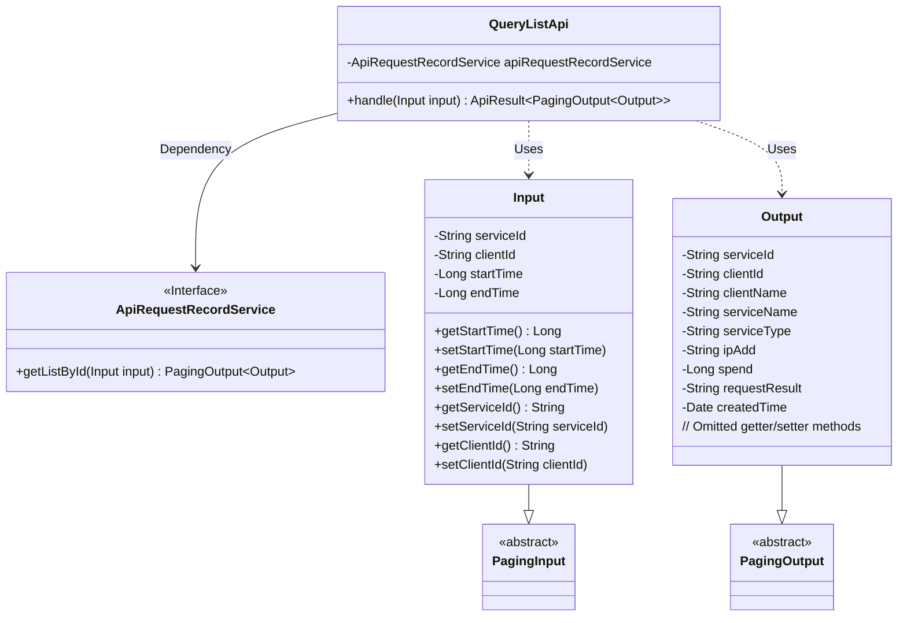

# Basic Information

|      |      |
|------|------|
| Name | QueryListApi |
| Language | .java |
| Code Path | WeFe/serving/serving-service/src/main/java/com/welab/wefe/serving/service/api/apirequestrecord/QueryListApi.java |
| Package Name | com.welab.wefe.serving.service.api.apirequestrecord |
| Dependencies | ['com.welab.wefe.common.fieldvalidate.annotation.Check', 'com.welab.wefe.common.web.api.base.AbstractApi', 'com.welab.wefe.common.web.api.base.Api', 'com.welab.wefe.common.web.dto.ApiResult', 'com.welab.wefe.serving.service.dto.PagingInput', 'com.welab.wefe.serving.service.dto.PagingOutput', 'com.welab.wefe.serving.service.service.ApiRequestRecordService', 'org.springframework.beans.factory.annotation.Autowired', 'java.util.Date'] |
| Brief Description | The interface class for querying API request records includes input parameters (service ID, client ID, time range) and paginated output results (service information, client information, request details, etc.). It processes the request and returns results via ApiRequestRecordService. |

# Description

The code defines an API class named QueryListApi, which is used to query API request records. The API path is apirequestrecord/query-list, accepting Input parameters and returning paginated Output results. Input includes query conditions such as serviceId, clientId, startTime, and endTime. Output contains detailed information such as service ID, client ID, client name, service name, service type, IP address, time consumed, request result, and creation time. The processing logic is implemented through the getListById method of apiRequestRecordService.

# Class Summary

| Name   | Type  | Description |
|-------|------|-------------|
| QueryListApi | class | A class for querying API request records, including input parameters (service ID, client ID, time range) and output results (service information, client information, request details, etc.). Data is returned in paginated format. |

## Class QueryListApi

|      |      |
|------|------|
| Access Modifier | @Api(path = "apirequestrecord/query-list", name = "query api request records");public |
| Type | class |
| Name | QueryListApi |
| Description | A class for querying API request records, including input parameters (service ID, client ID, time range) and output results (service information, client information, request details, etc.). Data is returned in paginated format. |

### UML Class Diagram

This code illustrates the class structure of an API query system, with the QueryListApi class at its core, which inherits from AbstractApi and handles paginated query requests. The Input class extends PagingInput and includes query parameters such as serviceId, clientId, and time range. The Output class extends PagingOutput and contains detailed query result fields like service information, client information, and request details. QueryListApi implements the specific query logic through the dependency-injected ApiRequestRecordService interface, demonstrating a clear hierarchical structure and separation of responsibilities.

### Internal Method Call Graph

```mermaid
graph TD
    A["Class QueryListApi"]
    B["Inheritance: AbstractApi<Input, PagingOutput<Output>>"]
    C["Dependency: ApiRequestRecordService"]
    D["Method: handle(Input input)"]
    E["Invocation: apiRequestRecordService.getListById(input)"]
    F["Return: ApiResult<PagingOutput<Output>>"]
    G["Inner Class Input"]
    H["Properties: serviceId, clientId, startTime, endTime"]
    I["getter/setter methods"]
    J["Inner Class Output"]
    K["Properties: serviceId, clientId, clientName, etc."]
    L["getter/setter methods"]

    A --> B
    A --> C
    A --> D
    D --> E
    E --> F
    A --> G
    G --> H
    G --> I
    A --> J
    J --> K
    J --> L
```

This code represents an API query class that inherits from the AbstractApi base class, designed to handle paginated queries for API request records. It consists of three main components: the main QueryListApi class responsible for business processing, the inner Input class encapsulating query parameters, and the inner Output class defining the return data structure. The flowchart illustrates the class inheritance relationship, dependent services, the main method invocation chain, as well as the property and method structures of the two inner classes. The core business logic involves retrieving a data list through the apiRequestRecordService and ultimately returning paginated results.

### Field List

| Name  | Type  | Description |
|-------|-------|------|
| apiRequestRecordService | ApiRequestRecordService | Automatically inject the ApiRequestRecordService service instance. |

### Method List

| Name  | Type  | Description |
|-------|-------|------|
| handle | ApiResult<PagingOutput<Output>> | Java method override, calling apiRequestRecordService.getListById to process the input and return paginated results. |

