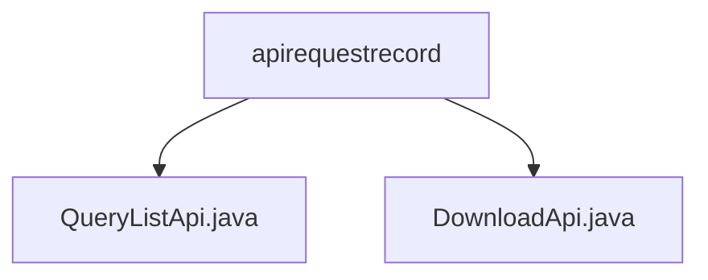

# Basic Information

|      |      |
|------|------|
| Name | apirequestrecord |
| Language | .java |
| Code Path | WeFe/serving/serving-service/src/main/java/com/welab/wefe/serving/service/api/apirequestrecord |
| Package Name | docs.serving.serving-service.src.main.java.com.welab.wefe.serving.service.api.apirequestrecord |
| Brief Description | The QueryListApi class provides the functionality to query API records, with the endpoint path as `apirequestrecord/query-list`. It supports filtering based on specified conditions and returns paginated results, including detailed information such as services, clients, response times, and more. |

# Description

## Overview  
The core responsibility of this module is to provide query and download functionalities for API request records, supporting conditional filtering and paginated result retrieval. The interface specifications include `QueryListApi` (path `apirequestrecord/query-list`) and `DownloadApi`. The former returns paginated `Output` results based on `Input` parameters (such as `serviceId`, time range, etc.), while the latter's functionality is not yet described. Key data structures include `Input` (query conditions) and `Output` (record details, such as service type, latency, etc.). The external dependency is the `getListById` method of `apiRequestRecordService`. For example, `QueryListApi` implements data filtering and pagination through service-layer methods.  

## Main Business Scenarios  
This module is suitable for auditing and analysis scenarios, such as tracking API call records for specific services or clients. The business workflow includes: users submitting query conditions → the system filtering records → returning paginated results or generating download files. The interaction mode resembles data filtering in an admin backend, supporting multi-condition combined queries. Typical applications include monitoring service call latency and calculating request success rates. The API type is RESTful, and integration cases require combining `apiRequestRecordService` to achieve data retrieval.

### Package Internal Structure View

This flowchart illustrates the file structure of two API files under the `apirequestrecord` directory in the `serving-service` project. `QueryListApi.java` and `DownloadApi.java` are sibling file nodes, both belonging to the `apirequestrecord` directory, clearly presenting the basic hierarchical relationship of backend service interface files. This structure is commonly seen in the organization of API modules within microservice architectures.

# File List

| Name   | Type  | Description |
|-------|------|-------------|
| [QueryListApi.java](QueryListApi.md) | file | The interface class for querying API request records, including input parameters (service ID, client ID, time range) and paginated output results (service information, client information, request details, etc.). The request is processed by ApiRequestRecordService and returns the result. |
| [DownloadApi.java](DownloadApi.md) | file | The input content is empty, unable to generate a summary description. |

