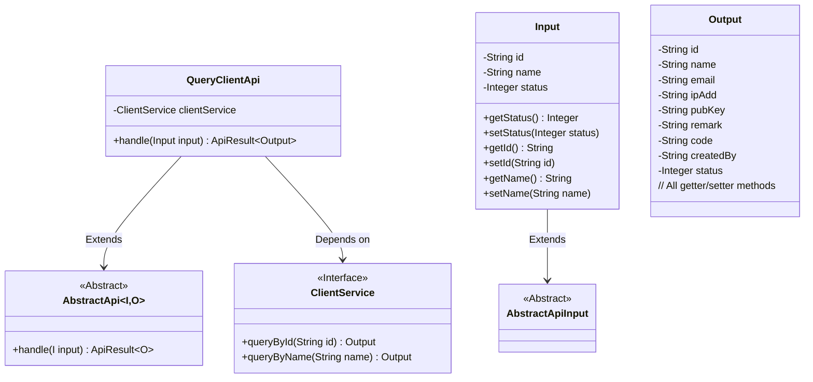

# Basic Information

|      |      |
|------|------|
| Name | QueryClientApi |
| Language | .java |
| Code Path | WeFe/serving/serving-service/src/main/java/com/welab/wefe/serving/service/api/client/QueryClientApi.java |
| Package Name | com.welab.wefe.serving.service.api.client |
| Dependencies | ['com.welab.wefe.common.exception.StatusCodeWithException', 'com.welab.wefe.common.fieldvalidate.annotation.Check', 'com.welab.wefe.common.web.api.base.AbstractApi', 'com.welab.wefe.common.web.api.base.Api', 'com.welab.wefe.common.web.dto.AbstractApiInput', 'com.welab.wefe.common.web.dto.ApiResult', 'com.welab.wefe.serving.service.service.ClientService', 'org.springframework.beans.factory.annotation.Autowired', 'javax.persistence.Column', 'java.io.IOException'] |
| Brief Description | Query client API to retrieve customer information by ID or name, returning output containing detailed information such as ID, name, email, etc. |

# Description

The code defines an API class named QueryClientApi, which is used to query client information. The API path is `client/query-one`, and its name is "get client". This class inherits from AbstractApi, with the input type being Input and the output type being Output. The Input class includes fields such as client ID, name, and status, while the Output class contains detailed client information such as ID, name, email, IP address, public key, remarks, creator, and status. The processing logic calls the corresponding methods of ClientService to query data based on the input ID or name.

# Class Summary

| Name   | Type  | Description |
|-------|------|-------------|
| QueryClientApi | class | Query the client API to retrieve client information based on ID or name, returning client details including fields such as ID, name, email, IP address, public key, etc. Input parameters include ID, name, and status. |

## Class QueryClientApi

|      |      |
|------|------|
| Access Modifier | @Api(path = "client/query-one", name = "get client");public |
| Type | class |
| Name | QueryClientApi |
| Description | Query the client API to retrieve client information based on ID or name, returning client details including fields such as ID, name, email, IP address, public key, etc. Input parameters include ID, name, and status. |

### UML Class Diagram

This code demonstrates an API implementation for querying client information. QueryClientApi inherits from the generic abstract class AbstractApi, processes Input, and returns Output. The Input class contains fields such as client ID, name, and status, while the Output class includes detailed client information. QueryClientApi queries client information through the ClientService interface based on input parameters, supporting queries by ID or name. The class diagram clearly illustrates the inheritance and dependency relationships, reflecting a well-layered design.

### Internal Method Call Graph

```mermaid
graph TD
    A["Class QueryClientApi"]
    B["Annotation: @Api(path='client/query-one', name='get client')"]
    C["Inheritance: AbstractApi<Input, Output>"]
    D["Dependency Injection: @Autowired ClientService"]
    E["Overridden Method: handle(Input input)"]
    F["Conditional Branch: input.id not null"]
    G["Invocation: clientService.queryById"]
    H["Conditional Branch: input.name not null"]
    I["Invocation: clientService.queryByName"]
    J["Return: ApiResult<Output>"]
    K["Static Inner Class Input"]
    L["Properties: String id, String name, Integer status"]
    M["Validation Annotation: @Check"]
    N["Static Inner Class Output"]
    O["Properties: String id, name, email, ipAdd, pubKey, remark, code, createdBy, status"]

    A --> B
    A --> C
    A --> D
    A --> E
    E --> F
    F -->|Yes| G
    F -->|No| H
    H -->|Yes| I
    G --> J
    I --> J
    A --> K
    K --> L
    L --> M
    A --> N
    N --> O
```

This flowchart illustrates the complete structure of the QueryClientApi class, including API annotations, inheritance relationships, service injection, and core processing logic. The handle method selects different query methods based on input parameter evaluation, with Input and Output as static inner classes defining the structure of request parameters and response data respectively. All properties are annotated with validation markers or detailed comments, reflecting rigorous interface design specifications.

### Field List

| Name  | Type  | Description |
|-------|-------|------|
| clientService | ClientService | Automatically inject the ClientService instance. |

### Method List

| Name  | Type  | Description |
|-------|-------|------|
| handle | ApiResult<Output> | Process input and return query results: Query customer information by ID or name, return empty if no match is found. |

