# Basic Information

|      |      |
|------|------|
| Name | QueryClientListApi |
| Language | .java |
| Code Path | WeFe/serving/serving-service/src/main/java/com/welab/wefe/serving/service/api/client/QueryClientListApi.java |
| Package Name | com.welab.wefe.serving.service.api.client |
| Dependencies | ['com.welab.wefe.common.exception.StatusCodeWithException', 'com.welab.wefe.common.fieldvalidate.annotation.Check', 'com.welab.wefe.common.web.api.base.AbstractApi', 'com.welab.wefe.common.web.api.base.Api', 'com.welab.wefe.common.web.dto.AbstractApiOutput', 'com.welab.wefe.common.web.dto.ApiResult', 'com.welab.wefe.serving.service.dto.PagingInput', 'com.welab.wefe.serving.service.dto.PagingOutput', 'com.welab.wefe.serving.service.service.ClientService', 'org.springframework.beans.factory.annotation.Autowired', 'java.io.IOException', 'java.util.Date'] |
| Brief Description | The QueryClientListApi is an interface for paginated querying of client lists. The input includes client names and time ranges, while the output contains information such as client ID, name, email, IP whitelist, public key, and status. The query logic is processed through the ClientService. |

# Description

This is an API class named QueryClientListApi, designed to retrieve a client list. It inherits from AbstractApi, with Input as its input type and PagingOutput<Output> as its output type. The input parameters include client name, start time, and end time, supporting paginated queries. The output contains fields such as client ID, name, email, IP whitelist, public key, client code, creation time, creator, updater, and status. The API processes requests through the queryList method of ClientService and returns paginated results. All fields are annotated with validation rules to ensure data validity.

# Class Summary

| Name   | Type  | Description |
|-------|------|-------------|
| QueryClientListApi | class | The QueryClientListApi is an interface for paginated querying of client lists. The input includes client names and time ranges, while the output contains information such as client ID, name, email, IP whitelist, public key, status, etc. |


## Class QueryClientListApi

|      |      |
|------|------|
| Access Modifier | @Api(path = "client/query-list", name = "get client list");public |
| Type | class |
| Name | QueryClientListApi |
| Description | The QueryClientListApi is an interface for paginated querying of client lists. The input includes client names and time ranges, while the output contains information such as client ID, name, email, IP whitelist, public key, status, etc. |


### UML Class Diagram

```mermaid
classDiagram
    class QueryClientListApi {
        -ClientService clientService
        +handle(Input input) ApiResult~PagingOutput~Output~~
    }
    class AbstractApi~T, R~ {
        <<Abstract>>
    }
    class PagingInput {
        <<Abstract>>
    }
    class PagingOutput~T~ {
        <<Generic>>
    }
    class AbstractApiOutput {
        <<Abstract>>
    }
    class ClientService {
        <<Interface>>
        +queryList(Input input) PagingOutput~Output~
    }
    class Input {
        -String clientName
        -Long startTime
        -Long endTime
        +getClientName() String
        +setClientName(String clientName)
        +getStartTime() Long
        +setStartTime(Long startTime)
        +getEndTime() Long
        +setEndTime(Long endTime)
    }
    class Output {
        -String id
        -String name
        -String email
        -String ipAdd
        -String pubKey
        -String code
        -Date createdTime
        -String createdBy
        -String updatedBy
        -Integer status
        // Omitted getter/setter methods
    }

    QueryClientListApi --> AbstractApi~Input, PagingOutput~Output~~ : Extends
    QueryClientListApi --> ClientService : Depends
    Input --> PagingInput : Extends
    Output --> AbstractApiOutput : Extends
    ClientService ..|> AbstractApi~Input, PagingOutput~Output~~ : Implements
```

This code demonstrates a query client list API implementation, where the core class QueryClientListApi inherits from the generic abstract class AbstractApi to handle paginated query requests. The Input class extends PagingInput and contains query conditions, while the Output class extends AbstractApiOutput and includes response fields. The business logic is implemented through the ClientService interface, adopting a layered architecture design that complies with RESTful API specifications. The class diagram clearly illustrates inheritance and dependency relationships, reflecting the decoupling between the control layer and service layer.


### Internal Method Call Graph

```mermaid
graph TD
    A["Class QueryClientListApi"]
    B["Inheritance: AbstractApi<Input, PagingOutput<Output>>"]
    C["Dependency: @Autowired ClientService"]
    D["Method: handle(Input input)"]
    E["Nested Class Input"]
    F["Nested Class Output"]
    G["Input Attributes: clientName, startTime, endTime"]
    H["Input Methods: getter/setter"]
    I["Output Attributes: id, name, email, ipAdd, pubKey, code, createdTime, createdBy, updatedBy, status"]
    J["Output Methods: getter/setter"]

    A --> B
    A --> C
    A --> D
    A --> E
    A --> F
    E --> G
    E --> H
    F --> I
    F --> J
    D --> C["Calls clientService.queryList(input)"]
```



This code demonstrates a paginated client list query API implementation, including input parameter validation and output data structure. The flowchart clearly presents the class inheritance relationship, service dependency, core processing method, and the complete structure of nested Input/Output classes. The Input handles pagination and query conditions, while the Output encapsulates detailed client information fields. The overall design adheres to a layered architecture, achieving business logic decoupling through ClientService.

### Field List

| Name  | Type  | Description |
|-------|-------|------|
| clientService | ClientService | Automatically inject the ClientService instance. |

### Method List

| Name  | Type  | Description |
|-------|-------|------|
| handle | ApiResult<PagingOutput<Output>> | Rewrite the handle method to call clientService.queryList for processing the input and return paginated results. |


