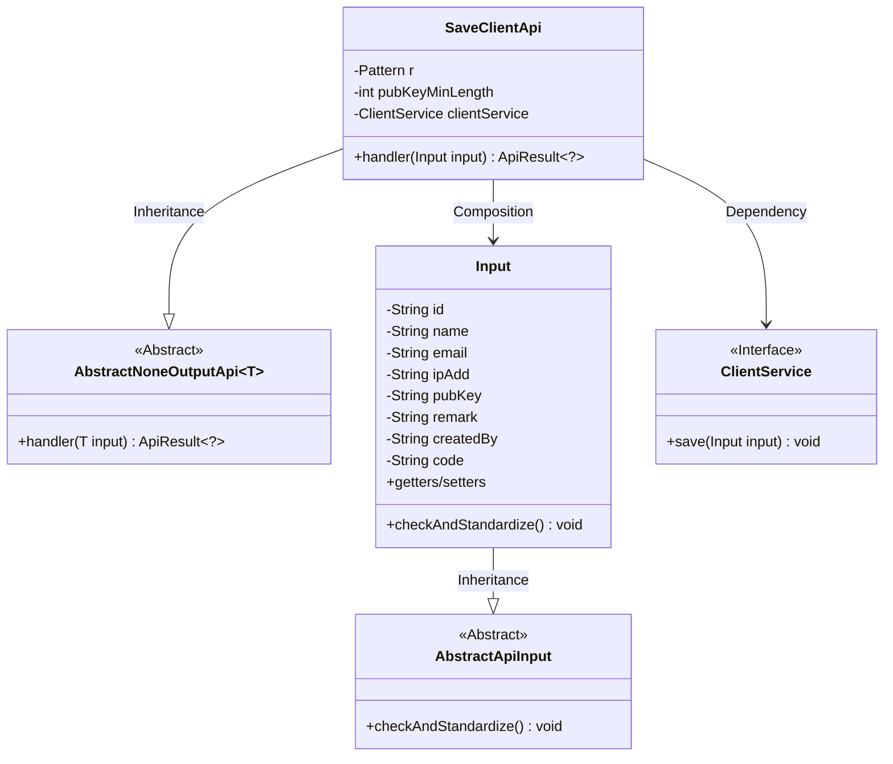

# Basic Information

|      |      |
|------|------|
| Name | SaveClientApi |
| Language | .java |
| Code Path | WeFe/serving/serving-service/src/main/java/com/welab/wefe/serving/service/api/client/SaveClientApi.java |
| Package Name | com.welab.wefe.serving.service.api.client |
| Dependencies | ['com.welab.wefe.common.StatusCode', 'com.welab.wefe.common.exception.StatusCodeWithException', 'com.welab.wefe.common.fieldvalidate.annotation.Check', 'com.welab.wefe.common.util.StringUtil', 'com.welab.wefe.common.web.api.base.AbstractNoneOutputApi', 'com.welab.wefe.common.web.api.base.Api', 'com.welab.wefe.common.web.dto.AbstractApiInput', 'com.welab.wefe.common.web.dto.ApiResult', 'com.welab.wefe.serving.service.service.ClientService', 'org.springframework.beans.factory.annotation.Autowired', 'java.util.List', 'java.util.regex.Matcher', 'java.util.regex.Pattern'] |
| Brief Description | The SaveClientApi is used to save client information, including mandatory fields such as name, IP address, and public key. The IP must conform to the specified format, and the public key must be at least 128 bits in length. |

# Description

This is a Java class named SaveClientApi, designed to handle API operations for client saving. The class extends AbstractNoneOutputApi and uses the Input class as its parameter. Its primary functions include: saving client information via clientService and validating input parameters. The input parameters consist of fields such as client ID, name, email, IP address, and public key, with name, IP address, and public key being mandatory. The validation logic includes: IP address format verification (using regular expressions to match IPv4 format) and public key length check (minimum 128 characters). Upon successful validation, the processing result is returned.

# Class Summary

| Name   | Type  | Description |
|-------|------|-------------|
| SaveClientApi | class | The SaveClientApi class is used to save client information, including mandatory fields such as name, IP address, and public key, with validation for IP format and public key length. It processes input data through ClientService and returns successful results. |

## Class SaveClientApi

|      |      |
|------|------|
| Access Modifier | @Api(path = "client/save", name = "save");public |
| Type | class |
| Name | SaveClientApi |
| Description | The SaveClientApi class is used to save client information, including mandatory fields such as name, IP address, and public key, with validation for IP format and public key length. It processes input data through ClientService and returns successful results. |

### UML Class Diagram

This code describes a class structure for a client information saving API. SaveClientApi inherits from AbstractNoneOutputApi, containing the input parameter validation class Input and the dependent ClientService interface. The main functionality is to process client information saving requests through the handler method, where the Input class enforces strict validation on IP address format and public key length. The overall design demonstrates a clear hierarchical structure, adhering to the principle of separating input validation from business logic.

### Internal Method Call Graph

```mermaid
graph TD
    A["Class SaveClientApi"]
    B["Inheritance: AbstractNoneOutputApi<Input>"]
    C["Annotation: @Api(path='client/save', name='save')"]
    D["Static field: Pattern r (IP regex)"]
    E["Static field: int pubKeyMinLength=128"]
    F["Dependency injection: ClientService clientService"]
    G["Overridden method: handler(Input input)"]
    H["Inner class: Input"]
    I["Inheritance: AbstractApiInput"]
    J["Field: String id (Client ID)"]
    K["Field: String name (Client name)"]
    L["Field: String email (Client email)"]
    M["Field: String ipAdd (IP address)"]
    N["Field: String pubKey (Public key)"]
    O["Field: String remark (Remarks)"]
    P["Field: String createdBy (Creator)"]
    Q["Field: String code (Client code)"]
    R["Method: checkAndStandardize()"]
    S["Method: Field getters/setters"]

    A --> B
    A --> C
    A --> D
    A --> E
    A --> F
    A --> G
    A --> H
    H --> I
    H --> J
    H --> K
    H --> L
    H --> M
    H --> N
    H --> O
    H --> P
    H --> Q
    H --> R
    H --> S
    G --> F
    R --> D
    R --> E
```

This flowchart illustrates the complete structure of the SaveClientApi class, including inheritance relationships, annotations, field definitions, and core method invocation chains. The main workflow involves processing Input parameters through the handler method, where the Input class inherits from AbstractApiInput and contains multiple fields with validation annotations. Key validation logic is implemented in the checkAndStandardize() method, including IP format verification and public key length checks. The overall design reflects a layered architecture of API interface input validation, business processing, and data persistence.

### Field List

| Name  | Type  | Description |
|-------|-------|------|
| pubKeyMinLength = 128 | int | Define a private static constant pubKeyMinLength with a value of 128, representing the minimum length restriction for a public key. |
| r = Pattern.compile("((2(5[0-5]|[0-4]\\d))|[0-1]?\\d{1,2})(\\.((2(5[0-5]|[0-4]\\d))|[0-1]?\\d{1,2})){3}") | Pattern | Java regular expression for matching IPv4 address format, supporting four numeric segments ranging from 0-255, separated by dots. |
| clientService | ClientService | Using @Autowired to automatically inject a ClientService instance. |

### Method List

| Name  | Type  | Description |
|-------|-------|------|
| handler | ApiResult<?> | Override the handler method, call the clientService to save the input and return a successful result. |

