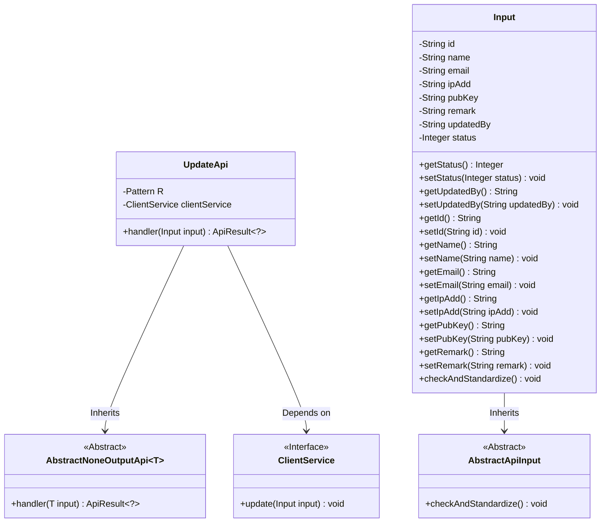

# Basic Information

|      |      |
|------|------|
| Name | UpdateApi |
| Language | .java |
| Code Path | WeFe/serving/serving-service/src/main/java/com/welab/wefe/serving/service/api/client/UpdateApi.java |
| Package Name | com.welab.wefe.serving.service.api.client |
| Dependencies | ['com.welab.wefe.common.StatusCode', 'com.welab.wefe.common.exception.StatusCodeWithException', 'com.welab.wefe.common.fieldvalidate.annotation.Check', 'com.welab.wefe.common.util.StringUtil', 'com.welab.wefe.common.web.api.base.AbstractNoneOutputApi', 'com.welab.wefe.common.web.api.base.Api', 'com.welab.wefe.common.web.dto.AbstractApiInput', 'com.welab.wefe.common.web.dto.ApiResult', 'com.welab.wefe.serving.service.service.ClientService', 'org.springframework.beans.factory.annotation.Autowired', 'java.sql.SQLIntegrityConstraintViolationException', 'java.util.List', 'java.util.regex.Matcher', 'java.util.regex.Pattern'] |
| Brief Description | The UpdateApi is used to update customer information, including mandatory fields such as name, IP address, and public key. The IP address must pass regex validation. It invokes clientService.update to process the input and returns a success result. |

# Description

The code defines an API class named UpdateApi, designed to handle client update requests. The API path is client/update, which inherits from AbstractNoneOutputApi and takes the internal class Input as its input type. The Input class includes fields such as client ID, name, email, IP address, public key, remarks, modifier, and status, with name, IP address, and public key being mandatory. The IP address is validated for format using a regular expression. The handler method invokes the update method of ClientService to process the input data. The Input class also incorporates field validation and normalization logic to ensure the IP address format is correct.

# Class Summary

| Name   | Type  | Description |
|-------|------|-------------|
| UpdateApi | class | API class for updating customer information, including mandatory field validation and IP address format verification, which calls the ClientService to complete the update operation. |

## Class UpdateApi

|      |      |
|------|------|
| Access Modifier | @Api(path = "client/update", name = "update");public |
| Type | class |
| Name | UpdateApi |
| Description | API class for updating customer information, including mandatory field validation and IP address format verification, which calls the ClientService to complete the update operation. |

### UML Class Diagram

Class Diagram Description: This diagram illustrates the structural relationships of UpdateApi and its associated classes. UpdateApi inherits from the generic class AbstractNoneOutputApi<Input> and depends on the ClientService interface. The Input class inherits from AbstractApiInput, containing multiple private fields with their getter/setter methods, and overrides the checkAndStandardize() method for parameter validation. ClientService, as an interface, provides the update method. The overall structure reflects a layered design pattern for API request processing.

### Internal Method Call Graph

```mermaid
graph TD
    A["Class UpdateApi"]
    B["Parent Class: AbstractNoneOutputApi<Input>"]
    C["Constant: Pattern R (IP regex)"]
    D["Dependency: ClientService clientService"]
    E["Method: handler(Input input)"]
    F["Nested Class Input"]
    G["Attributes: id/name/email/ipAdd/pubKey/remark/updatedBy/status"]
    H["Method: checkAndStandardize()"]
    I["Getter/Setter method group"]

    A --> B
    A --> C
    A --> D
    A --> E
    A --> F
    F --> G
    F --> H
    F --> I
    H -->|"splitWithoutEmptyItem"| J["Split IP string"]
    H -->|"R.matcher()"| K["IP format validation"]
    H -->|"StringUtil.join"| L["Merge valid IPs"]
    E -->|"clientService.update"| M["Invoke service update"]
    E -->|"success()"| N["Return success result"]
```

This flowchart illustrates the core structure of the UpdateApi class, including the IP validation process and service invocation chain. It consists of three main parts: 1) Class inheritance and dependency injection; 2) Parameter validation logic in the nested Input class, which verifies IP format using regular expressions; 3) The handler method flow that invokes clientService to complete data updates and returns a success result. The validation process strictly handles multi-IP splitting and recombination to ensure parameter legality.

### Field List

| Name  | Type  | Description |
|-------|-------|------|
| clientService | ClientService | Use @Autowired to automatically inject an instance of ClientService. |
| R = Pattern.compile("((2(5[0-5]|[0-4]\\d))|[0-1]?\\d{1,2})(\\.((2(5[0-5]|[0-4]\\d))|[0-1]?\\d{1,2})){3}") | Pattern | The code defines a regular expression pattern for matching IPv4 address formats. |

### Method List

| Name  | Type  | Description |
|-------|-------|------|
| handler | ApiResult<?> | Java method override, calling clientService to update the input and return a successful result. |

