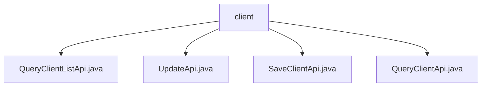

# Basic Information

|      |      |
|------|------|
| Name | client |
| Language | .java |
| Code Path | WeFe/serving/serving-service/src/main/java/com/welab/wefe/serving/service/api/client |
| Package Name | docs.serving.serving-service.src.main.java.com.welab.wefe.serving.service.api.client |
| Brief Description | The QueryClientListApi is used for paginated querying of client lists, including parameters such as name and time. The UpdateApi handles client updates, validating mandatory fields and IP format. The SaveClientApi saves client information, validating IP and public key. The QueryClientApi queries details of a single client. All inherit from the base API class and are processed via the ClientService. |

# Description

## Overview  
This module provides comprehensive lifecycle management functionalities for clients, including operations such as querying lists, updating, saving, and retrieving individual records. The interface specifications uniformly inherit from either `AbstractApi` or `AbstractNoneOutputApi`, adopting either paginated output (e.g., `PagingOutput<Output>`) or no-output designs. Key data structures include fields such as client ID, name, email, IP whitelist, and public key, with validation annotations ensuring data integrity (e.g., IPv4 format regex validation). The only external dependency is the `ClientService`, which handles core business logic. For instance, the `SaveClientApi` requires the public key length to be ≥128 characters.  

## Key Business Scenarios  
The module supports CRUD operations for client information, resembling a basic data management platform. Business workflows include: paginated list queries via `QueryClientListApi`, data saving or updating using `SaveClientApi`/`UpdateApi` (with IP and public key validation), and retrieving individual details through `QueryClientApi`. All interactions follow RESTful conventions, such as the `client/update` endpoint handling update requests. Typical applications include client information maintenance, with integration cases covering end-to-end operations from creation to querying.

### Package Internal Structure View

This flowchart illustrates the API file structure under the client directory in the WeFe project. The root node is the client folder, which contains four Java interface files: QueryClientListApi, UpdateApi, SaveClientApi, and QueryClientApi. These files are directly subordinate to the client directory with no deeper subdirectory hierarchy.

# File List

| Name   | Type  | Description |
|-------|------|-------------|
| [QueryClientListApi.java](QueryClientListApi.md) | file | The QueryClientListApi is an interface for paginated querying of client lists. The input includes client names and time ranges, while the output contains information such as client ID, name, email, IP whitelist, public key, and status. The query logic is processed by the ClientService. |
| [UpdateApi.java](UpdateApi.md) | file | The UpdateApi is used to update customer information, including mandatory fields such as name, IP address, and public key. The IP address must comply with regex validation. It invokes clientService.update to process the input and returns a successful result. |
| [SaveClientApi.java](SaveClientApi.md) | file | SaveClientApi is used to save client information, including mandatory fields such as name, IP address, and public key. The IP must comply with the specified format, and the public key must be at least 128 bits in length. |
| [QueryClientApi.java](QueryClientApi.md) | file | Query client API to retrieve customer information by ID or name, returning output that includes detailed information such as ID, name, email, etc. |

