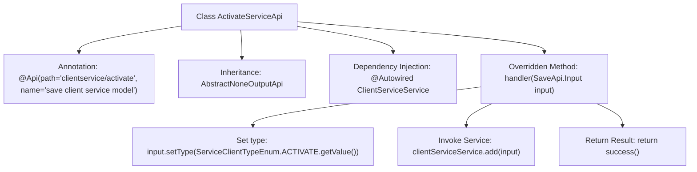

# Basic Information

|      |      |
|------|------|
| Name | ActivateServiceApi |
| Language | .java |
| Code Path | WeFe/serving/serving-service/src/main/java/com/welab/wefe/serving/service/api/clientservice/ActivateServiceApi.java |
| Package Name | com.welab.wefe.serving.service.api.clientservice |
| Dependencies | ['org.springframework.beans.factory.annotation.Autowired', 'com.welab.wefe.common.exception.StatusCodeWithException', 'com.welab.wefe.common.web.api.base.AbstractNoneOutputApi', 'com.welab.wefe.common.web.api.base.Api', 'com.welab.wefe.common.web.dto.ApiResult', 'com.welab.wefe.serving.service.enums.ServiceClientTypeEnum', 'com.welab.wefe.serving.service.service.ClientServiceService'] |
| Brief Description | This is an API class for activating client services, with the path "clientservice/activate". It processes the input by calling the add method of ClientServiceService and returns a successful result. |

# Description

The content describes a Java class named ActivateServiceApi, which handles client service activation requests. This class inherits from AbstractNoneOutputApi, with the generic parameter set to SaveApi.Input. The @Api annotation defines the API path as "clientservice/activate" and the name as "save client service model". The class injects the ClientServiceService and overrides the handler method. This method sets the input parameter's type to the ACTIVATE enum value, processes the input by calling clientServiceService.add, and finally returns a successful result. The entire class implements an API processing logic with no output.

# Class Summary

| Name   | Type  | Description |
|-------|------|-------------|
| ActivateServiceApi | class | The ActivateServiceApi class is used to activate client services. It saves the input data by calling the clientServiceService.add method, sets the type to ACTIVATE, and returns a successful result. |


## Class ActivateServiceApi

|      |      |
|------|------|
| Access Modifier | @Api(path = "clientservice/activate", name = "save client service model");public |
| Type | class |
| Name | ActivateServiceApi |
| Description | The ActivateServiceApi class is used to activate client services. It saves the input data by calling the clientServiceService.add method, sets the type to ACTIVATE, and returns a successful result. |


### UML Class Diagram

```mermaid
classDiagram
    class ActivateServiceApi {
        -ClientServiceService clientServiceService
        +handler(SaveApi~Input~ input) ApiResult~?~
    }
    class AbstractNoneOutputApi~T~ {
        <<Abstract>>
        #handler(T input) ApiResult~?~
    }
    class SaveApi {
        class Input {
            +setType(String type)
        }
    }
    class ClientServiceService {
        +add(SaveApi~Input~ input)
    }
    class ServiceClientTypeEnum {
        <<Enumeration>>
        +ACTIVATE
        +getValue() String
    }

    ActivateServiceApi --|> AbstractNoneOutputApi~SaveApi~Input~~ : Inheritance
    ActivateServiceApi --> ClientServiceService : Invocation
    ActivateServiceApi --> SaveApi~Input~ : Usage
    SaveApi~Input~ --> ServiceClientTypeEnum : Dependency
```

This code illustrates a Spring framework-based API implementation class ActivateServiceApi, which inherits from the generic abstract class AbstractNoneOutputApi and specializes in handling client service activation requests. The class diagram showcases core business logic: adding service records of type ACTIVATE through ClientServiceService, involving input parameter processing and enumeration type conversion. Components collaborate via dependency injection and inheritance relationships, demonstrating clear hierarchical structure and responsibility partitioning.


### Internal Method Call Graph



This code illustrates a Spring framework-based API class ActivateServiceApi, primarily designed to handle client service activation requests. The flowchart clearly depicts the class structure: defining API path and name via @Api annotation, inheriting from an abstract parent class, and injecting the ClientServiceService dependency. The core handler method sequentially executes three steps - setting service type, invoking the service layer to add data, and returning a success result - comprehensively describing the request processing workflow.

### Field List

| Name  | Type  | Description |
|-------|-------|------|
| clientServiceService | ClientServiceService | Using @Autowired to automatically inject an instance of ClientServiceService. |

### Method List

| Name  | Type  | Description |
|-------|-------|------|
| handler | ApiResult<?> | This method handles saving the API request, sets the input type to active, invokes the client service to add the input, and finally returns a successful result. |


