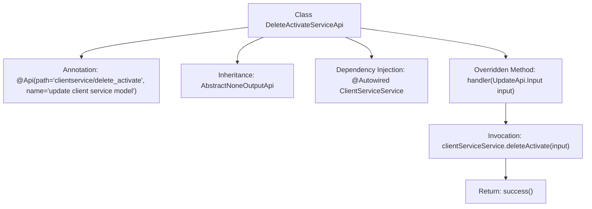

# Basic Information

|      |      |
|------|------|
| Name | DeleteActivateServiceApi |
| Language | .java |
| Code Path | WeFe/serving/serving-service/src/main/java/com/welab/wefe/serving/service/api/clientservice/DeleteActivateServiceApi.java |
| Package Name | com.welab.wefe.serving.service.api.clientservice |
| Dependencies | ['org.springframework.beans.factory.annotation.Autowired', 'com.welab.wefe.common.exception.StatusCodeWithException', 'com.welab.wefe.common.web.api.base.AbstractNoneOutputApi', 'com.welab.wefe.common.web.api.base.Api', 'com.welab.wefe.common.web.dto.ApiResult', 'com.welab.wefe.serving.service.service.ClientServiceService'] |
| Brief Description | This is an API class for deleting an activated client service, with the path "clientservice/delete_activate". It calls the deleteActivate method of ClientServiceService to process the input and return a successful result. |

# Description

The content describes a Java class named DeleteActivateServiceApi, which extends AbstractNoneOutputApi and is used to handle update operations for the client service model. The class is annotated with an Api annotation, specifying the path as "clientservice/delete_activate" and the name as "update client service model." The class injects the ClientServiceService and processes the input parameters by calling the deleteActivate function in the handler method, returning an ApiResult upon success. The entire class focuses on implementing the functionality of deleting and activating client services.

# Class Summary

| Name   | Type  | Description |
|-------|------|-------------|
| DeleteActivateServiceApi | class | This is an API class named DeleteActivateServiceApi, with the path "clientservice/delete_activate", used for updating the client service model. It inherits from AbstractNoneOutputApi, processes UpdateApi.Input input, calls the deleteActivate method of clientServiceService, and returns a successful result. |


## Class DeleteActivateServiceApi

|      |      |
|------|------|
| Access Modifier | @Api(path = "clientservice/delete_activate", name = "update client service model");public |
| Type | class |
| Name | DeleteActivateServiceApi |
| Description | This is an API class named DeleteActivateServiceApi, with the path "clientservice/delete_activate", used for updating the client service model. It inherits from AbstractNoneOutputApi, processes UpdateApi.Input input, calls the deleteActivate method of clientServiceService, and returns a successful result. |


### UML Class Diagram

```mermaid
classDiagram
    class DeleteActivateServiceApi {
        -ClientServiceService clientServiceService
        +handler(UpdateApi~Input~ input) ApiResult~?~
    }
    <<Interface>> UpdateApi
    UpdateApi : +Input
    class AbstractNoneOutputApi~T~ {
        <<abstract>>
        +handler(T input) ApiResult~?~
    }
    class ClientServiceService {
        +deleteActivate(UpdateApi~Input~ input) void
    }
    DeleteActivateServiceApi --|> AbstractNoneOutputApi~UpdateApi~Input~~
    DeleteActivateServiceApi --> ClientServiceService : dependency
    DeleteActivateServiceApi ..|> UpdateApi : implements
```

This class diagram illustrates the structure where DeleteActivateServiceApi inherits from the generic class AbstractNoneOutputApi and implements the UpdateApi interface. The class utilizes ClientServiceService via dependency injection to perform deleteActivate operations, with the handler method processing input parameters and returning ApiResult. AbstractNoneOutputApi serves as an abstract base class defining core processing logic, while the UpdateApi interface standardizes the API's input-output contract. The entire design demonstrates clear hierarchical relationships and separation of responsibilities, aligning with Spring framework's API development patterns.


### Internal Method Call Graph



This code describes a Spring framework-based API service class `DeleteActivateServiceApi` designed to handle client service deactivation operations. The class defines the interface path and name via the `@Api` annotation, inherits from an abstract parent class, and injects the `ClientServiceService` dependency. The core logic resides in the `handler` method, which invokes the service layer method to complete the deletion operation and returns a success result. The flowchart clearly illustrates the complete processing chain from class structure definition to method invocation.

### Field List

| Name  | Type  | Description |
|-------|-------|------|
| clientServiceService | ClientServiceService | Using @Autowired to automatically inject an instance of ClientServiceService. |

### Method List

| Name  | Type  | Description |
|-------|-------|------|
| handler | ApiResult<?> | Java method override, invoking clientServiceService to delete activation input, returns ApiResult upon success. Handles exceptions with StatusCodeWithException. |


