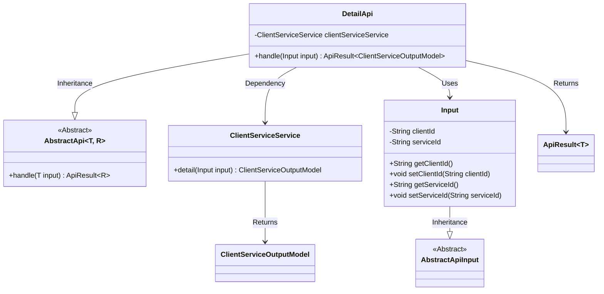

# Basic Information

|      |      |
|------|------|
| Name | DetailApi |
| Language | .java |
| Code Path | WeFe/serving/serving-service/src/main/java/com/welab/wefe/serving/service/api/clientservice/DetailApi.java |
| Package Name | com.welab.wefe.serving.service.api.clientservice |
| Dependencies | ['java.io.IOException', 'org.springframework.beans.factory.annotation.Autowired', 'com.welab.wefe.common.exception.StatusCodeWithException', 'com.welab.wefe.common.fieldvalidate.annotation.Check', 'com.welab.wefe.common.web.api.base.AbstractApi', 'com.welab.wefe.common.web.api.base.Api', 'com.welab.wefe.common.web.dto.AbstractApiInput', 'com.welab.wefe.common.web.dto.ApiResult', 'com.welab.wefe.serving.service.database.entity.ClientServiceOutputModel', 'com.welab.wefe.serving.service.service.ClientServiceService'] |
| Brief Description | The DetailApi class is used to retrieve customer service details. It requires the clientId and serviceId parameters, and returns the result by invoking the clientServiceService.detail method. |

# Description

The code defines an API class named `DetailApi`, which is used to retrieve customer service details. It inherits from `AbstractApi`, accepts an `Input` class as the input parameter, and returns a result of type `ClientServiceOutputModel`. The `Input` class contains two mandatory fields: `clientId` and `serviceId`, both validated via the `@Check` annotation. The API path is `"clientservice/detail"`, and it processes the request by invoking the `detail` method of the injected `ClientServiceService`, returning a successful result. The entire class encapsulates the query logic for customer service details.

# Class Summary

| Name   | Type  | Description |
|-------|------|-------------|
| DetailApi | class | The DetailApi class is used to retrieve customer service details, requiring the provision of clientId and serviceId. It invokes the ClientServiceService for processing and returns the result. |

## Class DetailApi

|      |      |
|------|------|
| Access Modifier | @Api(path = "clientservice/detail", name = "get client service ");public |
| Type | class |
| Name | DetailApi |
| Description | The DetailApi class is used to retrieve customer service details, requiring the provision of clientId and serviceId. It invokes the ClientServiceService for processing and returns the result. |

### UML Class Diagram

Class Diagram Description: The diagram illustrates an API implementation structure based on abstract classes. DetailApi inherits from the generic class AbstractApi, processes Input parameters, and returns ApiResult<ClientServiceOutputModel>. The Input class inherits from AbstractApiInput and contains client and service ID fields. DetailApi retrieves detailed data through dependency-injected ClientServiceService, demonstrating a typical controller-service layer interaction pattern.

### Internal Method Call Graph

```mermaid
graph TD
    A["Class DetailApi"]
    B["Annotation: @Api(path='clientservice/detail', name='get client service')"]
    C["Inheritance: AbstractApi<Input, ClientServiceOutputModel>"]
    D["Dependency Injection: @Autowired ClientServiceService"]
    E["Overridden Method: handle(Input input)"]
    F["Nested Class Input"]
    G["Field: @Check String clientId"]
    H["Field: @Check String serviceId"]
    I["getter/setter methods"]
    J["Invocation: clientServiceService.detail(input)"]
    K["Return: success(result)"]

    A --> B
    A --> C
    A --> D
    A --> E
    C --> F
    F --> G
    F --> H
    F --> I
    E --> J
    J --> K
```

This flowchart illustrates the complete structure of the DetailApi class, including class annotations, inheritance relationships, dependency injection fields, and core business logic processing flow. It highlights the call chain where the handle method retrieves detail data through clientServiceService and returns a successful result, while detailing the field structure and validation annotations of the nested Input class. The entire process demonstrates a closed-loop business flow from request handling to data return.

### Field List

| Name  | Type  | Description |
|-------|-------|------|
| clientServiceService | ClientServiceService | Using @Autowired to automatically inject a ClientServiceService instance. |

### Method List

| Name  | Type  | Description |
|-------|-------|------|
| handle | ApiResult<ClientServiceOutputModel> | This method processes the input and returns client service details, encapsulating the result upon success or throwing a status code exception or IO exception in case of errors. |

