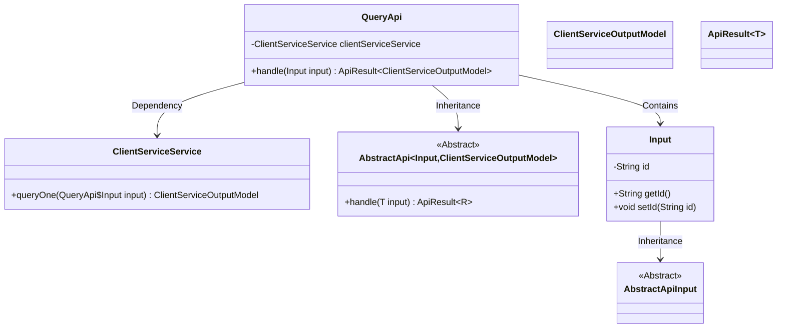

# Basic Information

|      |      |
|------|------|
| Name | QueryApi |
| Language | .java |
| Code Path | WeFe/serving/serving-service/src/main/java/com/welab/wefe/serving/service/api/clientservice/QueryApi.java |
| Package Name | com.welab.wefe.serving.service.api.clientservice |
| Dependencies | ['com.welab.wefe.common.exception.StatusCodeWithException', 'com.welab.wefe.common.fieldvalidate.annotation.Check', 'com.welab.wefe.common.web.api.base.AbstractApi', 'com.welab.wefe.common.web.api.base.Api', 'com.welab.wefe.common.web.dto.AbstractApiInput', 'com.welab.wefe.common.web.dto.ApiResult', 'com.welab.wefe.serving.service.database.entity.ClientServiceOutputModel', 'com.welab.wefe.serving.service.service.ClientServiceService', 'org.springframework.beans.factory.annotation.Autowired', 'java.io.IOException'] |
| Brief Description | The QueryApi class handles client service queries by invoking the clientServiceService.queryOne method with an ID input and returning a ClientServiceOutputModel result. |

# Description

This is a Java class named QueryApi, which extends AbstractApi and is used to handle client service query requests. The class is annotated with @Api, specifying the path as "clientservice/query" and the name as "get models". It injects the ClientServiceService via @Autowired. The main functionality involves processing the input parameter Input (containing an id field validated by the @Check annotation), calling the clientServiceService.queryOne method to retrieve data, and returning a ClientServiceOutputModel result. The entire class encapsulates the core logic of the query interface, including input parameter validation and business processing flow.

# Class Summary

| Name   | Type  | Description |
|-------|------|-------------|
| QueryApi | class | The QueryApi class provides query services via the path "clientservice/query," inherits from AbstractApi, processes the input ID, and invokes clientServiceService.queryOne to return the result. |

## Class QueryApi

|      |      |
|------|------|
| Access Modifier | @Api(path = "clientservice/query", name = "get models ");public |
| Type | class |
| Name | QueryApi |
| Description | The QueryApi class provides query services via the path "clientservice/query," inherits from AbstractApi, processes the input ID, and invokes clientServiceService.queryOne to return the result. |

### UML Class Diagram

This code demonstrates the structure of an API query service based on the Spring framework. The QueryApi class inherits from the generic abstract class AbstractApi to handle client service query requests. It includes an inner class Input for parameter reception and relies on ClientServiceService to execute business logic. The overall design adopts a layered architecture, achieving flexibility in input/output types through generics while utilizing Spring's dependency injection mechanism to manage service instances.

### Internal Method Call Graph

```mermaid
graph TD
    A["Class QueryApi"]
    B["Annotation: @Api(path='clientservice/query', name='get models')"]
    C["Inheritance: AbstractApi<Input, ClientServiceOutputModel>"]
    D["Dependency Injection: @Autowired ClientServiceService"]
    E["Overridden Method: handle(Input input)"]
    F["Inner Class: Input"]
    G["Validation Annotation: @Check(name='id')"]
    H["Field: String id"]
    I["Methods: getId()/setId()"]
    J["Invocation: clientServiceService.queryOne(input)"]
    K["Return: ApiResult<ClientServiceOutputModel>"]

    A --> B
    A --> C
    A --> D
    A --> E
    E --> J
    J --> K
    A -.-> F
    F --> G
    F --> H
    F --> I
```

This flowchart illustrates the structure of the QueryApi class, which is an API class annotated with REST interface annotations and inherits from the generic abstract class AbstractApi. The core logic involves executing queries through the injected ClientServiceService and returning encapsulated results. The inner class Input contains an ID field with validation annotations and its accessor methods, used for processing request parameters. The overall flow clearly demonstrates a typical design pattern in the API layer of Spring Boot.

### Field List

| Name  | Type  | Description |
|-------|-------|------|
| clientServiceService | ClientServiceService | Using @Autowired to automatically inject an instance of ClientServiceService. |

### Method List

| Name  | Type  | Description |
|-------|-------|------|
| handle | ApiResult<ClientServiceOutputModel> | The method processes the input and returns the query result, invoking the clientServiceService.queryOne method upon success. |

