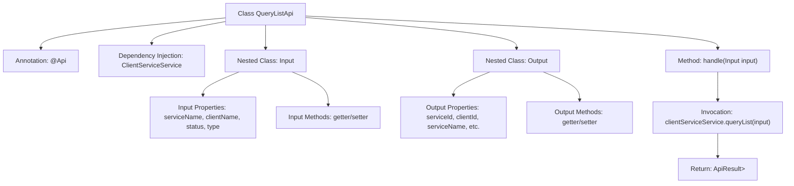

# Basic Information

|      |      |
|------|------|
| Name | QueryListApi |
| Language | .java |
| Code Path | WeFe/serving/serving-service/src/main/java/com/welab/wefe/serving/service/api/clientservice/QueryListApi.java |
| Package Name | com.welab.wefe.serving.service.api.clientservice |
| Dependencies | ['java.io.IOException', 'java.util.Date', 'org.springframework.beans.factory.annotation.Autowired', 'com.welab.wefe.common.exception.StatusCodeWithException', 'com.welab.wefe.common.fieldvalidate.annotation.Check', 'com.welab.wefe.common.web.api.base.AbstractApi', 'com.welab.wefe.common.web.api.base.Api', 'com.welab.wefe.common.web.dto.AbstractApiOutput', 'com.welab.wefe.common.web.dto.ApiResult', 'com.welab.wefe.serving.service.dto.PagingInput', 'com.welab.wefe.serving.service.dto.PagingOutput', 'com.welab.wefe.serving.service.service.ClientServiceService'] |
| Brief Description | The QueryListApi is an interface for querying customer service lists. The input includes service name, customer name, status, and type, while the output contains service details such as ID, name, status, IP, etc. |

# Description

This is a Java class named QueryListApi, designed to handle API requests for querying client service lists. The class extends AbstractApi, accepts an Input parameter, and returns a paginated Output result. The Input class includes pagination parameters as well as query conditions such as service name, client name, status, and type. The Output class contains detailed information such as service ID, client ID, service name, client name, service type, status, IP address, URL, payment type, unit price, creator, updater, creation time, type, and code. The API processes the request by invoking the queryList method of clientServiceService and returns the paginated result.

# Class Summary

| Name   | Type  | Description |
|-------|------|-------------|
| QueryListApi | class | QueryListApi is a paginated query interface that takes inputs including service name, client name, status, and type, and outputs service details and client information. |


## Class QueryListApi

|      |      |
|------|------|
| Access Modifier | @Api(path = "clientservice/query-list", name = "query list");public |
| Type | class |
| Name | QueryListApi |
| Description | QueryListApi is a paginated query interface that takes inputs including service name, client name, status, and type, and outputs service details and client information. |


### UML Class Diagram

```mermaid
classDiagram
    class AbstractApi~T, R~ {
        <<abstract>>
        +handle(T input) ApiResult~R~
    }

    class PagingInput {
        <<abstract>>
    }

    class PagingOutput~T~ {
        <<abstract>>
    }

    class AbstractApiOutput {
        <<abstract>>
    }

    class QueryListApi {
        -ClientServiceService clientServiceService
        +handle(Input input) ApiResult~PagingOutput~Output~~
    }

    class QueryListApi$Input {
        -String serviceName
        -String clientName
        -Integer status
        -Integer type
        +get/set methods
    }

    class QueryListApi$Output {
        -String serviceId
        -String clientId
        // ...other fields
        +get/set methods
    }

    class ClientServiceService {
        <<Interface>>
        +queryList(QueryListApi$Input input) PagingOutput~QueryListApi$Output~
    }

    QueryListApi --> AbstractApi : extends
    QueryListApi --> ClientServiceService : depends
    QueryListApi$Input --> PagingInput : extends
    QueryListApi$Output --> AbstractApiOutput : extends
    PagingOutput <|-- QueryListApi : generic parameter
```

This code demonstrates the implementation structure of a paginated query API. QueryListApi inherits from AbstractApi, using generics to specify the input type as inner class Input (extending PagingInput) and output type as PagingOutput<Output>. The core processing delegates to the queryList method of the ClientServiceService interface. The Input class includes query conditions such as service name and client name, while the Output class contains rich return fields like service ID and client ID. The overall design reflects clear hierarchical relationships and separation of responsibilities, with Input/Output as static inner classes encapsulating related data models.


### Internal Method Call Graph



This code defines an API class named QueryListApi, which inherits from AbstractApi and is used to handle paginated queries for client service lists. The class includes two nested classes, Input and Output. Input is used to receive query parameters (including service name, client name, status, etc.), while Output defines the structure of the returned data. The main flow involves calling the queryList method of ClientServiceService via the handle method and returning the paginated results. The flowchart clearly illustrates the class structure, properties, methods, and core invocation relationships.

### Field List

| Name  | Type  | Description |
|-------|-------|------|
| clientServiceService | ClientServiceService | Using @Autowired to automatically inject an instance of ClientServiceService. |

### Method List

| Name  | Type  | Description |
|-------|-------|------|
| handle | ApiResult<PagingOutput<QueryListApi.Output>> | Process the input and return paginated query results, invoking the service method upon success. |


