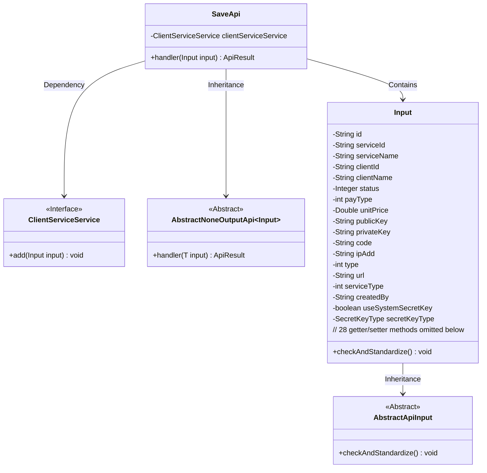

# Basic Information

|      |      |
|------|------|
| Name | SaveApi |
| Language | .java |
| Code Path | WeFe/serving/serving-service/src/main/java/com/welab/wefe/serving/service/api/clientservice/SaveApi.java |
| Package Name | com.welab.wefe.serving.service.api.clientservice |
| Dependencies | ['com.welab.wefe.common.StatusCode', 'com.welab.wefe.common.constant.SecretKeyType', 'com.welab.wefe.common.exception.StatusCodeWithException', 'com.welab.wefe.common.fieldvalidate.annotation.Check', 'com.welab.wefe.common.web.api.base.AbstractNoneOutputApi', 'com.welab.wefe.common.web.api.base.Api', 'com.welab.wefe.common.web.dto.AbstractApiInput', 'com.welab.wefe.common.web.dto.ApiResult', 'com.welab.wefe.serving.service.enums.ServiceClientTypeEnum', 'com.welab.wefe.serving.service.enums.ServiceStatusEnum', 'com.welab.wefe.serving.service.service.ClientServiceService', 'org.springframework.beans.factory.annotation.Autowired'] |
| Brief Description | The SaveApi class is used to save client service models, including input parameter validation and processing logic. Its main fields include service ID, client ID, public/private keys, pricing, etc. It ensures the unit price is non-negative before invoking the service to save data. |

# Description

The code defines an API class named `SaveApi`, which is used to save client service models. It inherits from `AbstractNoneOutputApi`, with the input parameter being the inner class `Input`. The `Input` class contains multiple fields such as `id`, `serviceId`, `clientId`, `status`, `payType`, `unitPrice`, `publicKey`, `privateKey`, etc. Each field has corresponding validation annotations and getter/setter methods. Among them, `serviceId` and `clientId` are mandatory fields. The `handler` method calls `clientServiceService.add` to save the input data. The `Input` class also includes a `checkAndStandardize` method to validate that `unitPrice` cannot be negative. The API path is `clientservice/save`.

# Class Summary

| Name   | Type  | Description |
|-------|------|-------------|
| SaveApi | class | The SaveApi class is used to save client service models, incorporating input parameter validation and business processing logic. Its primary fields include service ID, client ID, price, key, etc. It invokes the service save operation after ensuring data validity. |

## Class SaveApi

|      |      |
|------|------|
| Access Modifier | @Api(path = "clientservice/save", name = "save client service model");public |
| Type | class |
| Name | SaveApi |
| Description | The SaveApi class is used to save client service models, incorporating input parameter validation and business processing logic. Its primary fields include service ID, client ID, price, key, etc. It invokes the service save operation after ensuring data validity. |

### UML Class Diagram

This code demonstrates an API implementation for saving client service models. The core class SaveApi inherits from the generic abstract class AbstractNoneOutputApi and includes a static inner class Input as the parameter. The Input class extends AbstractApiInput, containing multiple fields with validation annotations and standardization logic. SaveApi utilizes the ClientServiceService interface through dependency injection to perform actual save operations. The overall design reflects layered architecture principles, separating input parameter validation from business logic, adhering to the Single Responsibility Principle.

### Internal Method Call Graph

```mermaid
graph TD
    A["Class SaveApi"]
    B["Annotation: @Api"]
    C["Inheritance: AbstractNoneOutputApi<Input>"]
    D["Dependency Injection: @Autowired ClientServiceService"]
    E["Overridden Method: handler(Input input)"]
    F["Inner Class: Input"]
    G["Input Attributes: 23 @Check-annotated fields"]
    H["Input Method: checkAndStandardize()"]
    I["Input Methods: 23 getters/setters"]
    J["Input Inheritance: AbstractApiInput"]

    A --> B
    A --> C
    A --> D
    A --> E
    A --> F
    F --> G
    F --> H
    F --> I
    F --> J
    E --> D
    E --> H
```

This code describes a SaveApi class for saving client service models, which inherits from AbstractNoneOutputApi and contains a complex Input inner class. The flowchart illustrates the main structure of the class: API annotation, service dependency injection, core handler method, and the inheritance relationships and method composition of the Input inner class. The Input class includes 23 @Check-validated fields with corresponding getters/setters, and overrides the checkAndStandardize() method for additional parameter validation.

### Field List

| Name  | Type  | Description |
|-------|-------|------|
| clientServiceService | ClientServiceService | Using @Autowired to automatically inject an instance of ClientServiceService. |

### Method List

| Name  | Type  | Description |
|-------|-------|------|
| handler | ApiResult<?> | Java method override, call clientServiceService.add to process the input, return ApiResult upon success. Throws StatusCodeWithException in case of exceptions. |

