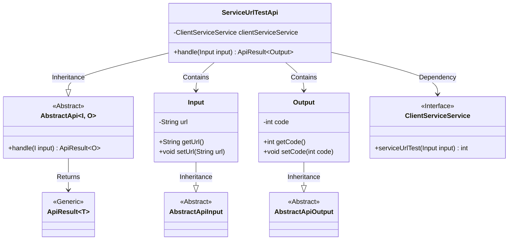
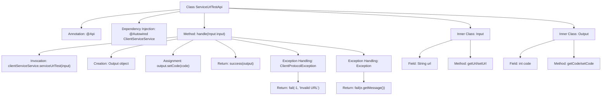

# Basic Information

|      |      |
|------|------|
| Name | ServiceUrlTestApi |
| Language | .java |
| Code Path | WeFe/serving/serving-service/src/main/java/com/welab/wefe/serving/service/api/clientservice/ServiceUrlTestApi.java |
| Package Name | com.welab.wefe.serving.service.api.clientservice |
| Dependencies | ['org.apache.http.client.ClientProtocolException', 'org.springframework.beans.factory.annotation.Autowired', 'com.welab.wefe.common.fieldvalidate.annotation.Check', 'com.welab.wefe.common.web.api.base.AbstractApi', 'com.welab.wefe.common.web.api.base.Api', 'com.welab.wefe.common.web.dto.AbstractApiInput', 'com.welab.wefe.common.web.dto.AbstractApiOutput', 'com.welab.wefe.common.web.dto.ApiResult', 'com.welab.wefe.serving.service.service.ClientServiceService'] |
| Brief Description | The `ServiceUrlTestApi` class is used to test service URLs. It takes a URL as input, outputs the status code, and handles exceptions by returning error messages. |

# Description

The code defines an API class named ServiceUrlTestApi for testing service URLs. It inherits from AbstractApi, accepts an Input parameter, and returns an Output result. The Input includes a mandatory URL field, while the Output contains a status code field. In the processing logic, it invokes the serviceUrlTest method of clientServiceService to test the URL, returning a status code upon success or catching exceptions and returning error messages upon failure.

# Class Summary

| Name   | Type  | Description |
|-------|------|-------------|
| ServiceUrlTestApi | class | The ServiceUrlTestApi class is used to test service URLs, checking their validity through the ClientServiceService, and returns a status code or error message. The input must include a URL, and the output contains the status code. |

## Class ServiceUrlTestApi

|      |      |
|------|------|
| Access Modifier | @Api(path = "clientservice/service_url_test", name = "service url test");public |
| Type | class |
| Name | ServiceUrlTestApi |
| Description | The ServiceUrlTestApi class is used to test service URLs, checking their validity through the ClientServiceService, and returns a status code or error message. The input must include a URL, and the output contains the status code. |

### UML Class Diagram

This code demonstrates the implementation structure of a service URL testing API. ServiceUrlTestApi inherits from the generic abstract class AbstractApi, handling Input and Output data types. The Input class contains a URL field and inherits from AbstractApiInput, while the Output class contains a status code field and inherits from AbstractApiOutput. The API performs actual service calls through the ClientServiceService interface, returning results encapsulated in ApiResult. The overall design employs layered abstraction and clear input/output type definitions, reflecting sound interface segregation principles and type-safe design.

### Internal Method Call Graph

This code demonstrates a Spring framework-based API class ServiceUrlTestApi for testing service URL connectivity. The flowchart clearly illustrates the class structure, including inheritance relationships between the main class and two inner classes Input/Output, as well as the core method handle's processing logic: performing URL testing via ClientServiceService, returning status codes upon success, and handling protocol errors and generic exceptions separately. The use of annotations and dependency injection reflects Spring framework features, while the input/output class design follows the abstract API template pattern.

### Field List

| Name  | Type  | Description |
|-------|-------|------|
| clientServiceService | ClientServiceService | Using @Autowired to automatically inject an instance of ClientServiceService. |

### Method List

| Name  | Type  | Description |
|-------|-------|------|
| handle | ApiResult<Output> | Process the input and invoke the service to test the URL, returning a status code upon success or an error message in case of an exception. |

