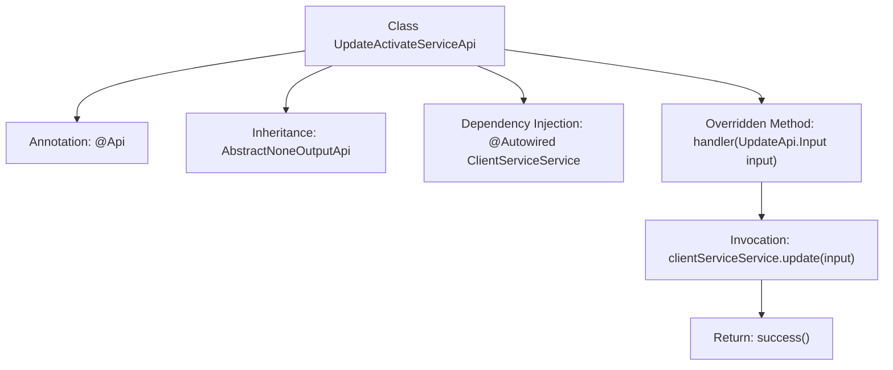

# Basic Information

|      |      |
|------|------|
| Name | UpdateActivateServiceApi |
| Language | .java |
| Code Path | WeFe/serving/serving-service/src/main/java/com/welab/wefe/serving/service/api/clientservice/UpdateActivateServiceApi.java |
| Package Name | com.welab.wefe.serving.service.api.clientservice |
| Dependencies | ['org.springframework.beans.factory.annotation.Autowired', 'com.welab.wefe.common.exception.StatusCodeWithException', 'com.welab.wefe.common.web.api.base.AbstractNoneOutputApi', 'com.welab.wefe.common.web.api.base.Api', 'com.welab.wefe.common.web.dto.ApiResult', 'com.welab.wefe.serving.service.service.ClientServiceService'] |
| Brief Description | This is an API class for updating the client service model, with the path "clientservice/update_activate". It inherits from an abstract API class with no output, processes update requests through the ClientServiceService, and returns a successful result. |

# Description

This is a Java class named UpdateActivateServiceApi, used for updating the activation status of a client service model. It extends the AbstractNoneOutputApi class with a generic parameter of UpdateApi.Input. The class is annotated with @Api, specifying the path as "clientservice/update_activate" and the name as "update client service model". The ClientServiceService instance is automatically injected via @Autowired. It overrides the handler method, which takes UpdateApi.Input as an input parameter, invokes the update method of clientServiceService to process the input, and finally returns a successful ApiResult. The entire class implements an API with no output functionality, designed for updating client service status.

# Class Summary

| Name   | Type  | Description |
|-------|------|-------------|
| UpdateActivateServiceApi | class | This is an API class for updating the activation status of a client service, with the path "clientservice/update_activate". It processes the input through the ClientServiceService and returns a successful result. |


## Class UpdateActivateServiceApi

|      |      |
|------|------|
| Access Modifier | @Api(path = "clientservice/update_activate", name = "update client service model");public |
| Type | class |
| Name | UpdateActivateServiceApi |
| Description | This is an API class for updating the activation status of a client service, with the path "clientservice/update_activate". It processes the input through the ClientServiceService and returns a successful result. |


### UML Class Diagram

```mermaid
classDiagram
    class UpdateActivateServiceApi {
        -ClientServiceService clientServiceService
        +handler(UpdateApi$Input input) ApiResult<?>
    }
    class AbstractNoneOutputApi~T~ {
        <<Abstract>>
        +handler(T input) ApiResult<?>
    }
    class ClientServiceService {
        +update(UpdateApi$Input input)
    }
    class UpdateApi$Input {
        // Input parameter class
    }
    class ApiResult~T~ {
        // Generic return result
    }

    UpdateActivateServiceApi --|> AbstractNoneOutputApi~UpdateApi$Input~ : Inheritance
    UpdateActivateServiceApi --> ClientServiceService : Invokes update method
    AbstractNoneOutputApi~T~ ..> ApiResult~T~ : Result dependency
    ClientServiceService ..> UpdateApi$Input : Method parameter dependency
```

This class diagram illustrates UpdateActivateServiceApi as an implementation of AbstractNoneOutputApi, which utilizes ClientServiceService via dependency injection to perform update operations. The API accepts UpdateApi.Input parameters and returns ApiResult, demonstrating a typical controller-service interaction pattern in Spring Boot. The abstract base class constrains input types through generics, while subclasses implement specific business logic processing.


### Internal Method Call Graph



This flowchart illustrates the structure and workflow of the UpdateActivateServiceApi class. The class defines an API path via the @Api annotation, inherits from an abstract parent class, and injects the ClientServiceService dependency. The core logic resides in the handler method, which first invokes the service layer to update data and finally returns a success result. The arrows clearly mark the complete call chain from class definition to method execution, with hierarchical relationships accurately reflecting the actual code structure.

### Field List

| Name  | Type  | Description |
|-------|-------|------|
| clientServiceService | ClientServiceService | Using @Autowired to automatically inject an instance of ClientServiceService. |

### Method List

| Name  | Type  | Description |
|-------|-------|------|
| handler | ApiResult<?> | Java method override, calling clientServiceService.update to process the input, returns ApiResult upon success. Throws StatusCodeWithException in case of exceptions. |


