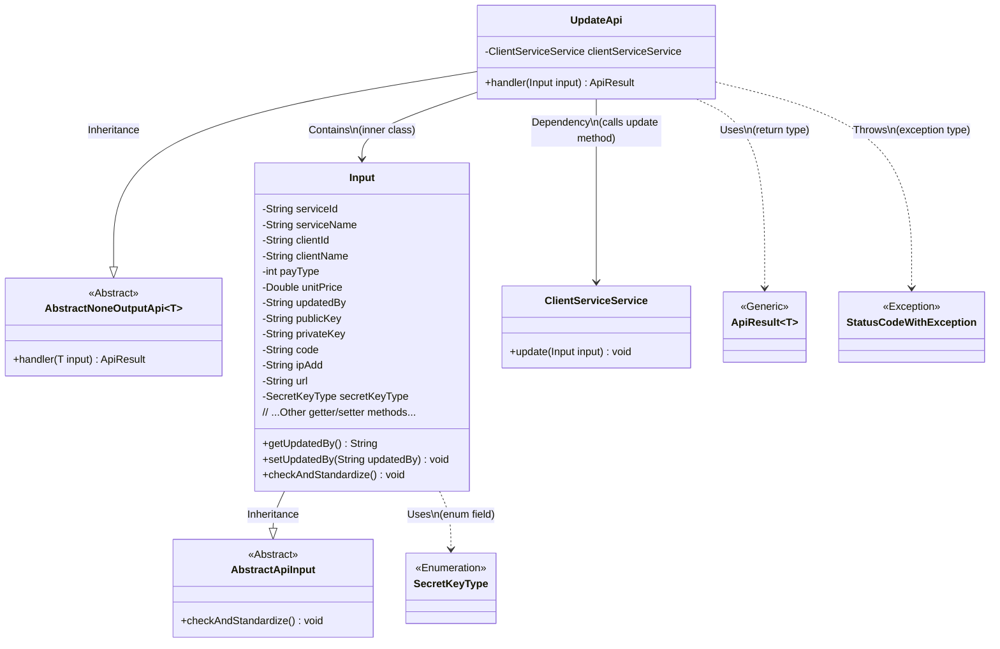

# Basic Information

|      |      |
|------|------|
| Name | UpdateApi |
| Language | .java |
| Code Path | WeFe/serving/serving-service/src/main/java/com/welab/wefe/serving/service/api/clientservice/UpdateApi.java |
| Package Name | com.welab.wefe.serving.service.api.clientservice |
| Dependencies | ['com.welab.wefe.common.constant.SecretKeyType', 'org.springframework.beans.factory.annotation.Autowired', 'com.welab.wefe.common.exception.StatusCodeWithException', 'com.welab.wefe.common.fieldvalidate.annotation.Check', 'com.welab.wefe.common.web.api.base.AbstractNoneOutputApi', 'com.welab.wefe.common.web.api.base.Api', 'com.welab.wefe.common.web.dto.AbstractApiInput', 'com.welab.wefe.common.web.dto.ApiResult', 'com.welab.wefe.serving.service.service.ClientServiceService'] |
| Brief Description | The UpdateApi class is used to update customer service information, including mandatory fields such as service ID, customer ID, payment type, and price, as well as optional fields like public key and IP whitelist. The update operation is performed via the ClientServiceService. |

# Description

UpdateApi is an API class for updating client services, inheriting from AbstractNoneOutputApi, with the path "clientservice/update". It processes update operations through ClientServiceService. The input parameter Input includes fields such as service ID, name, client ID, name, payment type, unit price, updater, public key, private key, caller code, IP whitelist, service address, and public/private key type, where the service ID and client ID are mandatory. All fields have corresponding getter and setter methods and undergo validation and standardization processing.

# Class Summary

| Name   | Type  | Description |
|-------|------|-------------|
| UpdateApi | class | Update the customer service API interface, including required fields such as service ID, customer ID, payment type, price, and key, and invoke the ClientServiceService to perform the update operation. |

## Class UpdateApi

|      |      |
|------|------|
| Access Modifier | @Api(path = "clientservice/update", name = "update client service");public |
| Type | class |
| Name | UpdateApi |
| Description | Update the customer service API interface, including required fields such as service ID, customer ID, payment type, price, and key, and invoke the ClientServiceService to perform the update operation. |

### UML Class Diagram

This code demonstrates the implementation structure of a client service update API. UpdateApi inherits from AbstractNoneOutputApi, uses the inner class Input as a parameter type, and executes business logic through ClientServiceService. The Input class contains multiple fields with validation annotations, inherits from AbstractApiInput, and implements parameter standardization checks. The class diagram clearly illustrates inheritance, containment, and dependency relationships between classes, as well as the usage of generic classes and enumeration types. The overall design reflects a layered architecture approach, separating input validation from business logic.

### Internal Method Call Graph

```mermaid
graph TD
    A["Class UpdateApi"]
    B["Inheritance: AbstractNoneOutputApi<Input>"]
    C["Annotation: @Api"]
    D["Dependency Injection: @Autowired ClientServiceService"]
    E["Overridden Method: handler(Input input)"]
    F["Static Inner Class: Input"]
    G["Inheritance: AbstractApiInput"]
    H["Attributes: 13 @Check annotated fields"]
    I["Method: checkAndStandardize()"]
    J["Method: Field getters/setters"]

    A --> B
    A --> C
    A --> D
    A --> E
    A --> F
    F --> G
    F --> H
    F --> I
    F --> J
    E --> D
    E --> F
```

This code describes a Spring framework-based API update service class UpdateApi, which inherits from an abstract base class and implements request handling logic with input parameters. The flowchart illustrates class inheritance relationships, dependency injection, core processing methods, and the nested Input data class structure. The Input class contains 13 validation-annotated fields and provides standardized data validation methods along with complete accessor methods. The overall design implements client service update functionality, where the handler method invokes ClientServiceService to complete business processing.

### Field List

| Name  | Type  | Description |
|-------|-------|------|
| clientServiceService | ClientServiceService | Using @Autowired to automatically inject an instance of ClientServiceService. |

### Method List

| Name  | Type  | Description |
|-------|-------|------|
| handler | ApiResult<?> | Java method override, invokes clientServiceService.update to process the input, returns ApiResult upon success. Throws StatusCodeWithException in case of exceptions. |

