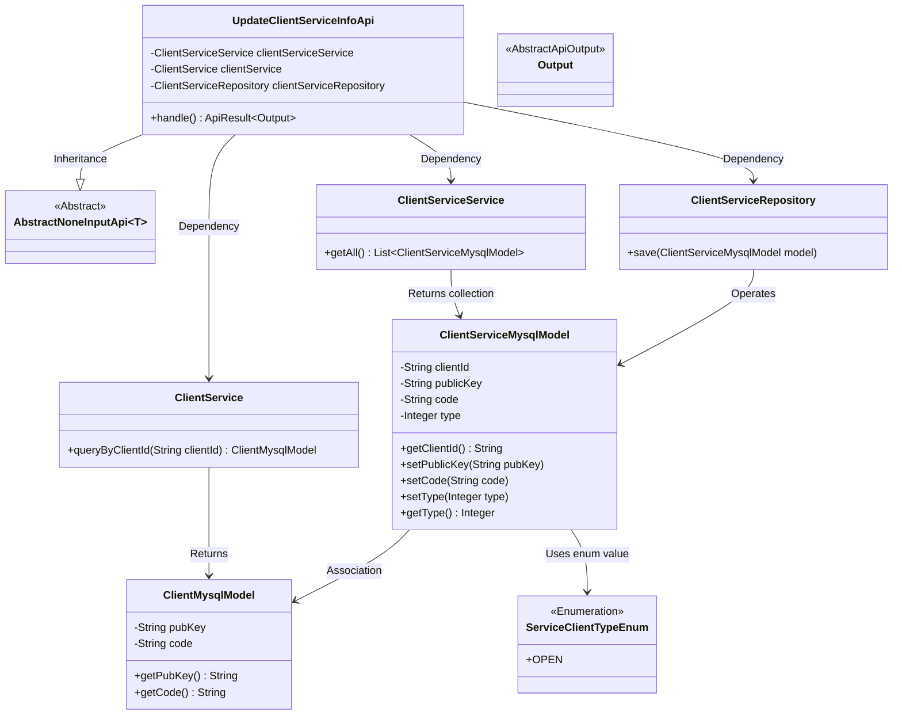
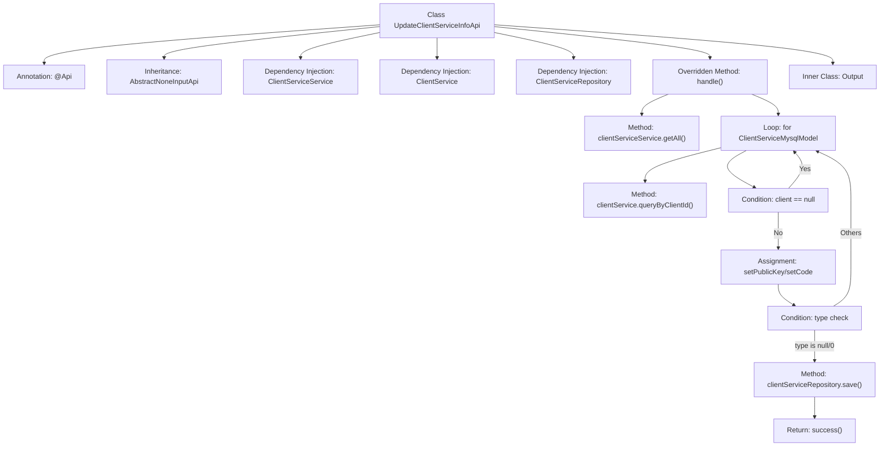

# Basic Information

|      |      |
|------|------|
| Name | UpdateClientServiceInfoApi |
| Language | .java |
| Code Path | WeFe/serving/serving-service/src/main/java/com/welab/wefe/serving/service/api/clientservice/UpdateClientServiceInfoApi.java |
| Package Name | com.welab.wefe.serving.service.api.clientservice |
| Dependencies | ['com.welab.wefe.common.exception.StatusCodeWithException', 'com.welab.wefe.common.web.api.base.AbstractNoneInputApi', 'com.welab.wefe.common.web.api.base.Api', 'com.welab.wefe.common.web.dto.AbstractApiOutput', 'com.welab.wefe.common.web.dto.ApiResult', 'com.welab.wefe.serving.service.database.entity.ClientMysqlModel', 'com.welab.wefe.serving.service.database.entity.ClientServiceMysqlModel', 'com.welab.wefe.serving.service.database.repository.ClientServiceRepository', 'com.welab.wefe.serving.service.enums.ServiceClientTypeEnum', 'com.welab.wefe.serving.service.service.ClientService', 'com.welab.wefe.serving.service.service.ClientServiceService', 'org.springframework.beans.factory.annotation.Autowired', 'java.util.List'] |
| Brief Description | API class for updating client service information, which queries and modifies client data to update service types and key information, then saves it to the database. |

# Description

The code defines an API class named `UpdateClientServiceInfoApi`, which is used to update client service information. It inherits from the `AbstractNoneInputApi` base class, with the output type being the internally defined `Output` class. The API path is `"clientservice/update_client_service_info"`. Its primary function is to iterate through all client service records, query the corresponding client information based on the client ID, and update the public key, code, and service type of the service records. For services with an unset type or a type of 0, their type is set to the `OPEN` enum value. Finally, the updated records are saved via the `Repository`. This API relies on three service components—`ClientServiceService`, `ClientService`, and `ClientServiceRepository`—to implement the business logic.

# Class Summary

| Name   | Type  | Description |
|-------|------|-------------|
| UpdateClientServiceInfoApi | class | This is an API class for updating client service information. It queries and iterates through client service data, updates the public key, encoding, and service type, and finally saves the changes to the database. |

## Class UpdateClientServiceInfoApi

|      |      |
|------|------|
| Access Modifier | @Api(path = "clientservice/update_client_service_info", name = "update client service info");public |
| Type | class |
| Name | UpdateClientServiceInfoApi |
| Description | This is an API class for updating client service information. It queries and iterates through client service data, updates the public key, encoding, and service type, and finally saves the changes to the database. |

### UML Class Diagram

This code describes an API class `UpdateClientServiceInfoApi` for updating client service information, which inherits from the abstract base class `AbstractNoneInputApi`. It accomplishes core business logic through three dependent components (`ClientServiceService`, `ClientService`, `ClientServiceRepository`). The main functionality involves iterating through all client service records, querying associated client information based on client ID, updating the service record's key, code, and service type (using the `ServiceClientTypeEnum` enum value), and finally saving modifications via the repository layer. The design demonstrates clear hierarchical structure and separation of responsibilities, with component collaboration achieved through dependency injection.

### Internal Method Call Graph

This flowchart illustrates the core logic of the UpdateClientServiceInfoApi class. It first retrieves all client service models via clientServiceService, then iterates through each model to query corresponding client information. If the client exists, it updates the public key and code fields, and determines whether to save modifications based on service type (only processing unactivated services). The process demonstrates key steps including dependency injection, loop processing, conditional judgments, and persistence operations, ultimately returning a success result. The inner class Output serves as an API response template but does not participate in the main workflow.

### Field List

| Name  | Type  | Description |
|-------|-------|------|
| clientServiceService | ClientServiceService | Automatically inject the ClientServiceService instance. |
| clientService | ClientService | Automatically inject the ClientService instance |
| clientServiceRepository | ClientServiceRepository | Using @Autowired to automatically inject an instance of ClientServiceRepository. |

### Method List

| Name  | Type  | Description |
|-------|-------|------|
| handle | ApiResult<Output> | Process client service data, update public keys and encoding, set service types, and save. |

