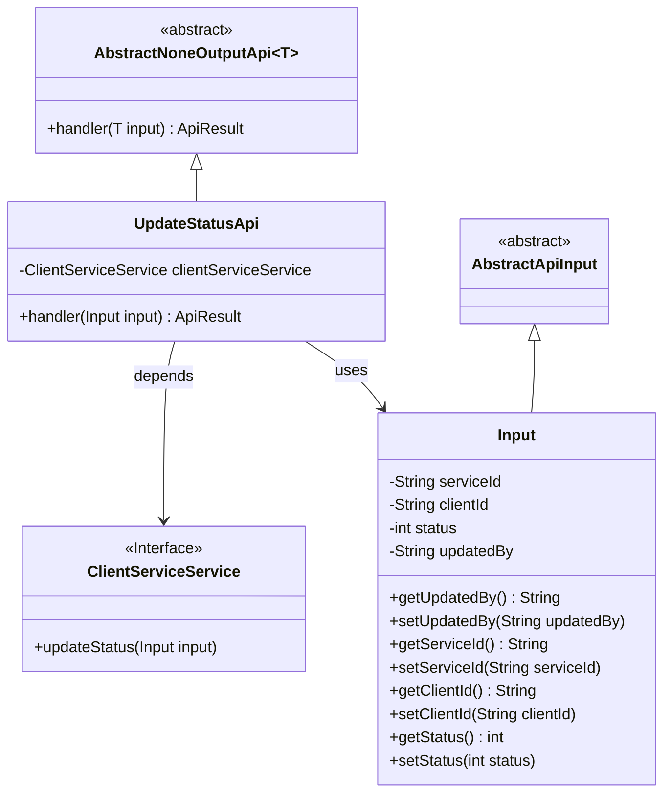

# Basic Information

|      |      |
|------|------|
| Name | UpdateStatusApi |
| Language | .java |
| Code Path | WeFe/serving/serving-service/src/main/java/com/welab/wefe/serving/service/api/clientservice/UpdateStatusApi.java |
| Package Name | com.welab.wefe.serving.service.api.clientservice |
| Dependencies | ['com.welab.wefe.common.exception.StatusCodeWithException', 'com.welab.wefe.common.fieldvalidate.annotation.Check', 'com.welab.wefe.common.web.api.base.AbstractNoneOutputApi', 'com.welab.wefe.common.web.api.base.Api', 'com.welab.wefe.common.web.dto.AbstractApiInput', 'com.welab.wefe.common.web.dto.ApiResult', 'com.welab.wefe.serving.service.service.ClientServiceService', 'org.springframework.beans.factory.annotation.Autowired'] |
| Brief Description | API for updating customer service status, which receives service ID, customer ID, status, and updater parameters, calls the service layer to update the status, and returns a successful result. |

# Description

The code defines an API class named UpdateStatusApi, which is used to update customer service status. The API path is "clientservice/update_status", inheriting from AbstractNoneOutputApi, with the input parameter being the inner class Input. Input includes required fields serviceId and clientId, as well as optional fields status and updatedBy. The processing logic updates the status via clientServiceService and returns an empty result upon success. All input fields are validated through the @Check annotation.

# Class Summary

| Name   | Type  | Description |
|-------|------|-------------|
| UpdateStatusApi | class | API for updating customer service status, which receives service ID, customer ID, status, and updater parameters, calls the service to update the status, and returns a successful result. |

## Class UpdateStatusApi

|      |      |
|------|------|
| Access Modifier | @Api(path = "clientservice/update_status", name = "update client service status");public |
| Type | class |
| Name | UpdateStatusApi |
| Description | API for updating customer service status, which receives service ID, customer ID, status, and updater parameters, calls the service to update the status, and returns a successful result. |

### UML Class Diagram

This code describes an API implementation for updating client service status. UpdateStatusApi inherits from the AbstractNoneOutputApi abstract class, uses Input as the parameter type, and performs the actual status update operation through the ClientServiceService interface. The Input class inherits from AbstractApiInput and contains fields such as service ID, client ID, status, and updater, along with corresponding getter and setter methods. The API processes input parameters through the handler method, calls the updateStatus method of clientServiceService to complete the status update, and returns a successful result.

### Internal Method Call Graph

```mermaid
graph TD
    A["Class UpdateStatusApi"]
    B["Annotation: @Api(path='clientservice/update_status', name='update client service status')"]
    C["Inheritance: AbstractNoneOutputApi<Input>"]
    D["Dependency Injection: @Autowired ClientServiceService"]
    E["Overridden Method: handler(Input input)"]
    F["Inner Class: Input extends AbstractApiInput"]
    G["Property: @Check String serviceId"]
    H["Property: @Check String clientId"]
    I["Property: @Check int status"]
    J["Property: @Check String updatedBy"]
    K["Getter/Setter Methods"]

    A --> B
    A --> C
    A --> D
    A --> E
    A --> F
    F --> G
    F --> H
    F --> I
    F --> J
    F --> K
```

This code defines an API class UpdateStatusApi for updating client service status, which inherits from the abstract class AbstractNoneOutputApi and implements the handler method. It includes an inner class Input to encapsulate input parameters annotated with validation @Check. The flowchart illustrates the class structure, inheritance, dependency injection, inner class structure with its properties and methods. The primary functionality is to update service status via clientServiceService.updateStatus() method and return a successful result.

### Field List

| Name  | Type  | Description |
|-------|-------|------|
| clientServiceService | ClientServiceService | Using @Autowired to automatically inject an instance of ClientServiceService. |

### Method List

| Name  | Type  | Description |
|-------|-------|------|
| handler | ApiResult<?> | Method override, call clientServiceService to update the status, and return the result upon success. |

