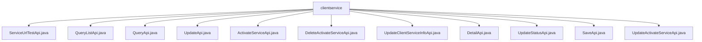

# Basic Information

|      |      |
|------|------|
| Name | clientservice |
| Language | .java |
| Code Path | WeFe/serving/serving-service/src/main/java/com/welab/wefe/serving/service/api/clientservice |
| Package Name | docs.serving.serving-service.src.main.java.com.welab.wefe.serving.service.api.clientservice |
| Brief Description | ServiceUrlTestApi test URL; QueryListApi query service list; QueryApi query service details; UpdateApi update service; ActivateServiceApi activate service; DeleteActivateServiceApi delete activation; UpdateClientServiceInfoApi update service information; DetailApi get details; UpdateStatusApi update status; SaveApi save service; UpdateActivateServiceApi update activation status. |

# Description

## Overview  
The core responsibility of this module is to provide a complete API collection for client service management, including functionalities such as service testing, querying, updating, and status management, similar to the service management subsystem in a CRM system. The interface specifications uniformly inherit from the AbstractApi base class, adopting the Input-Output pattern, and support paginated queries and status operations. Key data structures include ClientServiceOutputModel (containing fields such as service ID, client information, and payment type) and paginated result sets. External dependencies include the ClientServiceService business service and JPA Repository. For example, ServiceUrlTestApi tests URL availability, while QueryListApi supports multi-condition paginated queries.

## Main Business Scenarios  
The primary business processes cover the full lifecycle management of services: creation (SaveApi), querying (DetailApi/QueryApi), updating (UpdateApi), status changes (UpdateStatusApi), and deletion (DeleteActivateServiceApi). The interaction mode follows the RESTful style, such as using POST requests to trigger status changes and GET to retrieve paginated data. Typical applications include client service activation (ActivateServiceApi) and public-private key updates (UpdateClientServiceInfoApi). API types include CRUD operations and state machine-driven interfaces, such as UpdateActivateServiceApi, which drives service flow through status enumeration.

### Package Internal Structure View

This flowchart illustrates the API file structure under the clientservice directory in the serving-service project. The root node is the clientservice folder, which contains 11 specific API implementation classes, covering functionalities such as service URL testing, querying, updating, activating services, deleting activated services, updating client service information, detail retrieval, status updating, saving, and updating activated services.

# File List

| Name   | Type  | Description |
|-------|------|-------------|
| [ServiceUrlTestApi.java](ServiceUrlTestApi.md) | file | The `ServiceUrlTestApi` class is used to test service URLs. It takes a URL as input, outputs the status code, and handles exceptions by returning error messages. |
| [QueryListApi.java](QueryListApi.md) | file | QueryListApi is an interface for querying customer service lists. The input includes service name, customer name, status, and type, while the output contains service details such as ID, name, status, IP, etc. |
| [QueryApi.java](QueryApi.md) | file | The QueryApi class handles client service queries by invoking the clientServiceService.queryOne method with an ID input and returns a ClientServiceOutputModel result. |
| [UpdateApi.java](UpdateApi.md) | file | The UpdateApi class is used to update customer service information, including required fields such as service ID, customer ID, payment type, and price, as well as optional fields like public key and IP whitelist. The update operation is performed through the ClientServiceService. |
| [ActivateServiceApi.java](ActivateServiceApi.md) | file | This is an API class for activating client services, with the path "clientservice/activate". It processes the input by calling the `add` method of `ClientServiceService` and returns a successful result. |
| [DeleteActivateServiceApi.java](DeleteActivateServiceApi.md) | file | This is an API class for deleting activated client services, with the path "clientservice/delete_activate". It calls the deleteActivate method of ClientServiceService to process the input and return a successful result. |
| [UpdateClientServiceInfoApi.java](UpdateClientServiceInfoApi.md) | file | API class for updating client service information, which queries and modifies client data to update service types and key information, and finally saves it to the database. |
| [DetailApi.java](DetailApi.md) | file | The DetailApi class is used to retrieve customer service details. It requires the clientId and serviceId parameters and returns the result by calling the clientServiceService.detail method. |
| [UpdateStatusApi.java](UpdateStatusApi.md) | file | API for updating customer service status, which receives parameters including service ID, customer ID, status, and updater, invokes the service layer to update the status, and returns a successful result. |
| [SaveApi.java](SaveApi.md) | file | The SaveApi class is used to save client service models, including input parameter validation and processing logic. Its main fields include service ID, client ID, public/private keys, price, etc. It ensures the unit price is non-negative before calling the service to save data. |
| [UpdateActivateServiceApi.java](UpdateActivateServiceApi.md) | file | This is an API class for updating the client service model, with the path "clientservice/update_activate". It inherits from an abstract API class with no output, processes update requests through the ClientServiceService, and returns a successful result. |

