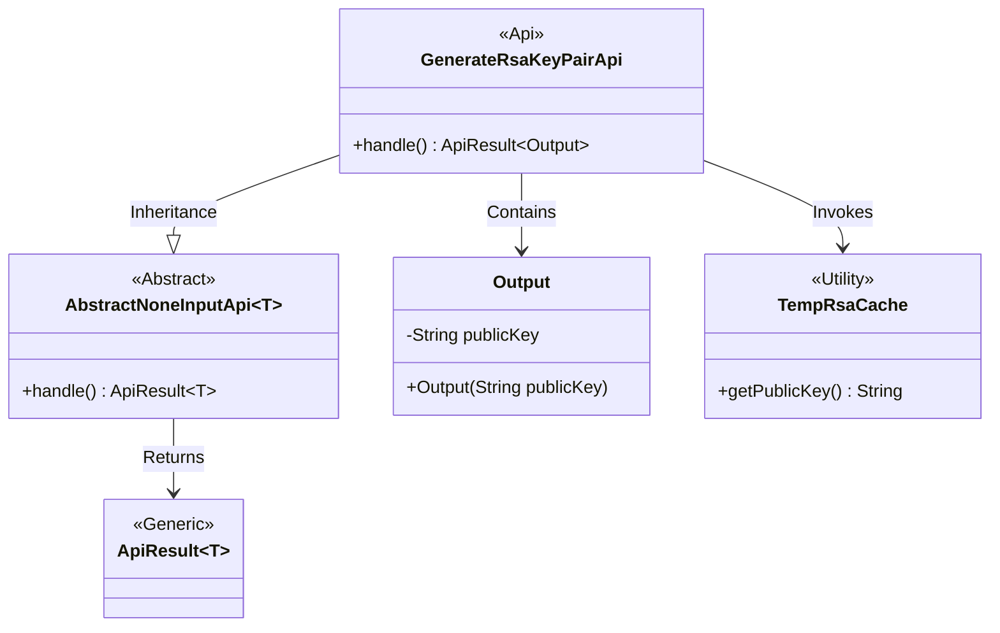
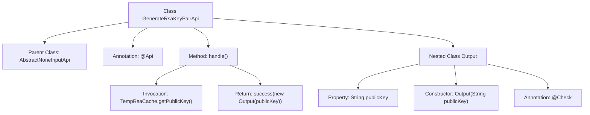

# Basic Information

|      |      |
|------|------|
| Name | GenerateRsaKeyPairApi |
| Language | .java |
| Code Path | WeFe/serving/serving-service/src/main/java/com/welab/wefe/serving/service/api/crypto/GenerateRsaKeyPairApi.java |
| Package Name | com.welab.wefe.serving.service.api.crypto |
| Dependencies | ['com.welab.wefe.common.exception.StatusCodeWithException', 'com.welab.wefe.common.fieldvalidate.annotation.Check', 'com.welab.wefe.common.web.TempRsaCache', 'com.welab.wefe.common.web.api.base.AbstractNoneInputApi', 'com.welab.wefe.common.web.api.base.Api', 'com.welab.wefe.common.web.dto.ApiResult'] |
| Brief Description | API for generating RSA key pairs, returns the public key for encrypted data transmission. |

# Description

The code defines an API class named GenerateRsaKeyPairApi, which is used to generate an RSA key pair and return the public key. The API path is crypto/generate_rsa_key_pair, and its function is to create a new RSA key pair and retrieve the public key. The processing logic obtains the public key through TempRsaCache and encapsulates it in the Output class for return. The Output class includes a publicKey field, labeled as the RSA public key, which is used for encrypting data transmission. The entire API inherits from AbstractNoneInputApi, does not accept input parameters, and directly returns a result containing the public key.

# Class Summary

| Name   | Type  | Description |
|-------|------|-------------|
| GenerateRsaKeyPairApi | class | Generate RSA key pair API, returning the public key for encrypted data transmission. The processing logic involves retrieving the public key from cache and encapsulating it for output. The output class includes a public key field and verification description. |

## Class GenerateRsaKeyPairApi

|      |      |
|------|------|
| Access Modifier | @Api(path = "crypto/generate_rsa_key_pair", name = "创建一对新的 Rsa 密钥，并得到其中的公钥。");public |
| Type | class |
| Name | GenerateRsaKeyPairApi |
| Description | Generate RSA key pair API, returning the public key for encrypted data transmission. The processing logic involves retrieving the public key from cache and encapsulating it for output. The output class includes a public key field and verification description. |

### UML Class Diagram

This class diagram illustrates the structural relationships of an RSA key pair generation API. The GenerateRsaKeyPairApi inherits from the generic abstract class AbstractNoneInputApi, specifying its output type as the inner class Output. The API retrieves the public key by invoking the TempRsaCache utility class, ultimately returning an ApiResult wrapped object containing the public key string. The Output class serves as a data transfer object, storing the RSA public key for encrypted transmission. The overall design demonstrates clear hierarchical structure and separation of responsibilities, aligning with common implementation patterns for API interfaces.

### Internal Method Call Graph

This flowchart illustrates the structure of the GenerateRsaKeyPairApi class and its key components. The class inherits from AbstractNoneInputApi and includes a handle method for processing requests, which retrieves the public key via TempRsaCache and returns an Output object containing the public key. As a nested class, Output features a publicKey property and constructor, annotated with @Check for parameter validation. The entire process clearly presents the complete path from API invocation to result return.

### Field List

| Name  | Type  | Description |
|-------|-------|------|

### Method List

| Name  | Type  | Description |
|-------|-------|------|
| handle | ApiResult<Output> | Method override, obtain temporary RSA public key and return success result. |

