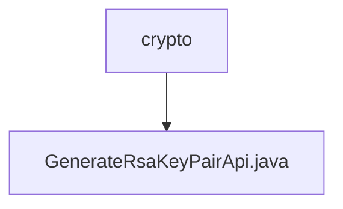

# Basic Information

|      |      |
|------|------|
| Name | crypto |
| Language | .java |
| Code Path | WeFe/serving/serving-service/src/main/java/com/welab/wefe/serving/service/api/crypto |
| Package Name | docs.serving.serving-service.src.main.java.com.welab.wefe.serving.service.api.crypto |
| Brief Description | API for generating RSA key pairs, returning the public key for encrypted data transmission. |

# Description

The code defines an API class named `GenerateRsaKeyPairApi`, which is used to generate an RSA key pair and return the public key. The API path is `crypto/generate_rsa_key_pair`, and its functionality involves creating a new RSA key pair and retrieving the public key. The processing logic obtains the public key via `TempRsaCache` and encapsulates it in an `Output` class for return. The `Output` class contains a `publicKey` field, labeled as an RSA public key, which is used for encrypting data transmission. The entire API inherits from `AbstractNoneInputApi`, requiring no input parameters and directly returning a result containing the public key.

### Package Internal Structure View

This flowchart illustrates the simplified structure of the encryption module in the WeFe project, where the crypto folder contains a file named GenerateRsaKeyPairApi.java. This structure clearly reflects the single-file implementation approach for RSA key pair generation functionality, serving as a foundational component of the service-layer encryption features.

# File List

| Name   | Type  | Description |
|-------|------|-------------|
| [GenerateRsaKeyPairApi.java](GenerateRsaKeyPairApi.md) | file | Generate an RSA key pair API, returning the public key for encrypted data transmission. |

