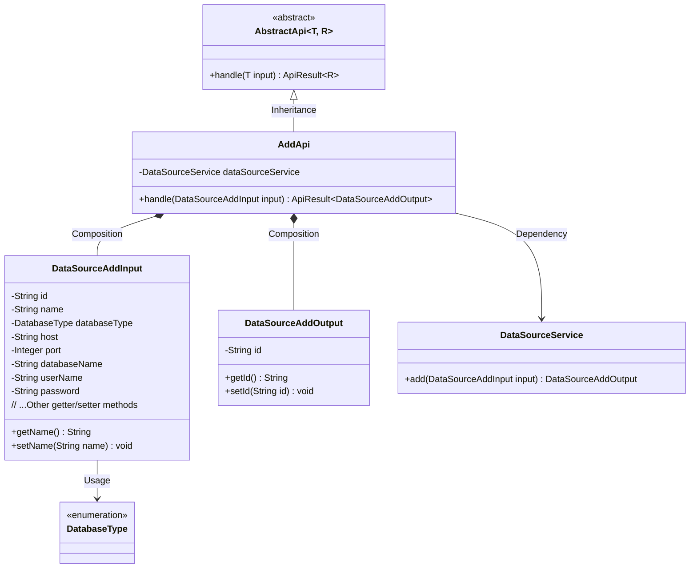
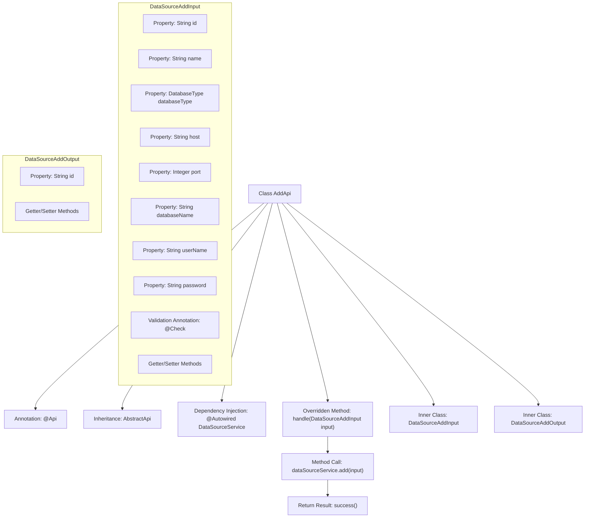

# Basic Information

|      |      |
|------|------|
| Name | AddApi |
| Language | .java |
| Code Path | WeFe/serving/serving-service/src/main/java/com/welab/wefe/serving/service/api/datasource/AddApi.java |
| Package Name | com.welab.wefe.serving.service.api.datasource |
| Dependencies | ['com.welab.wefe.common.exception.StatusCodeWithException', 'com.welab.wefe.common.fieldvalidate.annotation.Check', 'com.welab.wefe.common.jdbc.base.DatabaseType', 'com.welab.wefe.common.web.api.base.AbstractApi', 'com.welab.wefe.common.web.api.base.Api', 'com.welab.wefe.common.web.dto.AbstractApiInput', 'com.welab.wefe.common.web.dto.AbstractApiOutput', 'com.welab.wefe.common.web.dto.ApiResult', 'com.welab.wefe.serving.service.service.DataSourceService', 'org.springframework.beans.factory.annotation.Autowired'] |
| Brief Description | Added a new data source API class to handle input parameters such as name, type, host, port, etc., invoking the service to add a data source and returning the ID. Input parameters require validation, with the name length between 4-30. |

# Description

The code defines an API class named `AddApi`, which is used to add a new data source. The API path is `data_source/add`, accepting the `DataSourceAddInput` as the input parameter and returning the `DataSourceAddOutput` as the output result. The input parameters include mandatory fields such as the data source name, database type, IP address, port, database name, username, and password, where the name must adhere to a length constraint of 4-30 characters. The output parameter contains the generated ID. The `DataSourceService` processes the addition request and returns the operation result.

# Class Summary

| Name   | Type  | Description |
|-------|------|-------------|
| AddApi | class | Added a new data source API class to handle data source addition requests. The input includes required fields such as ID, name, database type, host, port, database name, username, and password. The output returns the generated ID. The addition logic is implemented through the DataSourceService. |

## Class AddApi

|      |      |
|------|------|
| Access Modifier | @Api(path = "data_source/add", name = "新增数据源");public |
| Type | class |
| Name | AddApi |
| Description | Added a new data source API class to handle data source addition requests. The input includes required fields such as ID, name, database type, host, port, database name, username, and password. The output returns the generated ID. The addition logic is implemented through the DataSourceService. |

### UML Class Diagram

This code demonstrates an API implementation for adding data sources, adopting a layered architecture design. The AddApi inherits from the generic abstract class AbstractApi, processes DataSourceAddInput and returns DataSourceAddOutput. The input class contains various data source parameters and validation annotations, while the output class simply encapsulates the generated ID. The core business logic is handled through the dependency-injected DataSourceService, reflecting a clear separation of responsibilities and type-safe design philosophy.

### Internal Method Call Graph

This code demonstrates an API class AddApi for adding data sources, which inherits from the abstract class AbstractApi and implements the core processing method handle. The API includes two nested static classes: DataSourceAddInput defines the input parameter structure with multiple validation annotations, while DataSourceAddOutput defines a simple output structure. The flowchart clearly presents the class inheritance relationship, dependency injection, method call chain, and the attribute structure of inner classes, fully reflecting the data processing flow from input to output.

### Field List

| Name  | Type  | Description |
|-------|-------|------|
| dataSourceService | DataSourceService | Using @Autowired to automatically inject a DataSourceService instance. |

### Method List

| Name  | Type  | Description |
|-------|-------|------|
| handle | ApiResult<DataSourceAddOutput> | Java method overriding, handling data source addition requests, calling service layer methods and returning results. |

