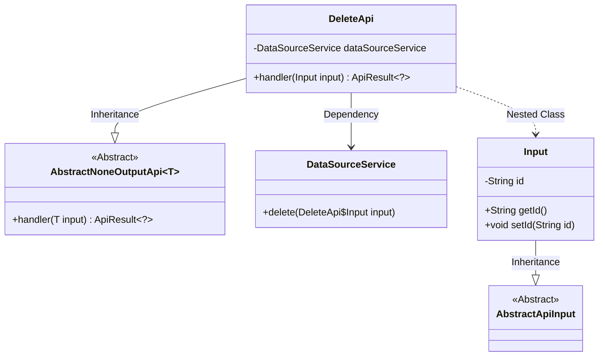
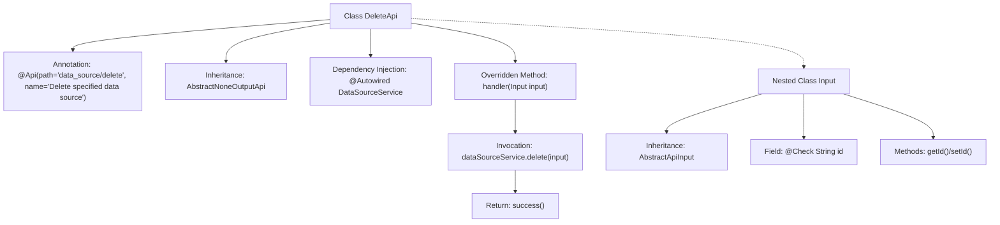

# Basic Information

|      |      |
|------|------|
| Name | DeleteApi |
| Language | .java |
| Code Path | WeFe/serving/serving-service/src/main/java/com/welab/wefe/serving/service/api/datasource/DeleteApi.java |
| Package Name | com.welab.wefe.serving.service.api.datasource |
| Dependencies | ['org.springframework.beans.factory.annotation.Autowired', 'com.welab.wefe.common.exception.StatusCodeWithException', 'com.welab.wefe.common.fieldvalidate.annotation.Check', 'com.welab.wefe.common.web.api.base.AbstractNoneOutputApi', 'com.welab.wefe.common.web.api.base.Api', 'com.welab.wefe.common.web.dto.AbstractApiInput', 'com.welab.wefe.common.web.dto.ApiResult', 'com.welab.wefe.serving.service.service.DataSourceService'] |
| Brief Description | Delete Data Source API requires passing the data source ID and invoking the DataSourceService to perform the deletion operation, with no return data. |

# Description

The code defines an API class named `DeleteApi`, designed to delete a specified data source. This class inherits from `AbstractNoneOutputApi`, with the generic parameter being the inner class `Input`. The API path is `"data_source/delete"`, and its name is `"Delete Specified Data Source"`. The `DataSourceService` is injected via the `Autowired` annotation. The `handler` method processes input parameters, invokes the `delete` method of `dataSourceService` to perform the deletion, and returns a success result. The inner class `Input` extends `AbstractApiInput` and includes a mandatory field `id` to identify the data source to be deleted, along with getter and setter methods. The entire API implements the core functionality of deleting a data source.

# Class Summary

| Name   | Type  | Description |
|-------|------|-------------|
| DeleteApi | class | Delete Data Source API requires passing the data source ID and invoking the DataSourceService to perform the deletion operation, with no return data. |

## Class DeleteApi

|      |      |
|------|------|
| Access Modifier | @Api(path = "data_source/delete", name = "删除指定数据源");public |
| Type | class |
| Name | DeleteApi |
| Description | Delete Data Source API requires passing the data source ID and invoking the DataSourceService to perform the deletion operation, with no return data. |

### UML Class Diagram

Class Diagram Description: This diagram illustrates that the DeleteApi class inherits from the generic class AbstractNoneOutputApi<Input> and depends on DataSourceService for data source deletion operations. Input, as a nested class of DeleteApi, inherits from AbstractApiInput and contains the id attribute along with corresponding getter/setter methods. The overall structure reflects a typical layered design pattern for API handler classes.

### Internal Method Call Graph

This code demonstrates a Spring-style API controller class DeleteApi for deleting data sources. The flowchart clearly presents the class structure: the top section shows the main class definition and annotations, the middle section illustrates the core business logic where the handler method invokes the service-layer delete operation, and the bottom section nests the validation logic of the input parameter class Input. The arrows accurately reflect class inheritance, method invocations, and attribute associations, highlighting the complete workflow from API entry point to data deletion.

### Field List

| Name  | Type  | Description |
|-------|-------|------|
| dataSourceService | DataSourceService | Automatically inject the DataSourceService instance. |

### Method List

| Name  | Type  | Description |
|-------|-------|------|
| handler | ApiResult<?> | The override method processes the input, invokes the data source service's delete operation, and returns the result upon success. |

