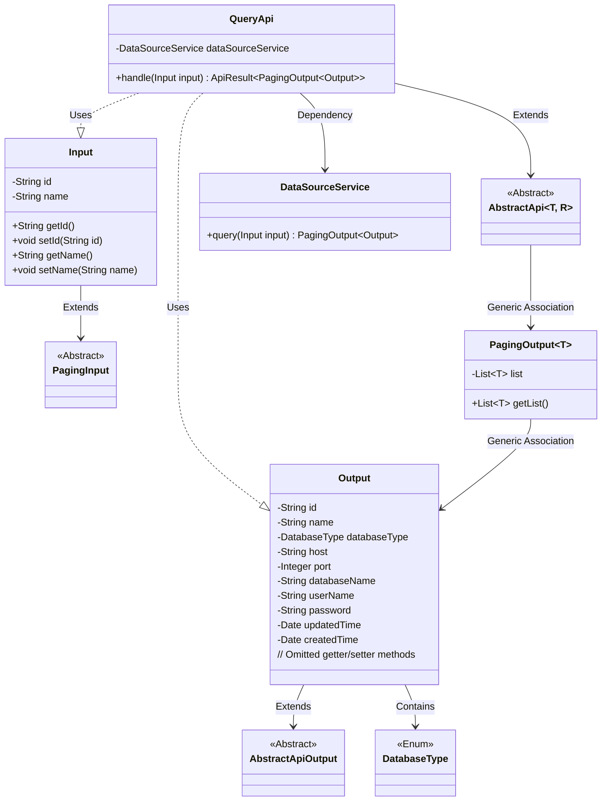

# Basic Information

|      |      |
|------|------|
| Name | QueryApi |
| Language | .java |
| Code Path | WeFe/serving/serving-service/src/main/java/com/welab/wefe/serving/service/api/datasource/QueryApi.java |
| Package Name | com.welab.wefe.serving.service.api.datasource |
| Dependencies | ['com.welab.wefe.common.exception.StatusCodeWithException', 'com.welab.wefe.common.fieldvalidate.annotation.Check', 'com.welab.wefe.common.jdbc.base.DatabaseType', 'com.welab.wefe.common.web.api.base.AbstractApi', 'com.welab.wefe.common.web.api.base.Api', 'com.welab.wefe.common.web.dto.AbstractApiOutput', 'com.welab.wefe.common.web.dto.ApiResult', 'com.welab.wefe.serving.service.database.entity.DataSourceMySqlModel', 'com.welab.wefe.serving.service.dto.PagingInput', 'com.welab.wefe.serving.service.dto.PagingOutput', 'com.welab.wefe.serving.service.service.DataSourceService', 'org.springframework.beans.factory.annotation.Autowired', 'java.util.Date'] |
| Brief Description | Query the data source API, which accepts ID and name parameters, and returns a paginated list of data sources with password fields desensitized. |

# Description

The code defines an API class named QueryApi, which is used to query data source information. The API path is data_source/query, inheriting from AbstractApi, with Input as the input class and a paginated Output class as the output. The Input class includes two query parameters: data source ID and name. The Output class contains detailed information about the data source, such as ID, name, database type, host, port, database name, username, password (masked when returned), as well as creation and update times. In the processing logic, it calls the query method of DataSourceService to obtain the results, masks the password field, and then returns them.

# Class Summary

| Name   | Type  | Description |
|-------|------|-------------|
| QueryApi | class | API class for querying data sources, which accepts ID and name as input and returns a paginated list of data sources containing ID, name, type, connection information, etc. The password field will be masked. |

## Class QueryApi

|      |      |
|------|------|
| Access Modifier | @Api(path = "data_source/query", name = "查询数据源");public |
| Type | class |
| Name | QueryApi |
| Description | API class for querying data sources, which accepts ID and name as input and returns a paginated list of data sources containing ID, name, type, connection information, etc. The password field will be masked. |

### UML Class Diagram

This code describes a data source query API class `QueryApi`, which inherits from the generic abstract class `AbstractApi` to handle paginated query requests. The class diagram illustrates the relationship between `QueryApi` and its internal classes `Input` (inheriting `PagingInput`) and `Output` (inheriting `AbstractApiOutput`), as well as the core query process via `DataSourceService`. The `Output` class contains detailed database connection information, with the password field being specially processed. The overall structure reflects layered design and generic application, supporting paginated query functionality.

### Internal Method Call Graph

```mermaid
graph TD
    A["Class QueryApi"]
    B["Annotation: @Api(path='data_source/query', name='Query Data Source')"]
    C["Inheritance: AbstractApi<Input, PagingOutput<Output>>"]
    D["Dependency Injection: @Autowired DataSourceService"]
    E["Overridden Method: handle(Input input)"]
    F["Inner Class: Input extends PagingInput"]
    G["Inner Class: Output extends AbstractApiOutput"]
    H["Input Properties: String id, String name"]
    I["Output Properties: id, name, databaseType, etc. (12 fields)"]
    J["Method Invocation: dataSourceService.query(input)"]
    K["Data Processing: result.getList().forEach(...)"]
    L["Return Result: success(result)"]

    A --> B
    A --> C
    A --> D
    A --> E
    A --> F
    A --> G
    F --> H
    G --> I
    E --> J
    J --> K
    K --> L
```

This flowchart illustrates the complete structure of the QueryApi class, including class annotations, inheritance relationships, dependency injection, core processing methods, and the structure of two inner classes. The handle method executes a query via DataSourceService, performs password desensitization on the results, and finally returns paginated results. The Input class contains pagination query parameters, while the Output class encapsulates detailed data source information with 12 fields of different types. The entire process demonstrates the complete chain from request handling to result return.

### Field List

| Name  | Type  | Description |
|-------|-------|------|
| dataSourceService | DataSourceService | Using @Autowired to automatically inject an instance of DataSourceService. |

### Method List

| Name  | Type  | Description |
|-------|-------|------|
| handle | ApiResult<PagingOutput<Output>> | This method overrides the parent class logic, calls the data source service to query the input parameters, iterates through the result list while masking password fields, and finally returns the paginated result. |

