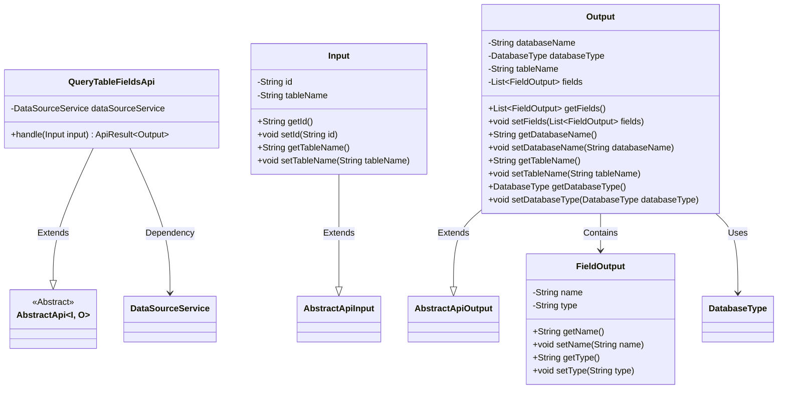
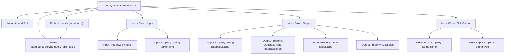

# Basic Information

|      |      |
|------|------|
| Name | QueryTableFieldsApi |
| Language | .java |
| Code Path | WeFe/serving/serving-service/src/main/java/com/welab/wefe/serving/service/api/datasource/QueryTableFieldsApi.java |
| Package Name | com.welab.wefe.serving.service.api.datasource |
| Dependencies | ['com.welab.wefe.common.exception.StatusCodeWithException', 'com.welab.wefe.common.fieldvalidate.annotation.Check', 'com.welab.wefe.common.jdbc.base.DatabaseType', 'com.welab.wefe.common.web.api.base.AbstractApi', 'com.welab.wefe.common.web.api.base.Api', 'com.welab.wefe.common.web.dto.AbstractApiInput', 'com.welab.wefe.common.web.dto.AbstractApiOutput', 'com.welab.wefe.common.web.dto.ApiResult', 'com.welab.wefe.serving.service.service.DataSourceService', 'org.springframework.beans.factory.annotation.Autowired', 'java.util.List'] |
| Brief Description | API for querying data source table fields, with input as data source ID and table name, and output including database name, type, table name, and field list. |

# Description

The code defines an API class named `QueryTableFieldsApi`, which is used to query table field information from a data source. The API path is `data_source/query_table_fields`, and its name is "Query All Tables in Data Source". The input parameters include the data source ID and table name, while the output contains the database name, database type, table name, and a list of fields. Field information includes the field name and type. The query request is processed by `DataSourceService`, and the result is encapsulated in `ApiResult`.

# Class Summary

| Name   | Type  | Description |
|-------|------|-------------|
| QueryTableFieldsApi | class | API for querying data source table fields, with input as data source ID and table name, and output including database name, type, table name, and field list. |

## Class QueryTableFieldsApi

|      |      |
|------|------|
| Access Modifier | @Api(path = "data_source/query_table_fields", name = "查询数据源的所有表");public |
| Type | class |
| Name | QueryTableFieldsApi |
| Description | API for querying data source table fields, with input as data source ID and table name, and output including database name, type, table name, and field list. |

### UML Class Diagram

Class Diagram Description: This diagram illustrates the structure of an API for querying data source table fields. QueryTableFieldsApi extends the generic abstract class AbstractApi, processes Input parameters, and returns Output results. Input includes the data source ID and table name, while Output contains database information, table name, and a list of fields (FieldOutput). FieldOutput stores field names and types. The overall functionality is implemented through DataSourceService, demonstrating clear hierarchical relationships and dependencies.

### Internal Method Call Graph

### Field List

| Name  | Type  | Description |
|-------|-------|------|
| dataSourceService | DataSourceService | Using @Autowired to automatically inject an instance of DataSourceService. |

### Method List

| Name  | Type  | Description |
|-------|-------|------|
| handle | ApiResult<Output> | Rewrite the handle method to call dataSourceService.queryTableFields for processing the input and return a successful result. |

