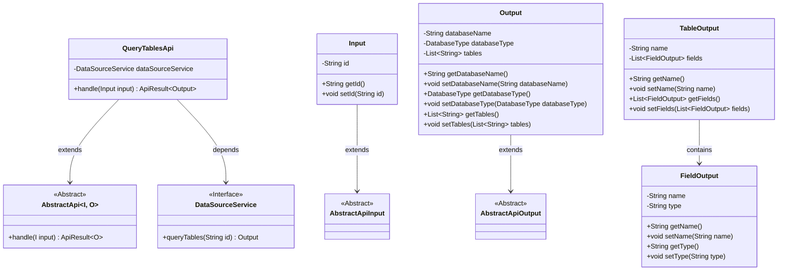

# Basic Information

|      |      |
|------|------|
| Name | QueryTablesApi |
| Language | .java |
| Code Path | WeFe/serving/serving-service/src/main/java/com/welab/wefe/serving/service/api/datasource/QueryTablesApi.java |
| Package Name | com.welab.wefe.serving.service.api.datasource |
| Dependencies | ['com.welab.wefe.common.exception.StatusCodeWithException', 'com.welab.wefe.common.fieldvalidate.annotation.Check', 'com.welab.wefe.common.jdbc.base.DatabaseType', 'com.welab.wefe.common.web.api.base.AbstractApi', 'com.welab.wefe.common.web.api.base.Api', 'com.welab.wefe.common.web.dto.AbstractApiInput', 'com.welab.wefe.common.web.dto.AbstractApiOutput', 'com.welab.wefe.common.web.dto.ApiResult', 'com.welab.wefe.serving.service.service.DataSourceService', 'org.springframework.beans.factory.annotation.Autowired', 'java.util.List'] |
| Brief Description | API for querying all tables in a data source. The input is the data source ID, and the output includes the database name, type, and table list. Table information contains the table name and field list. |

# Description

The code defines an API class named `QueryTablesApi`, which is used to query all table information from a data source. The API path is `"data_source/query_tables"`. The input parameter `Input` includes the data source ID, while the output `Output` contains the database name, database type, and a list of tables. The table information `TableOutput` includes the table name and a list of fields. The field `FieldOutput` consists of the field name and type. The query request is processed by `DataSourceService`, and the result is encapsulated in `ApiResult`.

# Class Summary

| Name   | Type  | Description |
|-------|------|-------------|
| QueryTablesApi | class | This is an API class for querying all tables in a data source, including input parameters (data source ID) and output results (database name, type, and table list). Table information includes table names and field lists. |

## Class QueryTablesApi

|      |      |
|------|------|
| Access Modifier | @Api(path = "data_source/query_tables", name = "查询数据源的所有表");public |
| Type | class |
| Name | QueryTablesApi |
| Description | This is an API class for querying all tables in a data source, including input parameters (data source ID) and output results (database name, type, and table list). Table information includes table names and field lists. |

### UML Class Diagram

This code demonstrates an API implementation for querying data source table structures. QueryTablesApi inherits from the generic abstract class AbstractApi, processes Input and returns Output. The core classes include nested Input and Output structures, where Output is associated with TableOutput and FieldOutput to describe table field structures. DataSourceService serves as an interface providing actual query functionality through dependency injection. The overall design adopts a layered architecture, with base input/output defined via abstract classes and concrete business logic implemented in subclasses.

### Internal Method Call Graph

```mermaid
graph TD
    A["Class QueryTablesApi"]
    B["Annotation: @Api"]
    C["Inheritance: AbstractApi<Input, Output>"]
    D["Dependency Injection: DataSourceService"]
    E["Overridden Method: handle(Input input)"]
    F["Inner Class: Input"]
    G["Inner Class: Output"]
    H["Inner Class: TableOutput"]
    I["Inner Class: FieldOutput"]
    J["Input Property: String id"]
    K["Input Methods: getId/setId"]
    L["Output Properties: databaseName/databaseType/tables"]
    M["Output Methods: getters/setters"]
    N["TableOutput Properties: name/fields"]
    O["TableOutput Methods: getters/setters"]
    P["FieldOutput Properties: name/type"]
    Q["FieldOutput Methods: getters/setters"]

    A --> B
    A --> C
    A --> D
    A --> E
    A --> F
    A --> G
    A --> H
    A --> I
    F --> J
    F --> K
    G --> L
    G --> M
    H --> N
    H --> O
    I --> P
    I --> Q
    E --> D["Invokes dataSourceService.queryTables"]
```

This code defines an API class for querying data source table structures using a layered design pattern. The core is the QueryTablesApi class, which implements standardized interfaces through inheritance from AbstractApi, containing two nested classes for input (Input) and output (Output), along with auxiliary classes for table structures (TableOutput) and fields (FieldOutput). The main workflow involves calling the DataSourceService via the handle method to query data source table information, with the input parameter being the data source ID and the output containing metadata such as database name, type, and table lists. All inner classes implement complete getter/setter methods, complying with JavaBean specifications.

### Field List

| Name  | Type  | Description |
|-------|-------|------|
| dataSourceService | DataSourceService | Automatically inject the DataSourceService instance. |

### Method List

| Name  | Type  | Description |
|-------|-------|------|
| handle | ApiResult<Output> | Java method override, invoking dataSourceService to query table data and return successful results. |

