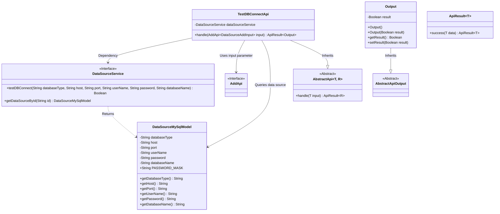
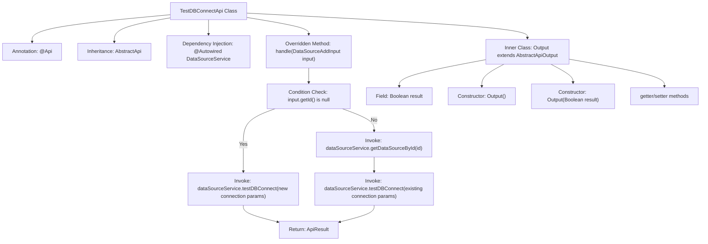

# Basic Information

|      |      |
|------|------|
| Name | TestDBConnectApi |
| Language | .java |
| Code Path | WeFe/serving/serving-service/src/main/java/com/welab/wefe/serving/service/api/datasource/TestDBConnectApi.java |
| Package Name | com.welab.wefe.serving.service.api.datasource |
| Dependencies | ['org.apache.commons.lang3.StringUtils', 'org.springframework.beans.factory.annotation.Autowired', 'com.welab.wefe.common.exception.StatusCodeWithException', 'com.welab.wefe.common.web.api.base.AbstractApi', 'com.welab.wefe.common.web.api.base.Api', 'com.welab.wefe.common.web.dto.AbstractApiOutput', 'com.welab.wefe.common.web.dto.ApiResult', 'com.welab.wefe.serving.service.database.entity.DataSourceMySqlModel', 'com.welab.wefe.serving.service.service.DataSourceService'] |
| Brief Description | Test the database connection API to check the database connection status by inputting parameters or an ID, and return the connection result. |

# Description

This is an API class for testing database connections, with the path "data_source/test_db_connect". It inherits from AbstractApi, processes DataSourceAddInput, and returns an Output containing a boolean result. The primary functionality involves testing database connections via DataSourceService, supporting two approaches: directly using input parameters or retrieving existing data source configurations by ID. When using the ID method, it checks whether the password is masked—if so, the stored password is used. The final Output object contains the connection test result.

# Class Summary

| Name   | Type  | Description |
|-------|------|-------------|
| TestDBConnectApi | class | Test the database connection API to check the database connection status by inputting parameters or an ID, and return the connection result. |

## Class TestDBConnectApi

|      |      |
|------|------|
| Access Modifier | @Api(path = "data_source/test_db_connect", name = "测试数据库是否能正常连接");public |
| Type | class |
| Name | TestDBConnectApi |
| Description | Test the database connection API to check the database connection status by inputting parameters or an ID, and return the connection result. |

### UML Class Diagram

This code describes a database connection testing API class `TestDBConnectApi`, which inherits from the generic abstract class `AbstractApi` and handles two database connection testing scenarios: directly using input parameters or querying existing data source configurations by ID. The class diagram illustrates core dependencies, including interactions with the data source service `DataSourceService`, usage of input parameter type `AddApi.DataSourceAddInput`, and the structure of output result `Output`. The API executes actual database connection tests via `dataSourceService` and returns an `ApiResult` wrapped object containing a boolean result based on different input paths.

### Internal Method Call Graph

This code represents a database connection testing API class, whose primary function is to test whether a database connection is functional using either input parameters or a datasource ID. The flowchart illustrates the class structure, method invocation relationships, and logical flow. When the input parameter ID is null, it directly tests the connection with the input parameters; when an ID exists, it first retrieves the stored datasource information before testing the connection. Ultimately, it returns an ApiResult object containing the test result. The inner class Output encapsulates the boolean test result. The entire process includes key steps such as conditional branching, service invocation, and data encapsulation.

### Field List

| Name  | Type  | Description |
|-------|-------|------|
| dataSourceService | DataSourceService | Using @Autowired to automatically inject a DataSourceService instance. |

### Method List

| Name  | Type  | Description |
|-------|-------|------|
| handle | ApiResult<Output> | Processing the data source connection test request. If the ID is empty, test the connection directly; otherwise, retrieve the data source information before testing the connection. When the password is masked, use the original password. |

