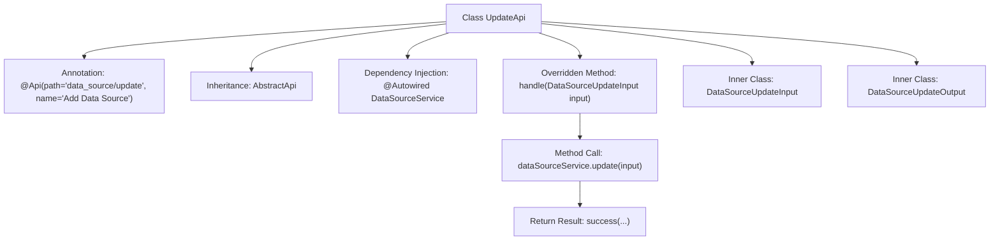

# Basic Information

|      |      |
|------|------|
| Name | UpdateApi |
| Language | .java |
| Code Path | WeFe/serving/serving-service/src/main/java/com/welab/wefe/serving/service/api/datasource/UpdateApi.java |
| Package Name | com.welab.wefe.serving.service.api.datasource |
| Dependencies | ['com.welab.wefe.common.exception.StatusCodeWithException', 'com.welab.wefe.common.fieldvalidate.annotation.Check', 'com.welab.wefe.common.jdbc.base.DatabaseType', 'com.welab.wefe.common.web.api.base.AbstractApi', 'com.welab.wefe.common.web.api.base.Api', 'com.welab.wefe.common.web.dto.AbstractApiInput', 'com.welab.wefe.common.web.dto.AbstractApiOutput', 'com.welab.wefe.common.web.dto.ApiResult', 'com.welab.wefe.serving.service.service.DataSourceService', 'org.springframework.beans.factory.annotation.Autowired'] |
| Brief Description | API class for updating data sources, including input and output parameters. The input requires validation of ID, name, database type, IP, port, database name, username, and password. The output returns the ID. |

# Description

The code defines an API class named `UpdateApi`, which is used to add a data source. It inherits from `AbstractApi`, processes the `DataSourceUpdateInput` input, and returns a `DataSourceUpdateOutput` output. The input parameters include the data source ID, name, database type, host address, port, database name, username, and password, all of which undergo non-null validation. The name must meet a length requirement of 4-30 characters. The output includes the data source ID. The injected `DataSourceService` calls the `update` method to handle the request.

# Class Summary

| Name   | Type  | Description |
|-------|------|-------------|
| UpdateApi | class | The UpdateApi class is used to update data sources, including required fields such as ID, name, database type, host, port, database name, username, and password, and it calls the dataSourceService.update method for processing. |


## Class UpdateApi

|      |      |
|------|------|
| Access Modifier | @Api(path = "data_source/update", name = "新增数据源");public |
| Type | class |
| Name | UpdateApi |
| Description | The UpdateApi class is used to update data sources, including required fields such as ID, name, database type, host, port, database name, username, and password, and it calls the dataSourceService.update method for processing. |


### UML Class Diagram

```mermaid
classDiagram
    class UpdateApi {
        -DataSourceService dataSourceService
        +handle(DataSourceUpdateInput input) ApiResult~DataSourceUpdateOutput~
    }
    <<Interface>> UpdateApi.AbstractApi
    UpdateApi --|> AbstractApi : extends
    UpdateApi --> DataSourceService : depends

    class DataSourceUpdateInput {
        -String id
        -String name
        -DatabaseType databaseType
        -String host
        -Integer port
        -String databaseName
        -String userName
        -String password
        +getId() String
        +setId(String id) void
        // ...other getters/setters omitted
    }
    DataSourceUpdateInput --|> AbstractApiInput : extends

    class DataSourceUpdateOutput {
        -String id
        +getId() String
        +setId(String id) void
    }
    DataSourceUpdateOutput --|> AbstractApiOutput : extends

    class DataSourceService {
        +update(DataSourceUpdateInput input) DataSourceUpdateOutput
    }
```

Class diagram description: This diagram illustrates the structural relationships of UpdateApi and its related classes. UpdateApi extends the generic class AbstractApi, processes DataSourceUpdateInput, and returns ApiResult<DataSourceUpdateOutput>. DataSourceUpdateInput and DataSourceUpdateOutput inherit from AbstractApiInput and AbstractApiOutput respectively, containing fields required for data source updates. UpdateApi relies on DataSourceService to perform data source update operations.


### Internal Method Call Graph



This code demonstrates an API class UpdateApi for updating data sources, which inherits from the abstract base class AbstractApi. The main flow involves receiving input parameters through the handle method, invoking the update method of DataSourceService to perform the update operation, and finally returning a success result. It includes two static inner classes: DataSourceUpdateInput defines the input parameters with validation rules, and DataSourceUpdateOutput defines the output data structure. The entire process reflects a typical API controller pattern, encompassing parameter validation, business processing, and result encapsulation.

### Field List

| Name  | Type  | Description |
|-------|-------|------|
| dataSourceService | DataSourceService | Using @Autowired to automatically inject a DataSourceService instance. |

### Method List

| Name  | Type  | Description |
|-------|-------|------|
| handle | ApiResult<DataSourceUpdateOutput> | This method overrides the parent class logic, invokes the data source service to update the input parameters, and returns a successful result. |


