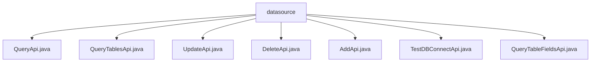

# Basic Information

|      |      |
|------|------|
| Name | datasource |
| Language | .java |
| Code Path | WeFe/serving/serving-service/src/main/java/com/welab/wefe/serving/service/api/datasource |
| Package Name | docs.serving.serving-service.src.main.java.com.welab.wefe.serving.service.api.datasource |
| Brief Description | QueryApi queries data source information, with Input containing ID and name, and Output containing details. QueryTablesApi queries data source table information, with Input containing ID, and Output containing tables and fields. UpdateApi updates a data source, with Input containing ID and other parameters, and Output containing ID. DeleteApi deletes a data source, with Input containing ID. AddApi adds a new data source, with Input containing name and other parameters, and Output containing ID. TestDBConnectApi tests database connection, with Input containing parameters or ID, and Output containing results. QueryTableFieldsApi queries table fields, with Input containing ID and table name, and Output containing field information. |

# Description

## Overview  
The core responsibility of this module is to provide CRUD operations for data sources and metadata query functionality, similar to the service layer of a database management system. The interface specifications uniformly adopt the RESTful style, with the path prefix `data_source/`. Input and output are encapsulated into specific classes, such as QueryApi using paginated Output and UpdateApi performing non-null validation. Key data structures include DataSourceAddInput (containing connection information), TableOutput (table structure), and FieldOutput (field attributes). The only external dependency is DataSourceService, which handles business logic. For example, password fields are automatically masked when returned, and table queries support field-level metadata retrieval.

## Main Business Scenarios  
The module supports full lifecycle management of data sources: maintaining connection information via AddApi/UpdateApi, cleaning up data sources with DeleteApi, and verifying connectivity with TestDBConnectApi. Metadata query scenarios include QueryApi for basic information and QueryTablesApi/QueryTableFieldsApi for exploring table structures. The interaction mode is always request-response, such as querying a table list by inputting an ID or retrieving field types by specifying a table name. Typical applications include configuring a data source by first testing the connection, then persisting the storage, and finally verifying it through API queries. Integration cases cover the complete workflow from addition to deletion.

### Package Internal Structure View

This flowchart illustrates the API file structure under the datasource directory in the serving-service project. The root node is the datasource folder, which contains seven direct child files: QueryApi, QueryTablesApi, UpdateApi, DeleteApi, AddApi, TestDBConnectApi, and QueryTableFieldsApi. All API files reside at the same level without deeper nesting, forming a flat file organization structure.

# File List

| Name   | Type  | Description |
|-------|------|-------------|
| [QueryApi.java](QueryApi.md) | file | Query the data source API, which accepts ID and name parameters, and returns a paginated list of data sources with password fields desensitized. |
| [QueryTablesApi.java](QueryTablesApi.md) | file | API for querying all tables in a data source. The input is the data source ID, and the output includes the database name, type, and table list. Table information contains the table name and field list. |
| [UpdateApi.java](UpdateApi.md) | file | API class for updating data sources, including input and output parameters. The input requires validation of ID, name, database type, IP, port, database name, username, and password. The output returns the ID. |
| [DeleteApi.java](DeleteApi.md) | file | Delete data source API requires passing the data source ID and calls DataSourceService to perform the deletion operation, with no return data. |
| [AddApi.java](AddApi.md) | file | Added a new data source API class to handle input parameters such as name, type, host, port, etc., invoking the service to add a data source and return the ID. Input parameters require validation, with the name length between 4-30. |
| [TestDBConnectApi.java](TestDBConnectApi.md) | file | Test the database connection API to check the database connection status by inputting parameters or an ID, and return the connection result. |
| [QueryTableFieldsApi.java](QueryTableFieldsApi.md) | file | API for querying data source table fields. The input includes the data source ID and table name, and the output contains the database name, type, table name, and field list. |

