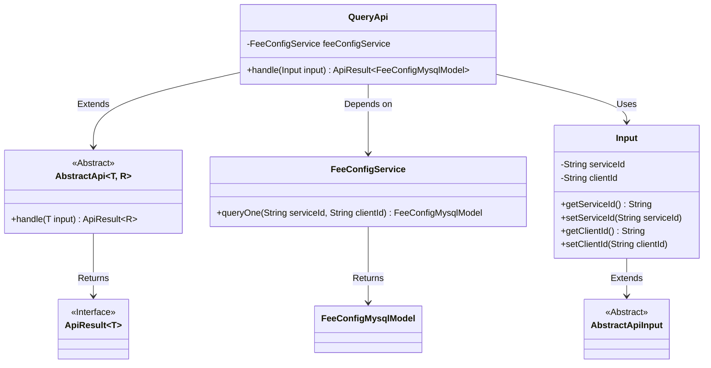

# Basic Information

|      |      |
|------|------|
| Name | QueryApi |
| Language | .java |
| Code Path | WeFe/serving/serving-service/src/main/java/com/welab/wefe/serving/service/api/feeconfig/QueryApi.java |
| Package Name | com.welab.wefe.serving.service.api.feeconfig |
| Dependencies | ['com.welab.wefe.common.web.api.base.AbstractApi', 'com.welab.wefe.common.web.api.base.Api', 'com.welab.wefe.common.web.dto.AbstractApiInput', 'com.welab.wefe.common.web.dto.ApiResult', 'com.welab.wefe.serving.service.database.entity.FeeConfigMysqlModel', 'com.welab.wefe.serving.service.service.FeeConfigService', 'org.springframework.beans.factory.annotation.Autowired'] |
| Brief Description | The QueryApi class is used to query fee configurations. It takes serviceId and clientId as parameters and returns the result by invoking the feeConfigService.queryOne method. |

# Description

This is a Java class named QueryApi, designed for querying fee configurations. It extends the AbstractApi class, with generic parameters specifying the input type as the inner class Input and the return type as FeeConfigMysqlModel. The class is annotated with the API path "feeconfig/query-one" and the name "query fee config". It utilizes the auto-injected FeeConfigService to call the queryOne method, passing the serviceId and clientId parameters for the query. The inner class Input defines these two string-type request parameters and provides corresponding getter and setter methods. The processing logic is encapsulated in the handle method, which returns an ApiResult object containing the query result upon success.

# Class Summary

| Name   | Type  | Description |
|-------|------|-------------|
| QueryApi | class | The QueryApi class retrieves a single fee configuration via feeConfigService, with input parameters being serviceId and clientId, and returns a FeeConfigMysqlModel result. |

## Class QueryApi

|      |      |
|------|------|
| Access Modifier | @Api(path = "feeconfig/query-one", name = "query fee config");public |
| Type | class |
| Name | QueryApi |
| Description | The QueryApi class retrieves a single fee configuration via feeConfigService, with input parameters being serviceId and clientId, and returns a FeeConfigMysqlModel result. |

### UML Class Diagram

This code demonstrates the implementation structure of a query API. QueryApi inherits from the generic abstract class AbstractApi, processes Input parameters, and returns an ApiResult containing FeeConfigMysqlModel. The Input class extends AbstractApiInput and includes serviceId and clientId fields. QueryApi executes actual query operations through the dependency-injected FeeConfigService, reflecting a clear hierarchy and separation of responsibilities.

### Internal Method Call Graph

```mermaid
graph TD
    A["Class QueryApi"]
    B["Annotation: @Api(path='feeconfig/query-one', name='query fee config')"]
    C["Inheritance: AbstractApi<Input, FeeConfigMysqlModel>"]
    D["Dependency Injection: @Autowired FeeConfigService"]
    E["Overridden Method: handle(Input input)"]
    F["Inner Class: Input"]
    G["Field: String serviceId"]
    H["Field: String clientId"]
    I["Method: getServiceId()/setServiceId()"]
    J["Method: getClientId()/setClientId()"]
    K["Invocation: feeConfigService.queryOne()"]
    L["Return: ApiResult<FeeConfigMysqlModel>"]

    A --> B
    A --> C
    A --> D
    A --> E
    E --> K
    K --> L
    A -.-> F
    F --> G
    F --> H
    F --> I
    F --> J
```

This flowchart illustrates the complete structure of the QueryApi class, encompassing class annotations, inheritance relationships, dependency injection, and the core business logic processing flow. It highlights the call chain where the handle method queries data through feeConfigService and returns results, while meticulously mapping the attribute and method structure of the inner class Input. The entire process demonstrates the complete data flow path from API entry to database query, with clear hierarchical relationships.

### Field List

| Name  | Type  | Description |
|-------|-------|------|
| feeConfigService | FeeConfigService | Automatically inject the FeeConfigService service instance. |

### Method List

| Name  | Type  | Description |
|-------|-------|------|
| handle | ApiResult<FeeConfigMysqlModel> | Rewrite the handle method to call feeConfigService.queryOne for querying service configuration, and return the result encapsulated in ApiResult. |

