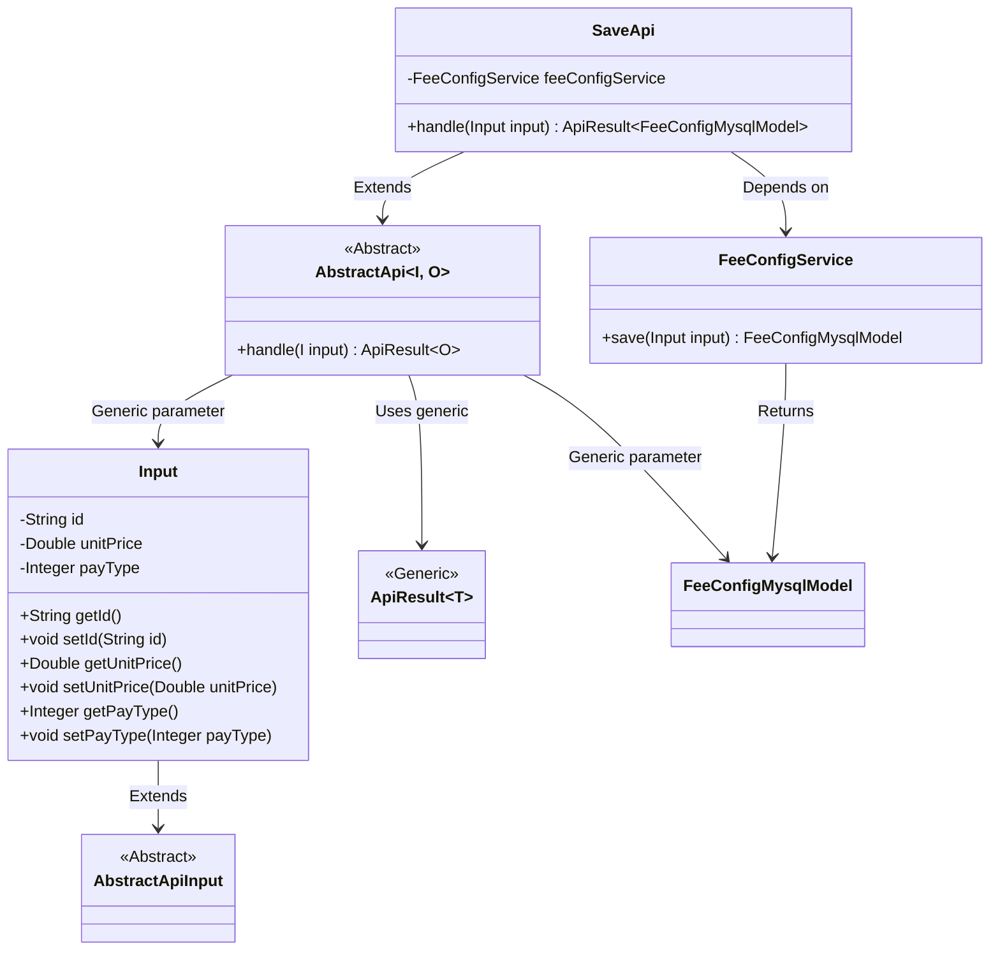

# Basic Information

|      |      |
|------|------|
| Name | SaveApi |
| Language | .java |
| Code Path | WeFe/serving/serving-service/src/main/java/com/welab/wefe/serving/service/api/feeconfig/SaveApi.java |
| Package Name | com.welab.wefe.serving.service.api.feeconfig |
| Dependencies | ['com.welab.wefe.common.exception.StatusCodeWithException', 'com.welab.wefe.common.fieldvalidate.annotation.Check', 'com.welab.wefe.common.web.api.base.AbstractApi', 'com.welab.wefe.common.web.api.base.Api', 'com.welab.wefe.common.web.dto.AbstractApiInput', 'com.welab.wefe.common.web.dto.ApiResult', 'com.welab.wefe.serving.service.database.entity.FeeConfigMysqlModel', 'com.welab.wefe.serving.service.service.FeeConfigService', 'org.springframework.beans.factory.annotation.Autowired', 'java.io.IOException'] |
| Brief Description | The API class for saving billing configurations, including mandatory unit price and optional ID and payment method, invokes the service layer to save data and returns the result. |

# Description

This is a Java class named SaveApi, designed for saving billing configurations. It extends AbstractApi, processes input of type Input, and outputs FeeConfigMysqlModel. The class injects the FeeConfigService and invokes feeConfigService.save via the handle method to persist the input data. The inner class Input contains three fields: id (billing configuration ID), unitPrice (mandatory billing unit price), and payType (payment method), each with corresponding getter and setter methods.

# Class Summary

| Name   | Type  | Description |
|-------|------|-------------|
| SaveApi | class | This is an API class for saving billing configurations, which includes mandatory billing rates and optional fields such as billing configuration ID and payment method. It calls the service layer to save data and returns the result. |

## Class SaveApi

|      |      |
|------|------|
| Access Modifier | @Api(path = "feeconfig/save", name = "save fee config");public |
| Type | class |
| Name | SaveApi |
| Description | This is an API class for saving billing configurations, which includes mandatory billing rates and optional fields such as billing configuration ID and payment method. It calls the service layer to save data and returns the result. |

### UML Class Diagram

This class diagram illustrates the structural relationships of SaveApi and its related classes. SaveApi inherits from the generic class AbstractApi, specifying Input as the input type and FeeConfigMysqlModel as the output type. The Input class inherits from AbstractApiInput and contains three private fields (id, unitPrice, and payType) along with their corresponding getter/setter methods. FeeConfigService is depended upon by SaveApi, providing save functionality and returning a FeeConfigMysqlModel instance. The overall structure reflects an API implementation pattern based on abstract classes, achieving type-safe data processing through generic parameters.

### Internal Method Call Graph

```mermaid
graph TD
    A["Class SaveApi"]
    B["Annotation: @Api(path='feeconfig/save', name='save fee config')"]
    C["Inheritance: AbstractApi<Input, FeeConfigMysqlModel>"]
    D["Dependency Injection: @Autowired FeeConfigService"]
    E["Overridden Method: handle(Input input)"]
    F["Inner Class: Input"]
    G["Field: @Check String id"]
    H["Field: @Check Double unitPrice"]
    I["Field: @Check Integer payType"]
    J["Method: getter/setter"]

    A --> B
    A --> C
    A --> D
    A --> E
    A --> F
    F --> G
    F --> H
    F --> I
    F --> J
    E --> D
    E -->|Invokes| F
```

The flowchart illustrates the structure of the SaveApi class, including API annotations, parent class inheritance, service injection, and input parameter processing logic. The core is the handle method saving input data via feeConfigService, where the inner Input class defines billing configuration parameters with validation annotations and exposes properties through getter/setter methods. The entire process demonstrates the complete call chain from API reception to database storage.

### Field List

| Name  | Type  | Description |
|-------|-------|------|
| feeConfigService | FeeConfigService | Automatically inject the FeeConfigService service instance. |

### Method List

| Name  | Type  | Description |
|-------|-------|------|
| handle | ApiResult<FeeConfigMysqlModel> | This code rewrites a method to process input, invoke a service to save data, and return either a successful result or an exception. |

