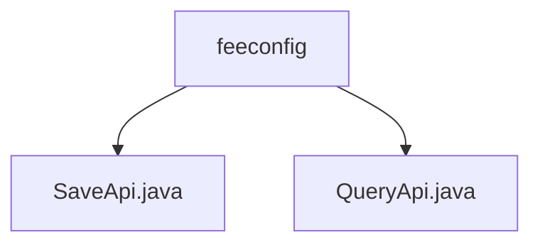

# Basic Information

|      |      |
|------|------|
| Name | feeconfig |
| Language | .java |
| Code Path | WeFe/serving/serving-service/src/main/java/com/welab/wefe/serving/service/api/feeconfig |
| Package Name | docs.serving.serving-service.src.main.java.com.welab.wefe.serving.service.api.feeconfig |
| Brief Description | SaveApi is a Java class for saving billing configurations, which inherits from AbstractApi, processes Input data, and invokes FeeConfigService to save. QueryApi is a class for querying fee configurations, inheriting from AbstractApi, which queries through FeeConfigService and returns results. Both contain an inner class Input to define request parameters. |

# Description

## Overview  
The core responsibility of this module is to manage billing configurations, providing save and query functionalities. The interface specification includes two APIs: SaveApi saves configurations via POST, while QueryApi retrieves configurations via GET, both returning the FeeConfigMysqlModel data structure. Key data structures include Input (with fields such as id, unitPrice, and payType) and FeeConfigMysqlModel. The only external dependency is the FeeConfigService. For example, SaveApi invokes feeConfigService.save, and QueryApi uses the queryOne method.  

## Main Business Scenarios  
The module supports full lifecycle management of configurations, similar to the CRUD pattern. Business processes include: clients submitting unit prices and payment methods to save configurations, or querying records via serviceId/clientId. The interaction model uniformly inherits from AbstractApi, adopting a "request-service-response" model. Typical applications include billing system initialization or dynamic pricing scenarios. API types encompass write operations (SaveApi) and read operations (QueryApi), such as immediate query validation after configuration updates.

### Package Internal Structure View

This flowchart illustrates two Java files under the feeconfig directory: SaveApi.java and QueryApi.java. Both files are directly subordinate to the feeconfig directory with no deeper nested structure. The diagram clearly presents the simple hierarchical relationship between feeconfig as the parent node and the two API files.

# File List

| Name   | Type  | Description |
|-------|------|-------------|
| [SaveApi.java](SaveApi.md) | file | The API class for saving billing configurations, including mandatory unit price and optional ID and payment method, calls the service layer to save data and returns the result. |
| [QueryApi.java](QueryApi.md) | file | The QueryApi class is used to query fee configurations. It takes serviceId and clientId as parameters and returns the result by invoking the feeConfigService.queryOne method. |

