# Basic Information

|      |      |
|------|------|
| Name | QueryListApi |
| Language | .java |
| Code Path | WeFe/serving/serving-service/src/main/java/com/welab/wefe/serving/service/api/feedetail/QueryListApi.java |
| Package Name | com.welab.wefe.serving.service.api.feedetail |
| Dependencies | ['com.welab.wefe.common.web.api.base.AbstractApi', 'com.welab.wefe.common.web.api.base.Api', 'com.welab.wefe.common.web.dto.ApiResult', 'com.welab.wefe.serving.service.dto.PagingInput', 'com.welab.wefe.serving.service.dto.PagingOutput', 'com.welab.wefe.serving.service.service.FeeDetailService', 'org.springframework.beans.factory.annotation.Autowired', 'java.math.BigDecimal', 'java.util.Date'] |
| Brief Description | Fee Details Query API: Input includes service name, client name, type, time range, etc., and outputs paginated results containing service details, call count, total cost, etc. |

# Description

The code defines an API class named `QueryListApi`, which is used to query a list of fee details. The API path is `feedetail/query-list`, inheriting from `AbstractApi`, with `Input` as the input class and a paginated `Output` class as the output. The `Input` class includes pagination parameters and query conditions such as service name, customer name, service type, statistical type, and time range. The `Output` class contains paginated results and fee detail information such as service ID, customer ID, service name, customer name, service type, unit price, payment type, total call count, total fee, and statistical date. The processing logic is implemented through the `queryList` method of `FeeDetailService`.

# Class Summary

| Name   | Type  | Description |
|-------|------|-------------|
| QueryListApi | class | Fee Details Query API supports paginated queries. The input includes service name, customer name, service type, time range, etc., and the output includes service information, customer information, call count, total cost, etc. |


## Class QueryListApi

|      |      |
|------|------|
| Access Modifier | @Api(path = "feedetail/query-list", name = "fee detail query");public |
| Type | class |
| Name | QueryListApi |
| Description | Fee Details Query API supports paginated queries. The input includes service name, customer name, service type, time range, etc., and the output includes service information, customer information, call count, total cost, etc. |


### UML Class Diagram

```mermaid
classDiagram
    class QueryListApi {
        -FeeDetailService feeDetailService
        +handle(Input input) ApiResult~PagingOutput~Output~~
    }
    <<Interface>> PagingInput
    <<Interface>> PagingOutput
    class Input {
        -String serviceName
        -String clientName
        -String serviceType
        -Integer queryDateType
        -Date startTime
        -Date endTime
        +getter/setter methods
    }
    class Output {
        -String id
        -String serviceId
        -String clientId
        -String serviceName
        -String clientName
        -String serviceType
        -BigDecimal unitPrice
        -Integer payType
        -Long totalRequestTimes
        -BigDecimal totalFee
        -String queryDate
        +getter/setter methods
    }
    QueryListApi --> Input : uses
    QueryListApi --> Output : generates
    QueryListApi --> FeeDetailService : depends
    Input --|> PagingInput : extends
    Output --|> PagingOutput : extends
```

This diagram illustrates the class structure of the fee detail query API. QueryListApi inherits from AbstractApi, processes Input parameters, and returns PagingOutput<Output> results. Input and Output, as static inner classes, extend the pagination base classes respectively, containing various business fields. FeeDetailService is injected for actual query operations, forming a complete fee detail query processing chain.


### Internal Method Call Graph

```mermaid
graph TD
    A["Class QueryListApi"]
    B["Inheritance: AbstractApi<Input, PagingOutput<Output>>"]
    C["Dependency: FeeDetailService"]
    D["Method: handle(Input input)"]
    E["Nested Class: Input"]
    F["Nested Class: Output"]
    G["Input Attributes: serviceName/clientName/serviceType/queryDateType/startTime/endTime"]
    H["Output Attributes: id/serviceId/clientId/serviceName/clientName/serviceType/unitPrice/payType/totalRequestTimes/totalFee/queryDate"]
    I["Call Chain: handle --> feeDetailService.queryList"]

    A --> B
    A --> C
    A --> D
    A --> E
    A --> F
    E --> G
    F --> H
    D --> I
```



This flowchart illustrates the core structure and data flow of the QueryListApi class. The class inherits from the AbstractApi generic class and contains two nested static classes, Input and Output, which encapsulate query parameters and paginated result data respectively. The main business logic is delegated to the queryList method of FeeDetailService via the handle method. The Input class includes six query condition fields such as service name and client name, while the Output class extends pagination results with twelve business fields. The overall design adheres to a layered architecture, implementing fee detail query functionality through clear class relationships.

### Field List

| Name  | Type  | Description |
|-------|-------|------|
| feeDetailService | FeeDetailService | Using @Autowired to automatically inject an instance of FeeDetailService. |

### Method List

| Name  | Type  | Description |
|-------|-------|------|
| handle | ApiResult<PagingOutput<Output>> | Java method override, call feeDetailService to query the list and return paginated results. |


