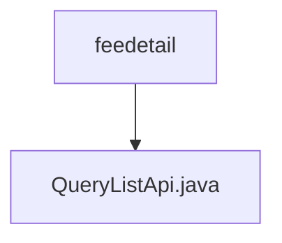

# Basic Information

|      |      |
|------|------|
| Name | feedetail |
| Language | .java |
| Code Path | WeFe/serving/serving-service/src/main/java/com/welab/wefe/serving/service/api/feedetail |
| Package Name | docs.serving.serving-service.src.main.java.com.welab.wefe.serving.service.api.feedetail |
| Brief Description | Fee Details Query API: Input includes service name, client name, type, time range, etc., and outputs paginated results containing service details, call count, total cost, etc. |

# Description

The code defines an API class named `QueryListApi`, designed for querying a list of fee details. The API path is `feedetail/query-list`, which inherits from `AbstractApi`. It takes an `Input` class as input and returns a paginated `Output` class. The `Input` class includes pagination parameters and query conditions such as service name, customer name, service type, statistical type, and time range. The `Output` class contains paginated results and fee detail information, including service ID, customer ID, service name, customer name, service type, unit price, payment type, total call count, total fee, and statistical date. The processing logic is implemented via the `queryList` method of `FeeDetailService`.

### Package Internal Structure View

This flowchart illustrates a simple Java project structure where `feedetail` serves as the parent directory containing a child file `QueryListApi.java`. Such a structure is commonly found in the API implementation layer of microservice architectures, typically used to store interface implementation classes for specific business modules. The diagram clearly presents a single-level containment relationship, aligning with the typical layered code organization approach.

# File List

| Name   | Type  | Description |
|-------|------|-------------|
| [QueryListApi.java](QueryListApi.md) | file | Fee Details Query API: Input includes service name, client name, type, time range, etc., and outputs paginated results containing service details, call count, total cost, etc. |

