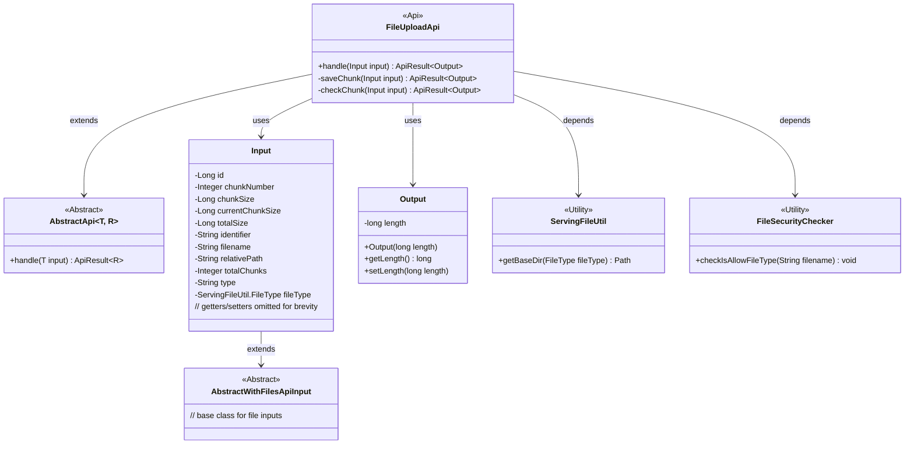

# Basic Information

|      |      |
|------|------|
| Name | FileUploadApi |
| Language | .java |
| Code Path | WeFe/serving/serving-service/src/main/java/com/welab/wefe/serving/service/api/file/FileUploadApi.java |
| Package Name | com.welab.wefe.serving.service.api.file |
| Dependencies | ['com.welab.wefe.common.StatusCode', 'com.welab.wefe.common.exception.StatusCodeWithException', 'com.welab.wefe.common.fieldvalidate.annotation.Check', 'com.welab.wefe.common.util.FileUtil', 'com.welab.wefe.common.web.api.base.AbstractApi', 'com.welab.wefe.common.web.api.base.Api', 'com.welab.wefe.common.web.dto.AbstractWithFilesApiInput', 'com.welab.wefe.common.web.dto.ApiResult', 'com.welab.wefe.serving.service.api.file.security.FileSecurityChecker', 'com.welab.wefe.serving.service.utils.ServingFileUtil', 'org.apache.commons.io.FileUtils', 'org.springframework.web.multipart.MultipartFile', 'java.io.File', 'java.io.IOException', 'java.io.InputStream', 'java.nio.file.Path'] |
| Brief Description | File Upload API, supporting chunked upload and verification. POST method saves chunks, GET method checks chunk existence. Includes file type validation, chunk number processing, and directory management functions. Input contains file information and chunk parameters, output returns file length. |

# Description

FileUploadApi is an API class for handling file uploads, supporting chunked uploads and checks. It inherits from AbstractApi, takes the Input class as input, and outputs the Output class. The API path is file/upload, and no login is required. Key functionalities include checking file types, saving file chunks, and verifying chunk existence. The Input class contains file-related parameters such as chunk number, size, identifier, etc. The Output class returns the file length. The processing logic invokes different methods based on the HTTP method: POST saves chunks, while GET checks chunks. When saving chunks, it creates directories and writes chunks to files; when checking chunks, it verifies their existence and returns the corresponding status code.

# Class Summary

| Name   | Type  | Description |
|-------|------|-------------|
| FileUploadApi | class | File upload API, supporting chunked uploads and verification. The POST method saves chunks, while the GET method checks for chunk existence. Includes file type validation, chunk processing, and status return functionality. Input parameters include chunk number, size, identifier, etc., and the output returns the file length. |

## Class FileUploadApi

|      |      |
|------|------|
| Access Modifier | @Api(path = "file/upload", name = "上传文件", desc = "上传文件", login = false);public |
| Type | class |
| Name | FileUploadApi |
| Description | File upload API, supporting chunked uploads and verification. The POST method saves chunks, while the GET method checks for chunk existence. Includes file type validation, chunk processing, and status return functionality. Input parameters include chunk number, size, identifier, etc., and the output returns the file length. |

### UML Class Diagram

The diagram illustrates the core structure of a file upload API. FileUploadApi inherits from the generic abstract class AbstractApi, handling Input/Output data transfer objects. The Input class extends AbstractWithFilesApiInput and contains various parameters required for chunked file uploads. The Output class simply encapsulates file length information. FileUploadApi relies on two utility classes, ServingFileUtil and FileSecurityChecker, for directory operations and file security checks. The overall design adopts a layered architecture, achieving code reuse through inheritance and encapsulating common functionalities via utility classes.

### Internal Method Call Graph

This code implements a file upload API supporting chunked upload and verification. Key processes include: 1) Validating file type; 2) Handling chunk saving or checking based on HTTP methods (POST/GET); 3) POST requests create directories and save chunk files; 4) GET requests verify chunk existence. The code encapsulates upload parameters via Input class and returns results via Output class, employing exception handling for robustness while supporting chunk resumption functionality.

### Field List

| Name  | Type  | Description |
|-------|-------|------|

### Method List

| Name  | Type  | Description |
|-------|-------|------|
| saveChunk | ApiResult<Output> | The method `saveChunk` receives input parameters and handles the saving of chunked files. It checks the chunk number, creates directories, and writes the input stream to a file. Errors are logged and exceptions are thrown when encountered. Upon success, it returns the file size. |
| handle | ApiResult<Output> | The method handles file upload requests by first checking if the file type is supported, returning error code 599 if the check fails. It invokes different logic based on the request method: POST saves the chunk, GET checks the chunk, and other methods throw an exception. |
| checkChunk | ApiResult<Output> | Check if the file fragment exists. If the fragment number is empty, set it to 0, and construct the path based on the file type and identifier. Return a success message if it exists, or a status code 299 with a prompt if it does not exist. |

