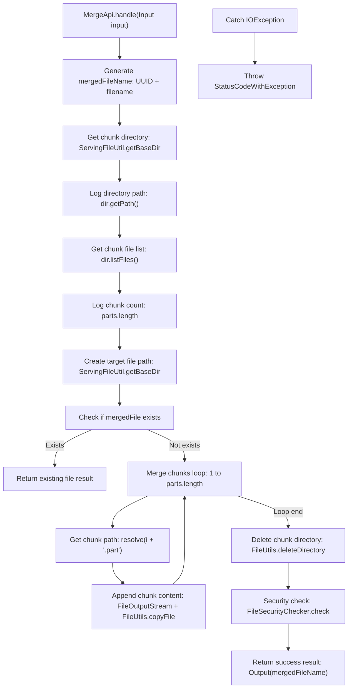
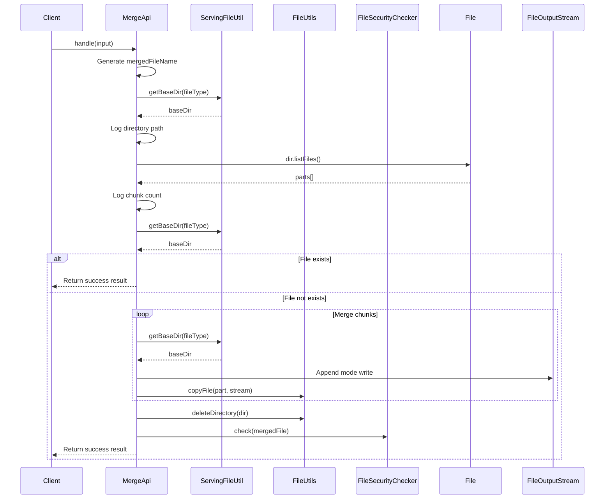

# Basic Information

|      |      |
|------|------|
| Name | MergeApi |
| Language | .java |
| Code Path | WeFe/serving/serving-service/src/main/java/com/welab/wefe/serving/service/api/file/MergeApi.java |
| Package Name | com.welab.wefe.serving.service.api.file |
| Dependencies | ['com.welab.wefe.common.StatusCode', 'com.welab.wefe.common.exception.StatusCodeWithException', 'com.welab.wefe.common.fieldvalidate.annotation.Check', 'com.welab.wefe.common.web.api.base.AbstractApi', 'com.welab.wefe.common.web.api.base.Api', 'com.welab.wefe.common.web.dto.AbstractApiInput', 'com.welab.wefe.common.web.dto.ApiResult', 'com.welab.wefe.serving.service.api.file.security.FileSecurityChecker', 'com.welab.wefe.serving.service.utils.ServingFileUtil', 'org.apache.commons.io.FileUtils', 'java.io.File', 'java.io.FileOutputStream', 'java.io.IOException', 'java.util.UUID'] |
| Brief Description | The MergeApi class is used to merge uploaded file chunks, generate a unique filename, check the security of the merged chunks, and return the result. |

# Description

The code defines a file merge API, which is used to combine chunked uploads into a complete file. The API path is "file/merge," and it takes the file name, unique identifier, and file type as input. The processing flow includes generating the merged file name, retrieving the chunk file directory, sequentially appending chunk files to the target file, deleting the temporary chunk directory, and performing file security checks. The output includes the merged file name. Exception handling covers system errors and IO exceptions.

# Class Summary

| Name   | Type  | Description |
|-------|------|-------------|
| MergeApi | class | File chunk upload and merge interface, which receives the file name, unique identifier, and file type, merges the chunked files, and returns the merged file name, including security checks. |


## Class MergeApi

|      |      |
|------|------|
| Access Modifier | @Api(path = "file/merge", name = "Merge the chunks after the file is uploaded");public |
| Type | class |
| Name | MergeApi |
| Description | File chunk upload and merge interface, which receives the file name, unique identifier, and file type, merges the chunked files, and returns the merged file name, including security checks. |


### UML Class Diagram

```mermaid
classDiagram
    class AbstractApi~T, R~ {
        <<Abstract>>
        +handle(T input) ApiResult~R~
    }

    class MergeApi {
        +handle(Input input) ApiResult~Output~
    }
    MergeApi --|> AbstractApi~Input, Output~ : Inheritance

    class MergeApi$Input {
        -String filename
        -String uniqueIdentifier
        -ServingFileUtil.FileType fileType
        +getFilename() String
        +setFilename(String filename)
        +getUniqueIdentifier() String
        +setUniqueIdentifier(String uniqueIdentifier)
        +getFileType() ServingFileUtil.FileType
        +setFileType(ServingFileUtil.FileType fileType)
    }
    MergeApi$Input --|> AbstractApiInput : Inheritance

    class MergeApi$Output {
        -String filename
        +Output(String filename)
        +getFilename() String
        +setFilename(String filename)
    }

    class ServingFileUtil {
        <<Utility>>
        +getBaseDir(FileType fileType) Path
    }
    MergeApi --> ServingFileUtil : Uses

    class FileSecurityChecker {
        <<Utility>>
        +check(File file)
    }
    MergeApi --> FileSecurityChecker : Uses

    class AbstractApiInput {
        <<Abstract>>
    }
```

Class Diagram Description: This diagram illustrates the core structure of the file merge API. MergeApi inherits from the generic abstract class AbstractApi, handling Input and Output types. The Input class inherits from AbstractApiInput, containing fields for filename, unique identifier, and file type; the Output class includes the merged filename. MergeApi relies on ServingFileUtil for directory operations and FileSecurityChecker for file security checks, collectively achieving the functionality of merging fragmented files.


### Internal Method Call Graph





Flowchart Description: This flowchart illustrates the complete process of file chunk merging, starting from generating the target filename, checking the chunk directory, iteratively merging all chunk files, and finally performing security checks and returning results. It includes exception handling branches and optimized paths for file existence checks, demonstrating comprehensive file operation logic and security control mechanisms.

Sequence Diagram Description: The sequence diagram clearly presents the interaction between the client calling MergeApi and server components (ServingFileUtil, FileUtils, and FileSecurityChecker), highlighting the loop operation for chunk merging and exception handling flow, reflecting the collaborative relationships across system layers.

### Field List

| Name  | Type  | Description |
|-------|-------|------|

### Method List

| Name  | Type  | Description |
|-------|-------|------|
| handle | ApiResult<Output> | Process the input file, merge chunked files into a single file, and return the result after security checks. Throw a system error in case of exceptions. |


