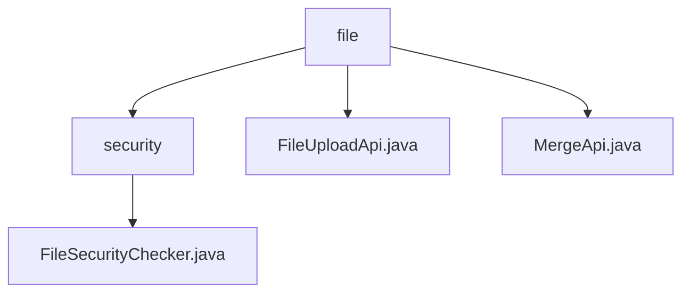

# Basic Information

|      |      |
|------|------|
| Name | file |
| Language | .java |
| Code Path | WeFe/serving/serving-service/src/main/java/com/welab/wefe/serving/service/api/file |
| Package Name | docs.serving.serving-service.src.main.java.com.welab.wefe.serving.service.api.file |
| Brief Description | FileSecurityChecker is an abstract class for checking file security, defining allowed types as json, zip, and txt, and providing validation methods. FileUploadApi handles chunked uploads, supporting chunk verification and storage. MergeApi merges chunked files, handles exceptions, and performs security checks. |

# Description

## Overview  
The core responsibility of this module is to provide secure and controllable file upload and merging services, ensuring file integrity through type validation and chunk processing. The interface specification includes three key APIs: file upload (file/upload), chunk verification (GET), and file merging (file/merge), all designed in RESTful style. Key data structures include the Input class (containing metadata such as chunk numbers/identifiers) and the Output class (returning file status). External dependencies are limited to the basic Java IO library. For example, the FileSecurityChecker validates file types against a whitelist (json/zip/txt) and automatically deletes hazardous files upon exceptions.

## Primary Business Scenarios  
The module supports the complete workflow of chunked upload and merging: clients first transmit file fragments via the FileUploadApi (similar to resumable uploads) and then invoke the MergeApi to trigger merging, during which security checks are automatically performed. The typical interaction pattern is: POST to upload chunks → GET to verify chunks → trigger merging → return the final filename. Functional integrity is reflected in chunk management, type filtering, exception rollback, and other aspects, such as automatic cleanup of temporary directories post-merging. API integration examples include frontend large file upload scenarios, where chunking reduces the risk of network interruptions.

### Package Internal Structure View

This flowchart illustrates the hierarchical structure of the file service module, with the root node being the file directory, which contains three child nodes: the security directory (containing the security checker implementation), the file upload interface, and the merge interface. The security directory includes only one file security checker class, clearly reflecting the layered design of the file service functionality.

# File List

| Name   | Type  | Description |
|-------|------|-------------|
| [FileUploadApi.java](FileUploadApi.md) | file | File upload API supporting chunked upload and verification. POST method saves chunks, GET method checks chunk existence. Includes file type validation, chunk numbering processing, and directory management functions. Input contains file information and chunk parameters, output returns file length. |
| [MergeApi.java](MergeApi.md) | file | The MergeApi class is used to merge uploaded file chunks, generate a unique filename, check the security of the merged file, and return the result. |
| [security](security/_module.md) | package | The abstract class FileSecurityChecker is used to check file security, containing a list of allowed file types and an array of keywords, providing file type checking and exception handling functionality. |

