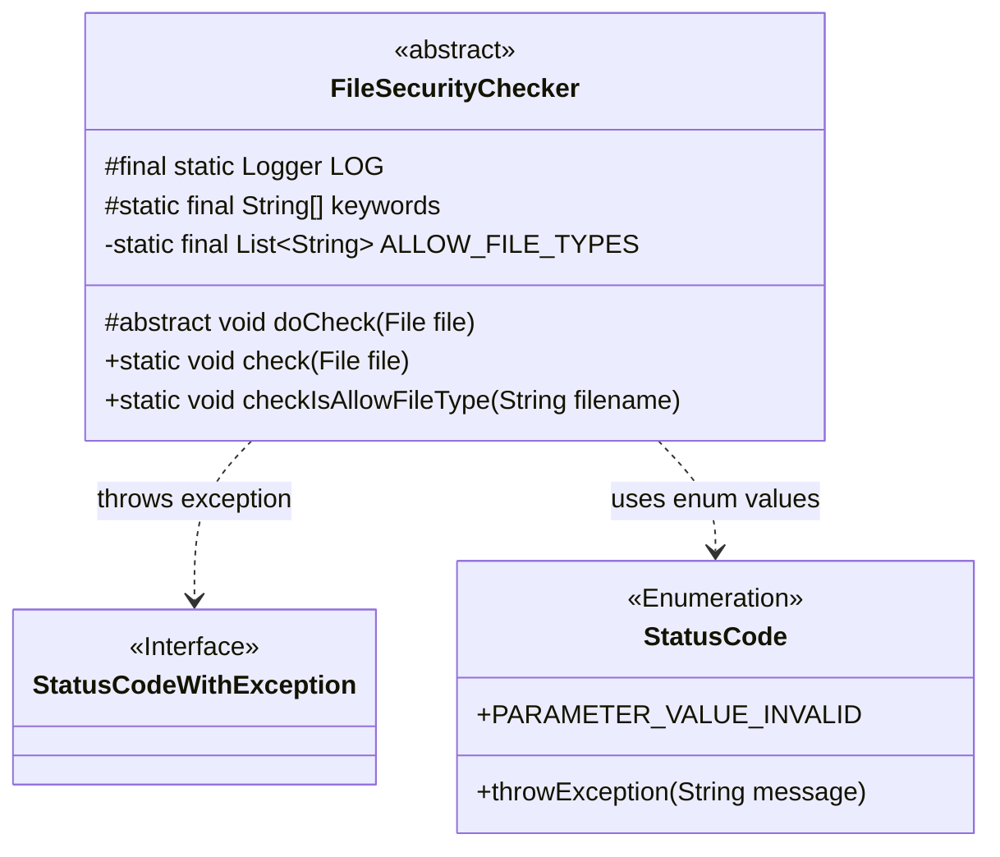
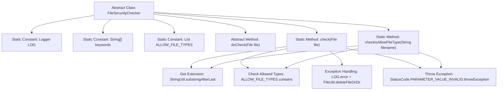

# Basic Information

|      |      |
|------|------|
| Name | FileSecurityChecker |
| Language | .java |
| Code Path | WeFe/serving/serving-service/src/main/java/com/welab/wefe/serving/service/api/file/security/FileSecurityChecker.java |
| Package Name | com.welab.wefe.serving.service.api.file.security |
| Dependencies | ['com.welab.wefe.common.StatusCode', 'com.welab.wefe.common.exception.StatusCodeWithException', 'com.welab.wefe.common.util.FileUtil', 'com.welab.wefe.common.util.StringUtil', 'org.slf4j.Logger', 'org.slf4j.LoggerFactory', 'java.io.File', 'java.io.IOException', 'java.util.Arrays', 'java.util.List'] |
| Brief Description | The abstract class FileSecurityChecker is used to check file security, containing a list of allowed file types and an array of keywords, providing file type checking and exception handling functionality. |

# Description

FileSecurityChecker is an abstract class designed for checking file security. It includes a logger and an array of keywords. The allowed file types are defined as json, zip, and txt. It provides an abstract method `doCheck` for subclasses to implement. The static method `check` validates the file type, permitting only zip and txt; otherwise, it throws an exception and deletes the file. The `checkIsAllowFileType` method checks whether the file name suffix is in the allowed list, and an empty file name or invalid suffix triggers an exception. Error logs are recorded during exception handling.

# Class Summary

| Name   | Type  | Description |
|-------|------|-------------|
| FileSecurityChecker | class | The abstract class FileSecurityChecker is used for file security checks, containing a list of allowed file types and keyword checks, supporting json, zip, and txt formats. It deletes files and logs exceptions when errors occur. |

## Class FileSecurityChecker

|      |      |
|------|------|
| Access Modifier | public abstract |
| Type | class |
| Name | FileSecurityChecker |
| Description | The abstract class FileSecurityChecker is used for file security checks, containing a list of allowed file types and keyword checks, supporting json, zip, and txt formats. It deletes files and logs exceptions when errors occur. |

### UML Class Diagram

Class diagram description:
FileSecurityChecker is an abstract class primarily used for file security checks, containing a static logger, a keyword list, and an allowed file types list. It provides a static method checkIsAllowFileType to verify whether a file type is permitted, along with an abstract method doCheck for subclasses to implement specific check logic. The class throws StatusCodeWithException exceptions and utilizes the StatusCode enumeration to handle cases of invalid parameters. The overall design reflects strict control over file security and an exception handling mechanism.

### Internal Method Call Graph

Flowchart Description: This flowchart illustrates the structure of the abstract class FileSecurityChecker, including static constant definitions, abstract methods, and two core static methods. The check method implements security verification through three main steps: obtaining file extensions, validating file types, and handling exceptions, utilizing utility classes StringUtil and FileUtil. The checkIsAllowFileType method independently performs filename extension validation, with both methods sharing the same exception-throwing mechanism and fundamental validation logic, forming a complete file security verification process.

### Field List

| Name  | Type  | Description |
|-------|-------|------|
| LOG = LoggerFactory.getLogger(FileSecurityChecker.class) | Logger | The static log object LOG of the FileSecurityChecker class is used to record log information. |
| keywords = {"<", ">", "\\"} | String[] | Define a protected static constant string array named keywords, containing three special characters: <, >, and \. |
| ALLOW_FILE_TYPES = Arrays.asList(            "json", "zip", "txt"    ) | List<String> | The allowed file types are json, zip, and txt. |

### Method List

| Name  | Type  | Description |
|-------|-------|------|
| doCheck | void | Abstract method doCheck, which takes a File parameter and may throw an IOException. |
| check | void | Check if the uploaded file type is allowed, only zip and txt are supported, otherwise throw an exception and delete the file. |
| checkIsAllowFileType | void | Check if the file type is allowed: the filename must not be empty, must have an extension, and the extension must be in the allowed list; otherwise, throw an exception. |

