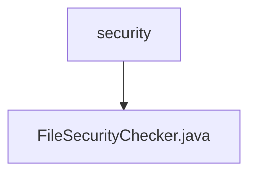

# Basic Information

|      |      |
|------|------|
| Name | security |
| Language | .java |
| Code Path | WeFe/serving/serving-service/src/main/java/com/welab/wefe/serving/service/api/file/security |
| Package Name | docs.serving.serving-service.src.main.java.com.welab.wefe.serving.service.api.file.security |
| Brief Description | The abstract class FileSecurityChecker is used to check file security, containing a list of allowed file types and an array of keywords, providing file type checking and exception handling functionality. |

# Description

FileSecurityChecker is an abstract class designed for checking file security. It includes a logger and an array of keywords. The allowed file types are defined as json, zip, and txt. It provides an abstract method `doCheck` for subclasses to implement. The static method `check` validates file types, permitting only zip and txt; otherwise, it throws an exception and deletes the file. The `checkIsAllowFileType` method checks whether the file name suffix is in the allowed list, with empty filenames or invalid suffixes triggering exceptions. Error logs are recorded during exception handling.

### Package Internal Structure View

This flowchart illustrates the hierarchical structure of the file security check module. The top-level node "security" represents the security-related code directory, which contains a specific implementation file "FileSecurityChecker.java". This structure clearly reflects the singular implementation approach of the security check functionality, adhering to the principle of minimalistic design.

# File List

| Name   | Type  | Description |
|-------|------|-------------|
| [FileSecurityChecker.java](FileSecurityChecker.md) | file | The abstract class FileSecurityChecker is used to check file security, containing a list of allowed file types and an array of keywords, providing file type checking and exception handling functionality. |

