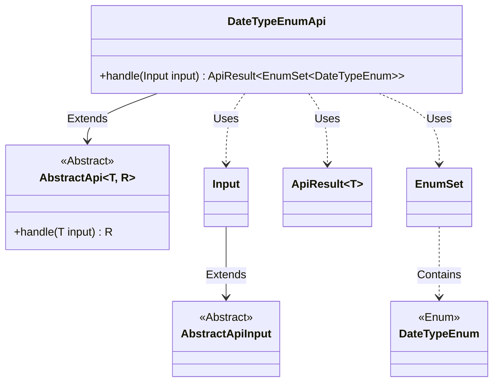

# Basic Information

|      |      |
|------|------|
| Name | DateTypeEnumApi |
| Language | .java |
| Code Path | WeFe/serving/serving-service/src/main/java/com/welab/wefe/serving/service/api/logger/DateTypeEnumApi.java |
| Package Name | com.welab.wefe.serving.service.api.logger |
| Dependencies | ['com.welab.wefe.common.web.api.base.AbstractApi', 'com.welab.wefe.common.web.api.base.Api', 'com.welab.wefe.common.web.dto.AbstractApiInput', 'com.welab.wefe.common.web.dto.ApiResult', 'com.welab.wefe.serving.service.enums.DateTypeEnum', 'java.util.EnumSet'] |
| Brief Description | DateTypeEnumApi interface, path "log/date_type", no login required, returns DateTypeEnum enumeration collection. Input class is empty. |

# Description

This is an API class named DateTypeEnumApi, with the path log/date_type, accessible without login. It inherits from AbstractApi, takes DateTypeEnumApi.Input as the input type, and returns EnumSet<DateTypeEnum>. The handle method processes the input and returns a collection containing all DateTypeEnum enum values. The Input class inherits from AbstractApiInput and currently has no defined properties. This API is primarily used to retrieve all possible values of the date type enum.

# Class Summary

| Name   | Type  | Description |
|-------|------|-------------|
| DateTypeEnumApi | class | This is an API class with the path "log/date_type", requiring no login, which returns all values of the DateTypeEnum enumeration. The input class is empty, and the processing logic directly returns the complete set of enumeration values. |

## Class DateTypeEnumApi

|      |      |
|------|------|
| Access Modifier | @Api(path = "log/date_type", name = "Date type", login = false);public |
| Type | class |
| Name | DateTypeEnumApi |
| Description | This is an API class with the path "log/date_type", requiring no login, which returns all values of the DateTypeEnum enumeration. The input class is empty, and the processing logic directly returns the complete set of enumeration values. |

### UML Class Diagram

This code demonstrates an implementation of an enumeration type query interface based on an abstract API framework. DateTypeEnumApi inherits from the generic abstract class AbstractApi, processes Input parameters, and returns an ApiResult containing an EnumSet of DateTypeEnum. The core functionality is to retrieve all enumeration values of DateTypeEnum through the handle method, with Input serving as an empty parameter class inheriting from AbstractApiInput. The class diagram clearly illustrates the inheritance relationships, generic parameter passing, and usage of enum collections, reflecting a standard API interface implementation pattern.

### Internal Method Call Graph

```mermaid
graph TD
    A["Class DateTypeEnumApi"]
    B["Annotation: @Api(path='log/date_type', name='Date type', login=false)"]
    C["Parent class: AbstractApi<Input, EnumSet<DateTypeEnum>>"]
    D["Method: handle(Input input)"]
    E["Inner class: Input extends AbstractApiInput"]
    F["Create EnumSet: EnumSet.allOf(DateTypeEnum.class)"]
    G["Return result: success(type)"]

    A --> B
    A --> C
    A --> D
    D --> F
    F --> G
    A --> E
```

This flowchart illustrates the structure and main logic flow of the DateTypeEnumApi class. The class inherits from the AbstractApi generic class and defines the API path and name via the @Api annotation. The core method handle() retrieves all enum values of DateTypeEnum and encapsulates them as a successful result for return. The inner class Input is used to receive request parameters. The overall process clearly demonstrates the complete chain from request handling to result return.

### Field List

| Name  | Type  | Description |
|-------|-------|------|

### Method List

| Name  | Type  | Description |
|-------|-------|------|
| handle | ApiResult<EnumSet<DateTypeEnum>> | This method overrides the parent class logic, accepts input parameters, and returns a successful result containing all date type enumeration values. |

