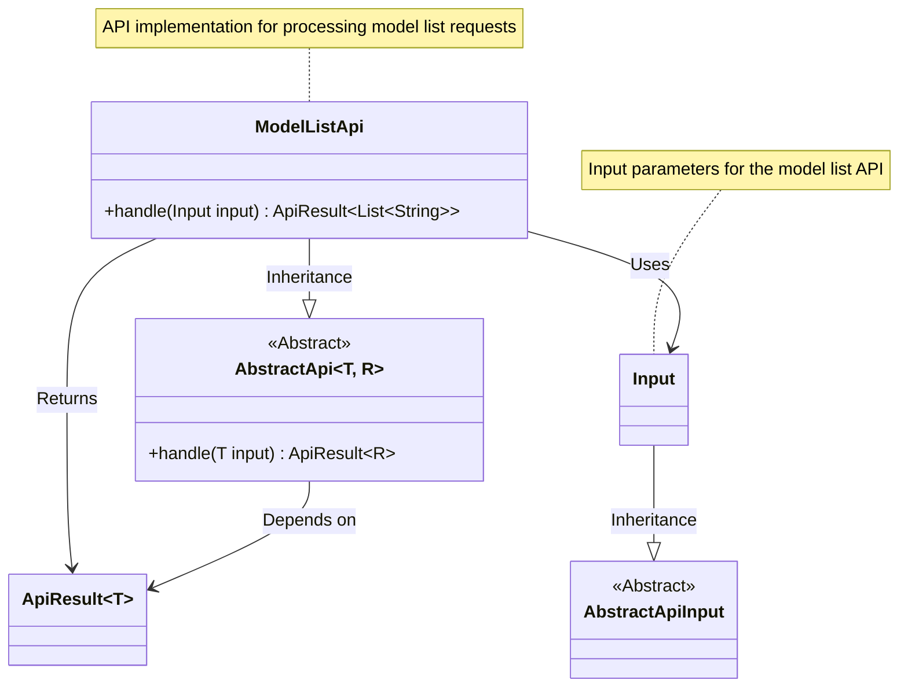

# Basic Information

|      |      |
|------|------|
| Name | ModelListApi |
| Language | .java |
| Code Path | WeFe/serving/serving-service/src/main/java/com/welab/wefe/serving/service/api/logger/ModelListApi.java |
| Package Name | com.welab.wefe.serving.service.api.logger |
| Dependencies | ['com.welab.wefe.common.web.api.base.AbstractApi', 'com.welab.wefe.common.web.api.base.Api', 'com.welab.wefe.common.web.dto.AbstractApiInput', 'com.welab.wefe.common.web.dto.ApiResult', 'java.util.List'] |
| Brief Description | This is a Java API class with the path "log/model_list", which does not require login and is used to handle model list requests. The input is ModelListApi.Input, and the output is a list of strings. |

# Description

This code defines an API class named `ModelListApi`, which inherits from the base class `AbstractApi`. The API path is `"log/model_list"`, with the name `"model list"`, and it can be accessed without login. It uses generics to specify the input type as the inner class `Input` (inheriting from `AbstractApiInput`) and the return type as a string list `List<String>`. The class includes an unimplemented `handle` method for processing requests, with the return type being a string list wrapped in `ApiResult`. The `Input` inner class currently only contains an empty getter/setter section, with no specific fields defined. The entire API design follows the template pattern of the abstract base class.

# Class Summary

| Name   | Type  | Description |
|-------|------|-------------|
| ModelListApi | class | Java API class ModelListApi, path "log/model_list", no login required, processes input and returns a string list. |

## Class ModelListApi

|      |      |
|------|------|
| Access Modifier | @Api(path = "log/model_list", name = "model list", login = false);public |
| Type | class |
| Name | ModelListApi |
| Description | Java API class ModelListApi, path "log/model_list", no login required, processes input and returns a string list. |

### UML Class Diagram

This code demonstrates the structure of an API implementation for handling model list requests. ModelListApi inherits from the generic abstract class AbstractApi, specifying the input type as the inner class Input and the return type as a list of strings. The Input class inherits from the base class AbstractApiInput and currently contains no specific fields. The overall structure reflects a typical API layered design pattern, where abstract base classes standardize interfaces while concrete APIs implement business logic. The annotation indicates this is a public API interface that requires no login.

### Internal Method Call Graph

```mermaid
graph TD
    A["Class ModelListApi"]
    B["Annotation: @Api"]
    C["Parent Class: AbstractApi<Input, List<String>>"]
    D["Method: handle(Input input)"]
    E["Nested Class: Input"]
    F["Parent Class: AbstractApiInput"]

    A --> B
    A --> C
    A --> D
    A --> E
    E --> F
```

This code demonstrates an implementation of the ModelListApi class based on an abstract API framework, which defines the interface path and name through the @Api annotation and inherits from the generic AbstractApi base class. The core structure includes the handle method for processing requests and a nested Input class that extends the AbstractApiInput base class. The flowchart clearly presents the class inheritance relationships and key components, reflecting the typical layered design pattern of API interfaces.

### Field List

| Name  | Type  | Description |
|-------|-------|------|

### Method List

| Name  | Type  | Description |
|-------|-------|------|
| handle | ApiResult<List<String>> | Rewrite method returns empty, processing input returns a list of strings as API result. |

