# Basic Information

|      |      |
|------|------|
| Name | QueryApi |
| Language | .java |
| Code Path | WeFe/serving/serving-service/src/main/java/com/welab/wefe/serving/service/api/logger/QueryApi.java |
| Package Name | com.welab.wefe.serving.service.api.logger |
| Dependencies | ['com.welab.wefe.common.fieldvalidate.annotation.Check', 'com.welab.wefe.common.web.api.base.AbstractApi', 'com.welab.wefe.common.web.api.base.Api', 'com.welab.wefe.common.web.dto.AbstractApiInput', 'com.welab.wefe.common.web.dto.ApiResult', 'com.welab.wefe.common.wefe.enums.Algorithm', 'com.welab.wefe.common.wefe.enums.FederatedLearningType', 'com.welab.wefe.common.wefe.enums.JobMemberRole', 'com.welab.wefe.serving.service.dto.PagingInput', 'com.welab.wefe.serving.service.dto.PagingOutput', 'com.welab.wefe.serving.service.service.PredictLogService', 'org.springframework.beans.factory.annotation.Autowired', 'java.util.Date'] |
| Brief Description | QueryApi is an interface for querying logs. The input includes parameters such as serial number and member ID, while the output contains information like log ID, request response, etc. The query request is processed via predictLogService. |

# Description

This is a log query API class named QueryApi, which inherits from AbstractApi and handles paginated query requests. The input class Input includes query conditions such as serial number, member ID, model ID, algorithm type, federated learning type, participant role, and time range, all annotated with validation annotations. The output class Output contains fields such as log ID, serial number, member information, model information, algorithm type, federated learning type, role, creation time, request content, response content, and time consumption. This API processes query requests through predictLogService and returns paginated results. All fields are provided with getter and setter methods.

# Class Summary

| Name   | Type  | Description |
|-------|------|-------------|
| QueryApi | class | The QueryApi class provides log query interfaces, taking parameters such as serial numbers and member IDs as input, and outputting log details including requests, responses, and time consumption. |


## Class QueryApi

|      |      |
|------|------|
| Access Modifier | @Api(path = "log/query", name = "query log");public |
| Type | class |
| Name | QueryApi |
| Description | The QueryApi class provides log query interfaces, taking parameters such as serial numbers and member IDs as input, and outputting log details including requests, responses, and time consumption. |


### UML Class Diagram

```mermaid
classDiagram
    class QueryApi {
        -PredictLogService predictLogService
        +handle(Input input) ApiResult~PagingOutput~Output~~
    }
    class PagingInput {
        <<Abstract>>
    }
    class AbstractApiInput {
        <<Abstract>>
    }
    class PredictLogService {
        <<Interface>>
        +query(Input input) PagingOutput~Output~
    }
    class Input {
        -String seqNo
        -String memberId
        -String modelId
        -Algorithm algorithm
        -FederatedLearningType flType
        -JobMemberRole myRole
        -Date startTime
        -Date endTime
        // getters/setters
    }
    class Output {
        -String id
        -String seqNo
        -String memberId
        -String modelId
        -Algorithm algorithm
        -FederatedLearningType flType
        -JobMemberRole myRole
        -Date createdTime
        -String request
        -String response
        -long spend
        // getters/setters
    }
    class PagingOutput~T~ {
        +Generic type T
    }
    class ApiResult~T~ {
        +Generic type T
    }

    QueryApi --> PredictLogService : Dependency
    QueryApi ..|> AbstractApi~Input, PagingOutput~Output~~ : Implements
    Input --|> PagingInput : Extends
    Output --|> AbstractApiInput : Extends
    PredictLogService ..> Input : Uses
    PredictLogService ..> Output : Uses
```

This code describes a log query API class `QueryApi`, which inherits from the generic abstract class `AbstractApi` and processes input `Input` and paginated output `PagingOutput<Output>`. The `Input` class contains multiple query condition fields and inherits from `PagingInput`; the `Output` class contains log detail fields and inherits from `AbstractApiInput`. `QueryApi` performs actual query operations through the `PredictLogService` interface and returns paginated results. The overall structure demonstrates a typical API layer design pattern, including layered request parameters, response data, and business logic processing.


### Internal Method Call Graph

```mermaid
graph TD
    A["Class QueryApi"]
    B["Annotation: @Api(path='log/query', name='query log')"]
    C["Inheritance: AbstractApi<Input, PagingOutput<Output>>"]
    D["Dependency Injection: @Autowired PredictLogService"]
    E["Overridden Method: handle(Input input)"]
    F["Inner Class: Input"]
    G["Inner Class: Output"]
    H["Input Properties: String seqNo (8 fields total)"]
    I["Output Properties: String id (11 fields total)"]
    J["Input Methods: getter/setter"]
    K["Output Methods: getter/setter"]

    A --> B
    A --> C
    A --> D
    A --> E
    A --> F
    A --> G
    F --> H
    F --> J
    G --> I
    G --> K
    E --> D
```



This flowchart illustrates the complete structure of the QueryApi class, which is a REST interface class annotated with @Api and inherits from the AbstractApi generic class. Its core consists of two static inner classes, Input and Output, serving as carriers for request parameters and response data respectively. The Input class extends PagingInput and contains 8 query condition fields with validation annotations, while the Output class extends AbstractApiInput with 11 log detail fields. The main class invokes predictLogService through the handle method to execute queries, with all inner classes implementing complete getter/setter methods.

### Field List

| Name  | Type  | Description |
|-------|-------|------|
| predictLogService | PredictLogService | The code snippet uses @Autowired to automatically inject an instance of PredictLogService. |

### Method List

| Name  | Type  | Description |
|-------|-------|------|
| handle | ApiResult<PagingOutput<Output>> | Java method override, calling predictLogService to query input and return paginated results. |


