# Basic Information

|      |      |
|------|------|
| Name | StatisticsApi |
| Language | .java |
| Code Path | WeFe/serving/serving-service/src/main/java/com/welab/wefe/serving/service/api/logger/StatisticsApi.java |
| Package Name | com.welab.wefe.serving.service.api.logger |
| Dependencies | ['com.welab.wefe.common.fieldvalidate.annotation.Check', 'com.welab.wefe.common.web.api.base.AbstractApi', 'com.welab.wefe.common.web.api.base.Api', 'com.welab.wefe.common.web.dto.AbstractApiInput', 'com.welab.wefe.common.web.dto.ApiResult', 'com.welab.wefe.common.wefe.enums.Algorithm', 'com.welab.wefe.common.wefe.enums.FederatedLearningType', 'com.welab.wefe.common.wefe.enums.JobMemberRole', 'com.welab.wefe.serving.service.service.PredictStatisticsService', 'org.springframework.beans.factory.annotation.Autowired', 'java.util.List'] |
| Brief Description | The `StatisticsApi` class provides log statistics functionality. It takes inputs including member ID, model ID, date type, and query interval, and outputs statistical results such as success/failure counts. Query requests are processed via `PredictStatisticsService`. |

# Description

The content describes a Java class named StatisticsApi, which is used to retrieve log statistics. This class inherits from AbstractApi, processes input as the Input class, and outputs a list of the Output class. The Input class includes fields such as member ID, model ID, date type, and query interval, all annotated with validation annotations. The Output class contains fields such as member ID, model ID, algorithm type, federated learning type, role, time granularity, and statistics for success/failure counts. The request is processed via the query method of PredictStatisticsService, returning statistical results. All fields are provided with getter/setter methods.

# Class Summary

| Name   | Type  | Description |
|-------|------|-------------|
| StatisticsApi | class | Log Statistics API class, with the path `log/statistics`. The input includes member ID, model ID, date type, and query interval. The output contains member ID, model ID, algorithm type, federated learning type, role, time granularity, and the total count of successes and failures. |


## Class StatisticsApi

|      |      |
|------|------|
| Access Modifier | @Api(path = "log/statistics", name = "Get log statistics");public |
| Type | class |
| Name | StatisticsApi |
| Description | Log Statistics API class, with the path `log/statistics`. The input includes member ID, model ID, date type, and query interval. The output contains member ID, model ID, algorithm type, federated learning type, role, time granularity, and the total count of successes and failures. |


### UML Class Diagram

```mermaid
classDiagram
    class AbstractApi~T, R~ {
        <<Abstract>>
        +handle(T input) R
    }

    class StatisticsApi {
        -PredictStatisticsService predictStatisticsService
        +handle(Input input) ApiResult~List~Output~~
    }

    class AbstractApiInput {
        <<Abstract>>
    }

    class StatisticsApi$Input {
        -String memberId
        -String modelId
        -String dateType
        -Integer interval
        +getMemberId() String
        +setMemberId(String memberId)
        +getModelId() String
        +setModelId(String modelId)
        +getDateType() String
        +setDateType(String dateType)
        +getInterval() Integer
        +setInterval(Integer interval)
    }

    class StatisticsApi$Output {
        -String memberId
        -String modelId
        -Algorithm algorithm
        -FederatedLearningType flType
        -JobMemberRole myRole
        -String month
        -String day
        -String hour
        -String minute
        -long total
        -long success
        -long fail
        // Omitted getter/setter methods
    }

    class PredictStatisticsService {
        <<Interface>>
        +query(Input input) List~Output~
    }

    AbstractApi <|-- StatisticsApi
    AbstractApiInput <|-- StatisticsApi$Input
    AbstractApiInput <|-- StatisticsApi$Output
    StatisticsApi --> PredictStatisticsService : Dependency
    StatisticsApi o-- StatisticsApi$Input
    StatisticsApi o-- StatisticsApi$Output
```

This code describes the implementation structure of a statistics API. StatisticsApi inherits from the generic abstract class AbstractApi, processing Input and returning List<Output> results. Both Input and Output are inner classes inheriting from AbstractApiInput, containing multiple fields with validation annotations. StatisticsApi implements core query logic through the dependency-injected PredictStatisticsService interface. The class diagram clearly illustrates inheritance relationships, composition relationships, and dependency relationships, reflecting layered design and interface segregation principles.


### Internal Method Call Graph

```mermaid
graph TD
    A["Class StatisticsApi"]
    B["Inheritance: AbstractApi<Input, List<Output>>"]
    C["Dependency: PredictStatisticsService"]
    D["Method: handle(Input input)"]
    E["Inner Class: Input"]
    F["Inner Class: Output"]
    G["Input Properties: memberId, modelId, dateType, interval"]
    H["Input Methods: getter/setter"]
    I["Output Properties: memberId, modelId, algorithm, etc."]
    J["Output Methods: getter/setter"]
    K["Annotation: @Api"]
    L["Annotation: @Autowired"]
    M["Annotation: @Check"]

    A --> B
    A --> C
    A --> D
    A --> E
    A --> F
    E --> G
    E --> H
    E --> M
    F --> I
    F --> J
    A -.-> K
    C -.-> L
    D --> C
```



This code defines an API class named StatisticsApi for retrieving log statistics. The class inherits from AbstractApi and contains two inner classes (Input and Output), with PredictStatisticsService injected via @Autowired. The main workflow involves the handle method calling predictStatisticsService.query to process input parameters and return a list of statistical results. The Input class includes query parameters with validation such as member ID and model ID, while the Output class contains detailed statistical result fields like algorithm type, time-dimension data, and success/failure counts. The overall structure reflects a typical API layer design pattern, featuring clear input/output definitions and business logic processing flow.

### Field List

| Name  | Type  | Description |
|-------|-------|------|
| predictStatisticsService | PredictStatisticsService | Automated Injection Prediction Statistics Service Instance. |

### Method List

| Name  | Type  | Description |
|-------|-------|------|
| handle | ApiResult<List<Output>> | This code rewrites the handle method, invoking the query method of predictStatisticsService to process the input and returns a successful result. |


