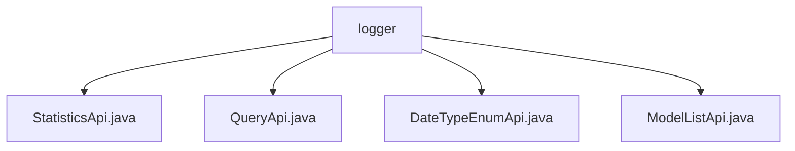

# Basic Information

|      |      |
|------|------|
| Name | logger |
| Language | .java |
| Code Path | WeFe/serving/serving-service/src/main/java/com/welab/wefe/serving/service/api/logger |
| Package Name | docs.serving.serving-service.src.main.java.com.welab.wefe.serving.service.api.logger |
| Brief Description | The StatisticsApi class inherits from AbstractApi and handles log statistics requests, accepting inputs with validation fields and outputting a list of statistical results. The QueryApi class manages paginated log queries, accepting inputs with various query conditions and outputting detailed log information. The DateTypeEnumApi class returns a collection of date type enumeration values. The ModelListApi class returns a string of model lists without requiring login. |

# Description

## Overview  
The core responsibility of this module is to provide log statistics and query functionalities, including obtaining statistical metrics, paginated log record queries, and auxiliary interfaces for enumerated values. The interface specifications follow a unified template, with input and output classes inheriting from AbstractApiInput/AbstractApi, and fields annotated with validation rules. For example, StatisticsApi handles statistical requests, while QueryApi supports paginated queries. Key data structures include log IDs, member/model information, time granularity, and statistical metrics, such as the Output class recording success/failure counts. External dependencies include PredictStatisticsService and predictLogService.  

## Key Business Scenarios  
The module supports full lifecycle management of federated learning logs, similar to an auditing system. Typical scenarios include: 1) Querying log details by conditions (e.g., time range, role), 2) Aggregating prediction counts (e.g., grouped by model/member), 3) Fetching auxiliary enumerated data (e.g., date types). API types encompass data queries (QueryApi), statistical aggregation (StatisticsApi), and metadata retrieval (DateTypeEnumApi). For instance, ModelListApi provides model lists, while DateTypeEnumApi returns enumerated collections. The interaction pattern follows a request-response model, with outputs standardized into the ApiResult wrapper structure.

### Package Internal Structure View

This flowchart illustrates the file hierarchy under the `logger` directory, which includes four files: `StatisticsApi.java`, `QueryApi.java`, `DateTypeEnumApi.java`, and `ModelListApi.java`. All these files are directly subordinate to the `logger` directory with no deeper nested structure. Such a flat directory organization facilitates quick locating and accessing of the relevant API files.

# File List

| Name   | Type  | Description |
|-------|------|-------------|
| [StatisticsApi.java](StatisticsApi.md) | file | The `StatisticsApi` class provides log statistics functionality. It takes inputs including member ID, model ID, date type, and query interval, and outputs statistical results such as success/failure counts. The query requests are processed via `PredictStatisticsService`. |
| [QueryApi.java](QueryApi.md) | file | QueryApi is an interface for querying logs. The input includes parameters such as serial numbers and member IDs, while the output contains information like log IDs and request responses. The query requests are processed through predictLogService. |
| [DateTypeEnumApi.java](DateTypeEnumApi.md) | file | DateTypeEnumApi interface, path "log/date_type", no login required, returns a collection of DateTypeEnum enumerations. The input class is empty. |
| [ModelListApi.java](ModelListApi.md) | file | This is a Java API class with the path "log/model_list", which does not require login. It is used to handle model list requests, with the input being ModelListApi.Input and the output being a list of strings. |

