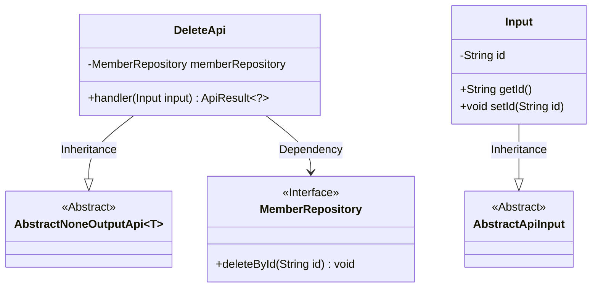
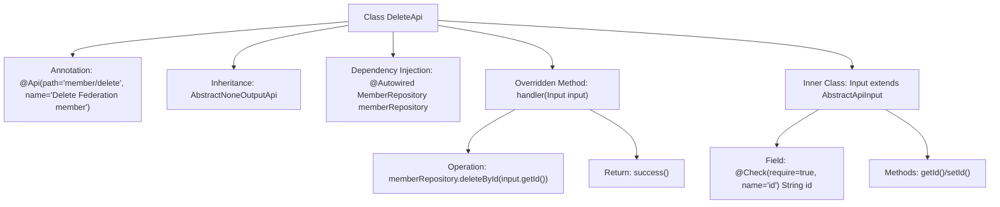

# Basic Information

|      |      |
|------|------|
| Name | DeleteApi |
| Language | .java |
| Code Path | WeFe/serving/serving-service/src/main/java/com/welab/wefe/serving/service/api/member/DeleteApi.java |
| Package Name | com.welab.wefe.serving.service.api.member |
| Dependencies | ['com.welab.wefe.common.fieldvalidate.annotation.Check', 'com.welab.wefe.common.web.api.base.AbstractNoneOutputApi', 'com.welab.wefe.common.web.api.base.Api', 'com.welab.wefe.common.web.dto.AbstractApiInput', 'com.welab.wefe.common.web.dto.ApiResult', 'com.welab.wefe.serving.service.database.repository.MemberRepository', 'org.springframework.beans.factory.annotation.Autowired'] |
| Brief Description | API for deleting alliance members, which accepts an ID parameter, calls the memberRepository to delete the corresponding record, and returns no data. |

# Description

The code defines an API class named `DeleteApi`, which is used to delete federation members. The class path is `member/delete`, inheriting from `AbstractNoneOutputApi`, with the input type being the inner class `Input`. It uses the `deleteById` method of `MemberRepository` to delete a member based on the input ID, returning an `ApiResult` upon successful operation. The `Input` class inherits from `AbstractApiInput`, containing a mandatory string-type `id` field, and provides getter and setter methods.

# Class Summary

| Name   | Type  | Description |
|-------|------|-------------|
| DeleteApi | class | API for deleting alliance members, which receives the member ID, calls the repository to delete the data, and returns no result. |

## Class DeleteApi

|      |      |
|------|------|
| Access Modifier | @Api(path = "member/delete", name = "Delete Federation member");public |
| Type | class |
| Name | DeleteApi |
| Description | API for deleting alliance members, which receives the member ID, calls the repository to delete the data, and returns no result. |

### UML Class Diagram

This code demonstrates an implementation of a member deletion API, including the DeleteApi class and its nested Input class. DeleteApi inherits from the generic class AbstractNoneOutputApi and relies on the MemberRepository interface to perform deletion operations. The Input class inherits from AbstractApiInput and contains a mandatory id field. The class diagram clearly illustrates the inheritance and dependency relationships between classes, with MemberRepository marked as an interface, and AbstractNoneOutputApi and AbstractApiInput existing as abstract classes.

### Internal Method Call Graph

This flowchart describes the structure and workflow of the DeleteApi class. It is an API class for deleting federation members, inheriting from the AbstractNoneOutputApi base class, and performing deletion operations via MemberRepository. The inner class Input contains a validated id field and its accessor methods. The core logic resides in the handler method, which first calls deleteById to remove the specified member by ID, then returns a success result. The annotation defines the API path and name, reflecting Spring Boot's dependency injection and parameter validation mechanisms.

### Field List

| Name  | Type  | Description |
|-------|-------|------|
| memberRepository | MemberRepository | Automatically inject the MemberRepository member variable. |

### Method List

| Name  | Type  | Description |
|-------|-------|------|
| handler | ApiResult<?> | This method deletes member data by inputting an ID and returns a successful result. |

