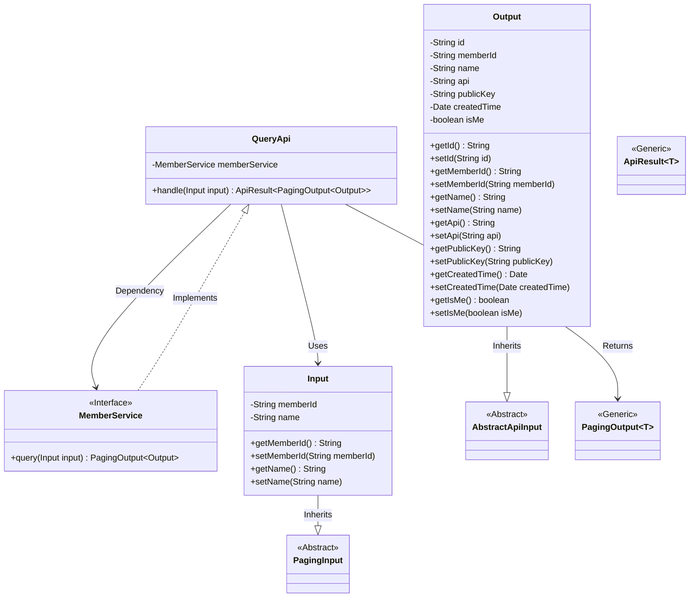

# Basic Information

|      |      |
|------|------|
| Name | QueryApi |
| Language | .java |
| Code Path | WeFe/serving/serving-service/src/main/java/com/welab/wefe/serving/service/api/member/QueryApi.java |
| Package Name | com.welab.wefe.serving.service.api.member |
| Dependencies | ['com.welab.wefe.common.fieldvalidate.annotation.Check', 'com.welab.wefe.common.web.api.base.AbstractApi', 'com.welab.wefe.common.web.api.base.Api', 'com.welab.wefe.common.web.dto.AbstractApiInput', 'com.welab.wefe.common.web.dto.ApiResult', 'com.welab.wefe.serving.service.dto.PagingInput', 'com.welab.wefe.serving.service.dto.PagingOutput', 'com.welab.wefe.serving.service.service.MemberService', 'org.springframework.beans.factory.annotation.Autowired', 'java.util.Date'] |
| Brief Description | API for querying alliance member information, including member ID and name inputs, returns paginated results containing member ID, name, API, public key, creation time, and self-identification flag. |

# Description

The code defines an API class named QueryApi, which is used to retrieve federated member information. The API path is member/query, inheriting from AbstractApi, processing Input and returning paginated Output. Input includes two verifiable fields: member ID and name, supporting pagination. Output contains detailed information such as member ID, name, API address, public key, creation time, and whether it is the current user identifier. The request is processed and results are returned via the query method of MemberService. All fields are accessed through getter/setter methods.

# Class Summary

| Name   | Type  | Description |
|-------|------|-------------|
| QueryApi | class | API for querying alliance member information, including pagination input parameters memberId and name, returns member ID, name, API, public key, creation time, and whether it is the current user, among other details. |

## Class QueryApi

|      |      |
|------|------|
| Access Modifier | @Api(path = "member/query", name = "Get Federation member information");public |
| Type | class |
| Name | QueryApi |
| Description | API for querying alliance member information, including pagination input parameters memberId and name, returns member ID, name, API, public key, creation time, and whether it is the current user, among other details. |

### UML Class Diagram

Class Diagram Description: The diagram illustrates the core structure of a query API, where the QueryApi class inherits from AbstractApi and relies on the MemberService interface for member queries. The Input class extends PagingInput for pagination parameters, while the Output class extends AbstractApiInput containing detailed member information. PagingOutput and ApiResult are generic classes designed for paginated results and API response encapsulation respectively. The overall design reflects layered architecture and generic programming principles, with Input/Output serving as DTOs to isolate internal and external data interactions.

### Internal Method Call Graph

```mermaid
graph TD
    A["Class QueryApi"]
    B["Annotation: @Api"]
    C["Dependency: MemberService memberService"]
    D["Method: handle(Input input)"]
    E["Nested Class: Input"]
    F["Nested Class: Output"]
    G["Input Property: String memberId"]
    H["Input Property: String name"]
    I["Input Methods: getter/setter"]
    J["Output Properties: String id (7 fields total)"]
    K["Output Methods: getter/setter"]
    L["Inheritance: AbstractApi<Input,PagingOutput<Output>>"]
    M["Input Inheritance: PagingInput"]
    N["Output Inheritance: AbstractApiInput"]

    A --> B
    A --> C
    A --> D
    A --> E
    A --> F
    E --> G
    E --> H
    E --> I
    F --> J
    F --> K
    A -.-> L
    E -.-> M
    F -.-> N
    D --> C
```

This code demonstrates a Spring framework-based REST API implementation class QueryApi for querying federated member information. The class inherits from AbstractApi and defines input/output data structures, processing business logic through MemberService. The flowchart clearly presents the class structure, properties/methods, inheritance relationships, and dependency injection, particularly detailing the nested Input and Output classes' attributes and getter/setter methods, reflecting clear boundaries in layered design and Spring's dependency injection features.

### Field List

| Name  | Type  | Description |
|-------|-------|------|
| memberService | MemberService | Using @Autowired to automatically inject an instance of MemberService. |

### Method List

| Name  | Type  | Description |
|-------|-------|------|
| handle | ApiResult<PagingOutput<Output>> | Process the input and return paginated results for member queries. |

