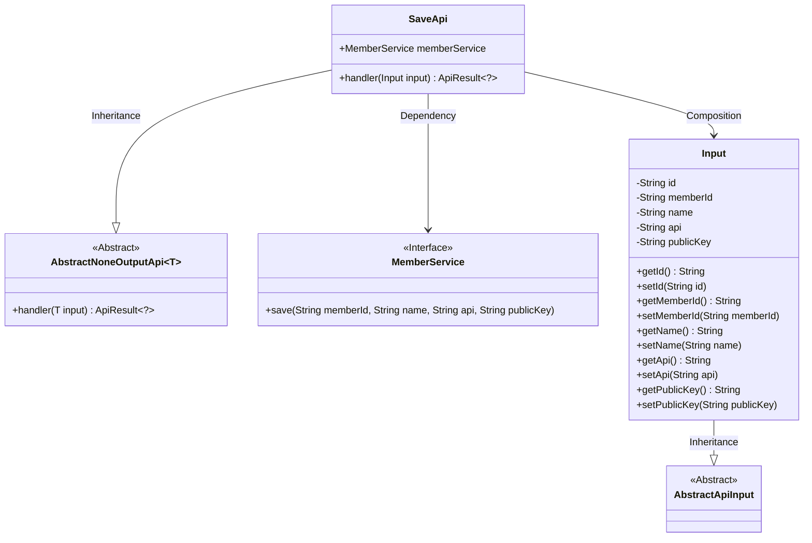
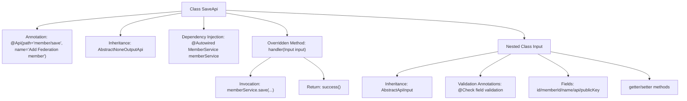

# Basic Information

|      |      |
|------|------|
| Name | SaveApi |
| Language | .java |
| Code Path | WeFe/serving/serving-service/src/main/java/com/welab/wefe/serving/service/api/member/SaveApi.java |
| Package Name | com.welab.wefe.serving.service.api.member |
| Dependencies | ['com.welab.wefe.common.fieldvalidate.annotation.Check', 'com.welab.wefe.common.web.api.base.AbstractNoneOutputApi', 'com.welab.wefe.common.web.api.base.Api', 'com.welab.wefe.common.web.dto.AbstractApiInput', 'com.welab.wefe.common.web.dto.ApiResult', 'com.welab.wefe.serving.service.service.MemberService', 'org.springframework.beans.factory.annotation.Autowired'] |
| Brief Description | The SaveApi class is used to add alliance members, receiving member ID, name, prediction interface address, and public key, then calling memberService to save the data. Input parameters must be validated for non-null values. |

# Description

The code defines an API class named SaveApi for adding federation members. The API path is "member/save", which inherits from AbstractNoneOutputApi, with the input parameter being the Input class. The Input class contains five fields: id, memberId, name, api, and publicKey, with the latter four being mandatory. The handler method invokes the save method of memberService to store member information, with parameters sourced from the Input object. Each field has getter and setter methods and is validated via the @Check annotation.

# Class Summary

| Name   | Type  | Description |
|-------|------|-------------|
| SaveApi | class | The SaveApi class is used to add alliance members by saving the member ID, name, prediction interface address, and public key through the memberService. The input parameters include the mandatory member ID, name, interface address, and public key. |

## Class SaveApi

|      |      |
|------|------|
| Access Modifier | @Api(path = "member/save", name = "Add Federation member");public |
| Type | class |
| Name | SaveApi |
| Description | The SaveApi class is used to add alliance members by saving the member ID, name, prediction interface address, and public key through the memberService. The input parameters include the mandatory member ID, name, interface address, and public key. |

### UML Class Diagram

This code demonstrates the implementation structure of an API for saving federation members. SaveApi inherits from AbstractNoneOutputApi, processes Input objects containing member information, and completes data persistence through MemberService. The Input class inherits from AbstractApiInput, containing fields such as member ID, name, API address, and public key, along with complete getter/setter methods. MemberService serves as an interface providing the save method implementation. The overall design reflects a clear hierarchical structure and separation of responsibilities, with input validation implemented through annotations.

### Internal Method Call Graph

This flowchart illustrates the complete structure of the SaveApi class, including API annotations, service injection, request handling flow, and nested input class. The main process involves the handler method receiving Input parameters, invoking memberService to save data, and finally returning a success result. The Input class contains 5 fields with validation annotations and their access methods, inheriting from the AbstractApiInput base class. The entire design implements the API functionality for member saving, clearly separating request handling and data validation logic through a layered structure.

### Field List

| Name  | Type  | Description |
|-------|-------|------|
| memberService | MemberService | Automatically inject the MemberService instance. |

### Method List

| Name  | Type  | Description |
|-------|-------|------|
| handler | ApiResult<?> | Process the input and save member information, then return a successful result. |

