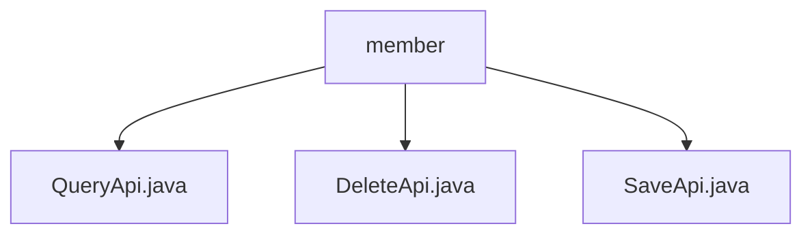

# Basic Information

|      |      |
|------|------|
| Name | member |
| Language | .java |
| Code Path | WeFe/serving/serving-service/src/main/java/com/welab/wefe/serving/service/api/member |
| Package Name | docs.serving.serving-service.src.main.java.com.welab.wefe.serving.service.api.member |
| Brief Description | The QueryApi class handles member queries, with the path member/query, accepting inputs including ID and name, and outputs paginated member information. The DeleteApi class handles member deletion, with the path member/delete, requiring an ID as input. The SaveApi class handles member addition, with the path member/save, accepting inputs containing mandatory fields. |

# Description

## Overview  
This module provides federated member management functionalities, with core responsibilities including member information query, addition, and deletion. The interface specifications adhere to the RESTful style, uniformly inheriting the AbstractApi base class, with a path prefix of `member/`. Key data structures include the Input class (containing fields such as ID and name) and the paginated Output class (containing API addresses, public keys, etc.). External dependencies include MemberService and MemberRepository. For example, QueryApi implements paginated queries via MemberService.query, while DeleteApi directly deletes data by calling Repository.  

## Key Business Scenarios  
The module supports a complete CRUD operation flow: adding members via SaveApi (similar to a registry), paginated queries via QueryApi (similar to a directory service), and removing members via DeleteApi. The interaction mode is exclusively request-response, with Input parameters validated via annotations. Typical applications include federated learning node management, such as invoking SaveApi when adding a new participant, which requires validation of mandatory fields like public keys. API types encompass data operations (create, delete, query) and status queries, with integration examples visible in distributed collaboration scenarios.

### Package Internal Structure View

This flowchart illustrates three Java files under the member directory in the serving-service module of the WeFe project: QueryApi.java, DeleteApi.java, and SaveApi.java. These files are directly subordinate to the member directory with no deeper nested structure, clearly reflecting the peer-level relationship of the API interface files under this path.

# File List

| Name   | Type  | Description |
|-------|------|-------------|
| [QueryApi.java](QueryApi.md) | file | API for querying alliance member information, including member ID and name input, returns paginated results containing member ID, name, API, public key, creation time, and self-identification flag. |
| [DeleteApi.java](DeleteApi.md) | file | API for deleting alliance members, which accepts an ID parameter, calls the memberRepository to delete the corresponding record, and returns no data. |
| [SaveApi.java](SaveApi.md) | file | The SaveApi class is used to add alliance members, receiving the member ID, name, prediction interface address, and public key, and then calling the memberService to save the data. The input parameters must be validated for non-null values. |

