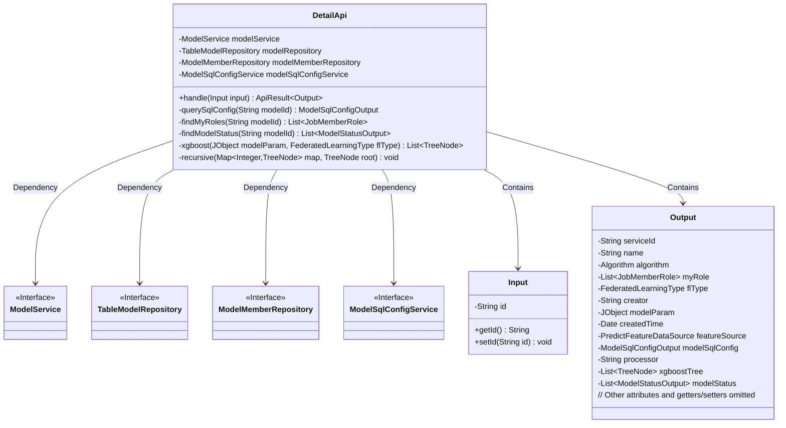
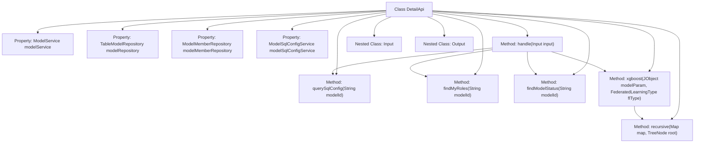
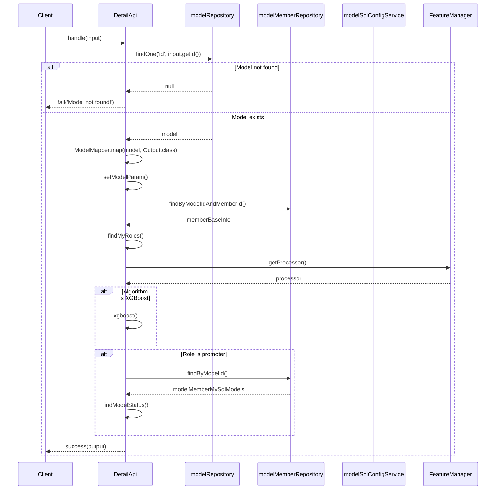

# Basic Information

|      |      |
|------|------|
| Name | DetailApi |
| Language | .java |
| Code Path | WeFe/serving/serving-service/src/main/java/com/welab/wefe/serving/service/api/model/DetailApi.java |
| Package Name | com.welab.wefe.serving.service.api.model |
| Dependencies | ['java.util.ArrayList', 'java.util.Date', 'java.util.HashMap', 'java.util.List', 'java.util.Map', 'java.util.stream.Collectors', 'org.apache.commons.collections4.CollectionUtils', 'org.springframework.beans.factory.annotation.Autowired', 'com.welab.wefe.common.fieldvalidate.annotation.Check', 'com.welab.wefe.common.util.JObject', 'com.welab.wefe.common.web.api.base.AbstractApi', 'com.welab.wefe.common.web.api.base.Api', 'com.welab.wefe.common.web.dto.AbstractApiOutput', 'com.welab.wefe.common.web.dto.ApiResult', 'com.welab.wefe.common.web.util.ModelMapper', 'com.welab.wefe.common.wefe.enums.Algorithm', 'com.welab.wefe.common.wefe.enums.FederatedLearningType', 'com.welab.wefe.common.wefe.enums.JobMemberRole', 'com.welab.wefe.common.wefe.enums.PredictFeatureDataSource', 'com.welab.wefe.serving.sdk.model.xgboost.XgboostDecisionTreeModel', 'com.welab.wefe.serving.sdk.model.xgboost.XgboostModel', 'com.welab.wefe.serving.sdk.model.xgboost.XgboostNodeModel', 'com.welab.wefe.serving.service.database.entity.ModelMemberMySqlModel', 'com.welab.wefe.serving.service.database.entity.ModelSqlConfigMySqlModel', 'com.welab.wefe.serving.service.database.entity.TableModelMySqlModel', 'com.welab.wefe.serving.service.database.repository.ModelMemberRepository', 'com.welab.wefe.serving.service.database.repository.TableModelRepository', 'com.welab.wefe.serving.service.dto.ModelSqlConfigOutput', 'com.welab.wefe.serving.service.dto.ModelStatusOutput', 'com.welab.wefe.serving.service.dto.PagingInput', 'com.welab.wefe.serving.service.dto.TreeNode', 'com.welab.wefe.serving.service.dto.TreeNodeData', 'com.welab.wefe.serving.service.manager.FeatureManager', 'com.welab.wefe.serving.service.service.CacheObjects', 'com.welab.wefe.serving.service.service.ModelService', 'com.welab.wefe.serving.service.service.ModelSqlConfigService'] |
| Brief Description | The DetailApi class retrieves model details by ID, including model parameters, roles, status, and other information, with support for XGBoost tree structure processing. |

# Description

The DetailApi is an API class designed for retrieving model details, inheriting from AbstractApi and processing Input and Output. It queries model data through injected components such as ModelService and TableModelRepository. The core logic includes: querying the model based on the input ID and returning a failure if it does not exist; mapping model data to the output object; and setting model parameters, user roles, processors, XGBoost tree structures, and model status information. The XGBoost tree is constructed recursively, containing data such as features, nodes, and weights. The output object includes detailed information such as service ID, algorithm type, creator, creation time, feature source, and SQL configuration. The input class includes primary key ID validation, while the output class extends AbstractApiOutput and provides getter and setter methods for model-related attributes.

# Class Summary

| Name   | Type  | Description |
|-------|------|-------------|
| DetailApi | class | The DetailApi class handles model detail queries, retrieving model information such as parameters, roles, status, etc., by inputting an ID, and supports XGBoost tree structure processing. |

## Class DetailApi

|      |      |
|------|------|
| Access Modifier | @Api(path = "model/detail", name = "Get model");public |
| Type | class |
| Name | DetailApi |
| Description | The DetailApi class handles model detail queries, retrieving model information such as parameters, roles, status, etc., by inputting an ID, and supports XGBoost tree structure processing. |

### UML Class Diagram

This class diagram illustrates the relationships between the DetailApi class and its related components. DetailApi inherits from AbstractApi, includes two static inner classes (Input and Output), and depends on four service interfaces (ModelService, TableModelRepository, etc.). Its primary functionality is to process model detail requests through the handle method, involving operations such as model querying, role lookup, status retrieval, etc., ultimately returning an Output object containing detailed model information. The diagram clearly reflects the hierarchical structure and dependencies of the code, with interfaces marked by <<Interface>>, private members prefixed with "-", and public methods prefixed with "+".

### Internal Method Call Graph

This flowchart illustrates the structure of the DetailApi class and its primary method invocation relationships, including 4 auto-injected service components and 6 core methods. The sequence diagram details the execution process of the handle method, covering key steps such as model querying, role validation, and XGBoost tree construction, with both normal and exception handling paths. The code primarily implements model detail query functionality, involving coordinated operations across multiple data sources and complex business logic judgments.

### Field List

| Name  | Type  | Description |
|-------|-------|------|
| modelMemberRepository | ModelMemberRepository | Using @Autowired to automatically inject the ModelMemberRepository instance. |
| modelRepository | TableModelRepository | Using @Autowired to automatically inject an instance of TableModelRepository. |
| modelSqlConfigService | ModelSqlConfigService | Using @Autowired to automatically inject an instance of ModelSqlConfigService. |
| modelService | ModelService | Automatically inject the ModelService instance. |

### Method List

| Name  | Type  | Description |
|-------|-------|------|
| querySqlConfig | ModelSqlConfigOutput | Query the SQL configuration for the specified model ID and map it to the output object. |
| xgboost | List<TreeNode> | This method parses the parameters of an XGBoost model and constructs a list of tree-structured nodes. The main steps include: obtaining feature mappings and model parameters, traversing each tree to generate nodes, setting node attributes (features, left/right child nodes, weights, etc.), recursively processing node relationships, and ultimately returning a list of tree structures. It supports vertical federated learning types. |
| findModelStatus | List<ModelStatusOutput> | This method queries member status based on the model ID, filters for the provider role, and returns a list containing member IDs, partner names, and statuses. |
| handle | ApiResult<DetailApi.Output> | The method processes the input, queries model data, maps the output, and sets parameters, supplementing information based on roles and algorithm types, before finally returning the result. If the model does not exist, it returns a failure. |
| findMyRoles | List<JobMemberRole> | This method queries the current user's role list by model ID, retrieves member information from the database, extracts the roles, and returns the list. |
| recursive | void | Recursively process the tree structure, returning if the node is a leaf. Retrieve the left and right child nodes, recursively process the left and right subtrees, and finally set the left and right subtrees as the children of the current node. |

