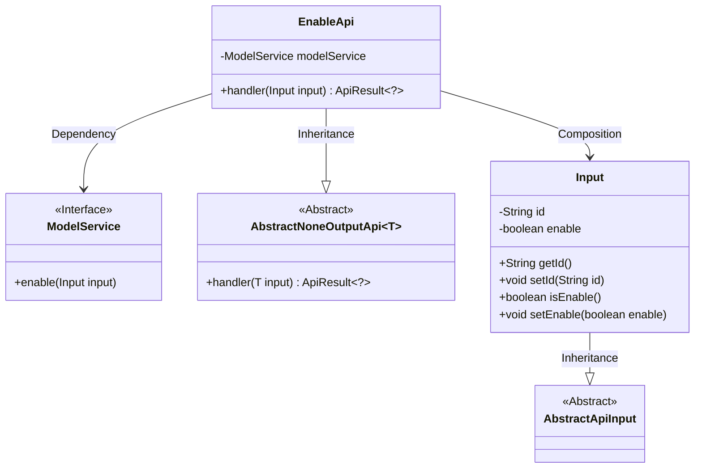
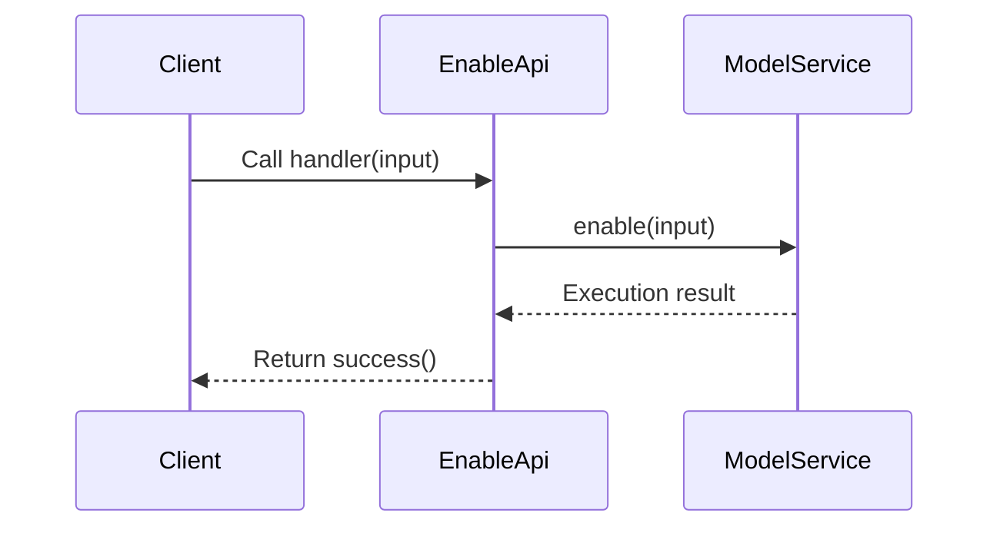

# Basic Information

|      |      |
|------|------|
| Name | EnableApi |
| Language | .java |
| Code Path | WeFe/serving/serving-service/src/main/java/com/welab/wefe/serving/service/api/model/EnableApi.java |
| Package Name | com.welab.wefe.serving.service.api.model |
| Dependencies | ['org.springframework.beans.factory.annotation.Autowired', 'com.welab.wefe.common.web.api.base.AbstractNoneOutputApi', 'com.welab.wefe.common.web.api.base.Api', 'com.welab.wefe.common.web.dto.AbstractApiInput', 'com.welab.wefe.common.web.dto.ApiResult', 'com.welab.wefe.serving.service.service.ModelService'] |
| Brief Description | EnableApi is used to update the model activation status. It accepts the id and enable parameters, calls the modelService.enable method for processing, and returns the success result. |

# Description

This is a Java class named EnableApi, designed to handle model activation and deactivation operations. The class extends AbstractNoneOutputApi and uses the generic type Input as its input parameter. It is annotated with the @Api annotation, specifying the path as model/enable, the name as "Model online and offline," and the description as "Update model enable field." The class injects the ModelService and overrides the handler method, which calls the enable method of modelService to process the input parameters and returns a successful result. The Input inner class extends AbstractApiInput and contains two properties: a String-type id and a Boolean-type enable, each with corresponding getter and setter methods.

# Class Summary

| Name   | Type  | Description |
|-------|------|-------------|
| EnableApi | class | EnableApi is used to update the model activation status. It accepts the id and enable parameters, calls modelService.enable for processing, and returns a successful result. |

## Class EnableApi

|      |      |
|------|------|
| Access Modifier | @Api(path = "model/enable", name = "Model online and offline", desc = "Update model enable field");public |
| Type | class |
| Name | EnableApi |
| Description | EnableApi is used to update the model activation status. It accepts the id and enable parameters, calls modelService.enable for processing, and returns a successful result. |

### UML Class Diagram

This code demonstrates the implementation structure of a model enable/disable API. EnableApi inherits from AbstractNoneOutputApi, processes Input parameters, and invokes the enable method of ModelService. The Input class inherits from AbstractApiInput and contains id and enable fields for controlling model states. The class diagram clearly illustrates inheritance relationships (EnableApi→AbstractNoneOutputApi, Input→AbstractApiInput), composition relationship (EnableApi contains Input), and dependency relationship (EnableApi uses the ModelService interface). The overall design adheres to object-oriented principles, achieving good extensibility through abstract base classes and interfaces.

### Internal Method Call Graph

```mermaid
graph TD
    A["Class EnableApi"]
    B["Annotation: @Api"]
    C["Inheritance: AbstractNoneOutputApi<Input>"]
    D["Dependency Injection: @Autowired ModelService"]
    E["Overridden Method: handler(Input input)"]
    F["Inner Class: Input"]
    G["Field: String id"]
    H["Field: boolean enable"]
    I["Methods: getId/setId"]
    J["Methods: isEnable/setEnable"]
    K["Invocation: modelService.enable(input)"]
    L["Return: success()"]

    A --> B
    A --> C
    A --> D
    A --> E
    E --> K
    E --> L
    A --> F
    F --> G
    F --> H
    F --> I
    F --> J
```

This code defines an EnableApi class for handling model enable/disable operations. The flowchart illustrates class structure relationships, including annotations, inheritance, dependency injection, and the definition of inner class Input. The sequence diagram depicts the process where a client calls the handler method, sequentially triggering ModelService's enable operation and returning a success response. The core functionality involves updating a model's enable field status via ModelService, with the Input class encapsulating model ID and enable state parameters.

### Field List

| Name  | Type  | Description |
|-------|-------|------|
| modelService | ModelService | Using @Autowired to automatically inject an instance of ModelService. |

### Method List

| Name  | Type  | Description |
|-------|-------|------|
| handler | ApiResult<?> | Java method override, calling modelService to enable input and return successful results. |

